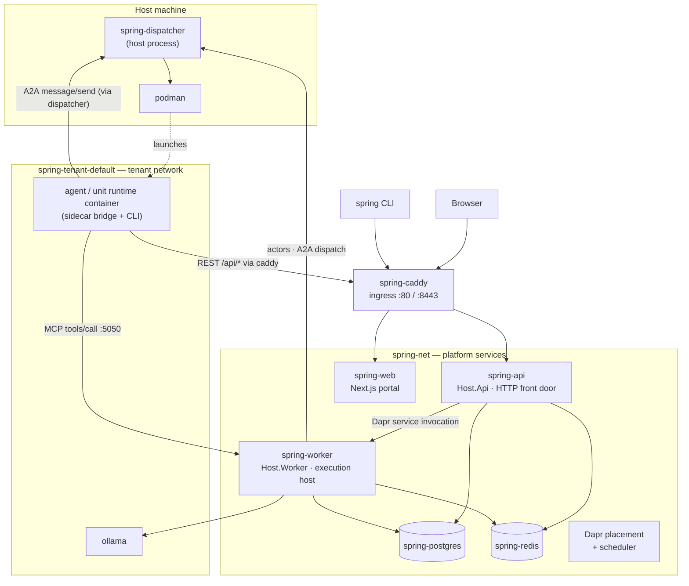

# Components

> **[Architecture index](README.md)** · Related: [Runtime flows](runtime-flows.md), [Deployment](deployment.md), [Data & identity](data-and-identity.md)

This page is the component inventory: every process, actor, and service that
makes up a running Spring Voyage deployment, what each one owns, and how they
connect. It describes the OSS single-host deployment; the cloud overlay adds
tenant-scoped middleware on top of the same components.

---

## Topology

The two .NET hosts have **explicit roles** ([ADR-0054](../decisions/0054-one-mcp-server-one-execution-host.md)): `spring-api` is a stateless HTTP front door; `spring-worker` is *the* execution host. Everything stateful or execution-related runs in the worker.

---

## Processes

### `spring-api` — HTTP front door (`Cvoya.Spring.Host.Api`)

The stateless public face of the platform. It serves the REST API, GitHub
webhook ingest, the OpenAPI document, OTLP telemetry ingest, and the API the
web portal calls. It registers `AddCvoyaSpringDapr(..., SpringHostRole.HttpFrontDoor)`,
so it runs **no** execution-hosted services — no `McpServer` listener, no
container registries, no health timers. Persistent-agent lifecycle requests
(`deploy` / `undeploy` / `scale` / `deployment-status` / `logs`) are accepted
here and **delegated to the worker** over Dapr service invocation.

### `spring-worker` — execution host (`Cvoya.Spring.Host.Worker`)

The execution host. It owns:

- the **Dapr actors** (Agent / Unit / Human / ThreadHop — see below);
- **A2A dispatch** — `A2AExecutionDispatcher`, which launches and drives agent
  runtime containers for a turn;
- the **platform MCP server** — one `McpServer` instance, served as a Kestrel
  route (`POST /mcp/`) on the MCP port (default `5050`);
- agent-container lifecycle — `PersistentAgentLifecycle`, the persistent /
  ephemeral agent registries, the agent-volume manager, container-health timers;
- **EF Core migrations** and the **default-tenant bootstrap** — the worker is
  the single owner of database lifecycle, so the two hosts never race on DDL.

It registers `AddCvoyaSpringDapr(..., SpringHostRole.ExecutionHost)`.

### `spring-dispatcher` — container runtime owner (`Cvoya.Spring.Dispatcher`)

A **host process** (not a container — see [ADR-0012](../decisions/0012-spring-dispatcher-service-extraction.md) and [Deployment](deployment.md)). It is the only process that holds the host's container binary. The worker's sole `IContainerRuntime` binding, `DispatcherClientContainerRuntime`, forwards every container operation — launch, logs, stop, image pull, network, probe, the A2A round-trip into a container — to the dispatcher over HTTP. The dispatcher's OSS backend shells out to `podman`.

### `spring-web` — portal (`Cvoya.Spring.Web`)

A Next.js / React application in `standalone` mode. It is a pure client of the
public Web API — there is no portal-private data path. It hosts the two portal
surfaces (management and engagement) described in [Interfaces](interfaces.md).

### `spring-caddy` — ingress

Reverse proxy. Terminates external traffic (`:80` / `:443`) and exposes a
tenant-facing entry (`:8443`) that agent and workflow containers use to reach
the authenticated REST API from inside the tenant network.

### Agent runtime containers

One container per agent or unit for the duration of a turn (ephemeral) or for
its service lifetime (persistent). Each runs the **A2A sidecar bridge**
(`Cvoya.Spring.AgentSidecar`, TypeScript) wrapping a runtime CLI — `claude`,
`codex`, `gemini`, or the `spring-voyage` agent. See [Agent runtime](agent-runtime.md).

---

## Dapr actors

All actors run in the worker. Each is a Dapr virtual actor with a flat `Guid`
id; turn-based concurrency gives each a natural mailbox.

| Actor | Represents | Owns |
|-------|-----------|------|
| **`AgentActor`** | A leaf agent | Per-thread FIFO mailbox channels, observation channel, lifecycle status, initiative state |
| **`UnitActor`** | A unit (a composite agent — an agent that has children) | The same mailbox contract as an agent, plus member dispatch; the member graph itself is EF-authoritative |
| **`HumanActor`** | A human participant | Notification routing, permission enforcement, per-thread read cursors; identity & permissions are EF-authoritative |
| **`ThreadHopActor`** | One message thread | A single hop counter — incremented per delivery, bounds delegation-loop fan-out |

`AgentActor`, `UnitActor`, and `HumanActor` all implement the same addressable,
message-receiving contract: a unit is indistinguishable from an agent at the
messaging boundary ([ADR-0017](../decisions/0017-unit-is-an-agent-composite.md),
[ADR-0053](../decisions/0053-units-are-agents-and-one-way-delivery.md)). Connectors
are **not** actors — they are non-routable bridges (see [Connectors](connectors.md)).

What an actor keeps in Dapr state versus what lives in PostgreSQL is governed by
the state-ownership matrix in [Data & identity](data-and-identity.md).

---

## .NET projects

The solution separates domain abstractions from infrastructure so the cloud
overlay can swap implementations via DI.

| Project | Role |
|---------|------|
| `Cvoya.Spring.Core` | Domain interfaces and types only — zero infrastructure dependencies, zero NuGet packages |
| `Cvoya.Spring.Dapr` | Dapr implementations: actors, dispatch, the `McpServer`, routing, state, EF data access |
| `Cvoya.Spring.A2A` | A2A protocol client and server |
| `Cvoya.Spring.AgentRuntimes` | Per-runtime launchers + the launcher registry |
| `Cvoya.Spring.AgentSidecar` | TypeScript A2A bridge bundled into agent images |
| `Cvoya.Spring.AgentSdk` | Runtime-image-facing typed messaging client over the MCP transport |
| `Cvoya.Spring.ModelProviders` | Per-model-provider wire-format adapters |
| `Cvoya.Spring.RuntimeCatalog` | Loads and serves `runtime-catalog.yaml` |
| `Cvoya.Spring.Manifest` | Package / artefact YAML parsing and validation |
| `Cvoya.Spring.Connectors.Abstractions` | The `IConnectorType` plugin contract |
| `Cvoya.Spring.Connector.{GitHub,Arxiv,WebSearch}` | Connector plugins |
| `Cvoya.Spring.Dispatcher` | The container-runtime host process |
| `Cvoya.Spring.Host.Api` / `Cvoya.Spring.Host.Worker` | The two host composition roots |
| `Cvoya.Spring.Cli` | The `spring` CLI |
| `Cvoya.Spring.Web` | The Next.js portal |

Agent runtimes and connectors are **plugins**: each ships as its own project,
references only its contract, and registers through one `AddCvoyaSpring*()` DI
extension. Host code references the abstraction only.

---

## Infrastructure dependencies

| Dependency | Purpose |
|------------|---------|
| **PostgreSQL** | Primary relational store (definitions, config, threads, messages, activity, costs, secrets); also backs the Dapr state store |
| **Redis** | Dapr pub/sub and the actor state store backend |
| **Dapr placement + scheduler** | Dapr control plane for virtual actors, reminders, and workflows |
| **Dapr sidecars** | One per .NET host; provide the actor, pub/sub, state, and workflow building blocks |
| **Ollama** | Local LLM serving for the `spring-voyage` runtime and Tier-1 initiative cognition |

Dapr building blocks are pluggable via YAML — Redis can become Kafka, the state
store can become any supported backend — without code changes.
