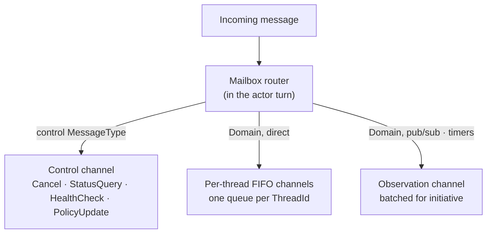

# Messaging

> **[Architecture index](README.md)** · Related: [Runtime flows](runtime-flows.md), [Units & agents](units-and-agents.md), [Agent runtime](agent-runtime.md), [Data & identity](data-and-identity.md)

How addressable entities communicate: the message model, the durable thread the
exchange lives on, the agent mailbox, the one-way delivery substrate, and the
platform MCP tool surface a runtime uses to deliver messages and read state.

The participant-set thread model and its rationale are settled in
[ADR-0030](../decisions/0030-thread-model.md); the one-way delivery model in
[ADR-0053](../decisions/0053-units-are-agents-and-one-way-delivery.md); the MCP
surface and the single MCP server in
[ADR-0054](../decisions/0054-one-mcp-server-one-execution-host.md).

---

## The message

A `Message` is the unit of communication between addressable entities. It is a
small record:

| Field | Notes |
|-------|-------|
| `Id` | `Guid` — unique; deduplication, ack, audit |
| `From` / `To` | `Address` — `(Scheme, Guid)`; see [Data & identity](data-and-identity.md) |
| `Type` | `MessageType` — `Domain` or a control type |
| `ThreadId` | The thread the message belongs to |
| `Payload` | `JsonElement` — interpreted per `MessageType` / domain convention |
| `Timestamp` | When it was created |

`MessageType` separates **domain** traffic from **control** traffic:

| Type | Handled by |
|------|-----------|
| `Domain` | The agent's runtime interprets the `Payload`. The platform never inspects it. |
| `Cancel` | The platform triggers the `CancellationTokenSource` for the active turn. |
| `StatusQuery` / `HealthCheck` | The actor replies synchronously with its state — infrastructure RPC, not domain messaging. |
| `PolicyUpdate` | The platform applies a runtime policy change to actor state. |

Routing is platform-controlled: a sender cannot escalate its own message's
priority. The platform decides which mailbox channel a message enters from the
`MessageType` and the delivery mechanism.

## Domain messaging is one-way

A domain `Message` is an **event** — "something happened" — delivered to a unit
or agent. No sender is blocked on a return value
([ADR-0053](../decisions/0053-units-are-agents-and-one-way-delivery.md)).

When a turn completes, the runtime's response is **recorded on the originating
thread** and is **never routed back** to `Message.From`. A unit or agent that
wants to respond acts through its tools, or sends a *new* one-way message on the
thread. Request/reply, where a flow genuinely needs it, is a pattern built on the
thread (send → end turn → resume when the reply lands) — not a transport feature.

Control-plane queries (`StatusQuery`, `HealthCheck`) keep their synchronous
in-actor reply; they are infrastructure probes, not domain messaging.

## The agent mailbox

Dapr actors are turn-based — one call at a time. An agent's mailbox is logically
partitioned so long-running work never blocks control traffic:

- **Control** messages are processed even mid-work — the actor turn only updates
  state (e.g. sets a cancellation flag); the runtime container checks it.
- **Per-thread FIFO channels** — each `ThreadId` has its own queue. By default
  an agent processes its threads **concurrently** (one in-flight turn per
  thread); per-thread FIFO is preserved, concurrency is across threads. The
  agent/unit definition carries `concurrent_threads` (default `true`); set
  `false` for agents that cannot multiplex cleanly
  ([ADR-0041](../decisions/0041-actor-runtime-contract.md)).
- **Observation** messages (pub/sub, reminders, timers) accumulate and are
  processed as a batch by the initiative cognition loop.

Work is never run inside the actor turn. The actor enqueues the message, kicks
off dispatch as a **detached task**, and returns in milliseconds. This
**fast-enqueue invariant** is what makes synchronous message delivery
deadlock-free (see below).

## Threads and the Timeline

A **thread** is identified by its **participant set** — the set of two or more
participants that share it. There is exactly one thread per unique participant
set; adding or removing a participant produces a *different* set, hence a
different thread. The thread is the durable, lifelong record for that set
([ADR-0030](../decisions/0030-thread-model.md)).

Each thread carries one ordered, append-only **Timeline** — the canonical shared
record of messages, `ParticipantStateChanged` events, retractions, and system
events. Each `(thread, participant)` pair has a state machine
(`added → active → removed → re-added`); the per-participant view is a
**read-time filter** over the one Timeline, not a separate copy. Per-thread FIFO
is the ordering invariant.

> In the product UI a thread is presented as an **engagement** (the enduring
> relationship) and worked in as a **collaboration** (the active workspace).
> "Thread" is the system term used in code, schema, and APIs.

## Message delivery

A runtime delivers a message through two platform tools. Both take the same
input shape — either an explicit `recipients` list or a `scope` — and differ in
**thread identity**, not input shape. Both return a **delivery
acknowledgement** — the message was durably placed in each recipient's mailbox
— never the recipient's reply.

| Tool | Thread shape |
|------|--------------|
| `sv.messaging.send(recipients \| scope, message, reason?)` | One SHARED thread for the whole participant set `{caller} ∪ recipients`. Every recipient sees the others in the inbound envelope's `to` field. |
| `sv.messaging.multicast(recipients \| scope, message, reason?)` | N INDEPENDENT 1-1 threads `{caller, recipient_i}`. Each recipient sees only itself in the inbound envelope and only this pair's history via `sv.memory.history_with`. |
| `sv.messaging.respond_to(message_id, message, reason?)` | CONTINUES the conversation `message_id` belongs to: the platform delivers to that conversation's current routable participants minus the caller, on the SAME thread (no fork). The agent names a `message_id` from the inbound envelope — never a thread id ([ADR-0064](../decisions/0064-conversation-participants-and-continuation.md)). |

The calling participant is auto-included in every thread's participant set —
the runtime does not list itself in `recipients`. Connector (`connector://`)
addresses are non-routable: passing one as a recipient returns an
`UnroutableTarget` error (connectors are senders only — they stamp message
provenance on inbound webhook events but never receive replies).

The runtime never names a `thread_id`. The platform derives it from the
participant set per [ADR-0030](../decisions/0030-thread-model.md); shared
history is reached via `sv.memory.history_with(participants=[…])` — the
participant set IS the identifier.

**Human and agent send paths converge on this primitive
([#2887](https://github.com/cvoya-com/spring-voyage/issues/2887)).** The Web API
send endpoint (`POST /api/v1/tenant/messages`) takes either a single `to` or a
multi-party `recipients[]`; a multi-party send resolves ONE shared thread from
`{sender} ∪ recipients` through the thread registry and fans the one message
out to each recipient — exactly as `sv.messaging.send` does for an agent
caller. A human-initiated engagement with N participants is therefore one
conversation, not N per-recipient threads.

- Delivery is **synchronous with bounded retry** inside the handler — there is no
  delivery queue. `agent:` / `unit:` / `human:` targets are virtual actors that
  always activate, so the only delivery failure is transient infrastructure; an
  invalid target is caught by synchronous validation.
- Both failure classes — validation failure, terminal delivery failure — surface
  as **synchronous tool errors**. Failure is never a message, so there is no
  system sender address.
- A **per-thread hop counter** (`ThreadHopActor`) is incremented on every call;
  a call past the platform limit is rejected, bounding delegation-loop fan-out.

There is no `delegate_to` tool. A runtime that wants to *delegate* sends a
message whose content says so — "delegation" is message content the recipient's
runtime interprets, not a platform mechanism. Recording the routing decision is
an optional, separate `sv.runtime.report_decision` call.

## The platform MCP tool surface

The platform exposes its tools to runtime containers through **one MCP server**,
in the worker, served as a Kestrel route (`POST /mcp/`, default port `5050`).
Every platform tool is named `sv.<area>.<verb>`:

| Area | Tools |
|------|-------|
| `sv.directory.*` | `get_self`, `get_member`, `list_members`, `get_siblings`, `get_parents`, `get_status` |
| `sv.memory.*` | Private memory: `add`, `get`, `list`, `search`, `update`, `delete`. Shared history (#2747): `history_with`, `engagements`, `search_messages` |
| `sv.messaging.*` | `send`, `multicast` (both take `recipients[]` or `scope`; differ in thread identity per #2747), `respond_to` (continue a conversation by `message_id`, ADR-0064) |
| `sv.runtime.*` | `report_progress`, `report_decision` |
| `sv.expertise.*` | `search`, plus dynamic per-capability `sv.expertise.{slug}` tools |

`sv.` is reserved for platform tools; connector tools keep a connector-named
namespace (`github.*`, …). Every `sv.*` call passes the effective-grant gate and
unit-policy enforcement — a unit policy can deny any tool, messaging included
(see [Security](security.md)).

**Authentication is one per-turn MCP session token.** It is minted by the worker
`McpServer` at dispatch start, carries the `(tenant, agentAddress, threadId,
messageId)` tuple, is delivered to the container in the A2A `message/send`, and
is revoked at turn-end. There is no separate callback credential. See
[Agent runtime](agent-runtime.md) for how a launcher attaches the server.

## Agent memory

Each agent has one ordered, append-only **`AgentMemory`** store. Entries are
`MemoryEntry` records (`{ id, timestamp, payload, thread_id?, threadOnly? }`).
Per-thread visibility is governed by the thread's `ThreadMemoryPolicy` (default
`threadOnly: true` — entries do not leave their thread). Memory is read and
written through the `sv.memory.*` tools; the platform stamps `thread_id` and
`threadOnly` from the agent's operating context.

**Tasks are memory entries** — a task is a memory entry whose payload represents
a task by convention; there is no typed `task` platform concept. The
collaboration surface renders task state by reading those entries.

## Addressing and activation

Every addressable entity has a stable `Guid` and an `Address` of shape
`(Scheme, Guid)` with canonical wire form `scheme:<32-hex>`. Actors have flat,
globally-unique ids; the directory resolves an address to an actor in a single
lookup — there is no multi-hop forwarding. Permission enforcement happens at
resolution time: the directory walks the membership graph and evaluates the
boundary policy at each edge. Full identifier rules are in
[Data & identity](data-and-identity.md).

An agent can be activated by a direct message, a pub/sub subscription, a Dapr
reminder or timer, or the initiative cognition loop. Pub/sub topics are
namespaced `{tenant}/{owner}/{topic}`; system topics use a `system/` prefix.
