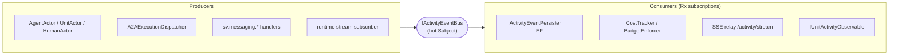

# Observability

> **[Architecture index](README.md)** · Related: [Messaging](messaging.md), [Units & agents](units-and-agents.md), [Interfaces](interfaces.md)

Observability is a first-class architectural concern. Everything an agent or
unit does surfaces as a structured event on one reactive bus, from which every
consumer — dashboards, persistence, cost tracking, the CLI — composes the view
it needs.

---

## Activity events

Every observable entity emits typed `ActivityEvent`s:

```
ActivityEvent:
  timestamp      DateTimeOffset
  source         Address
  type           MessageReceived | MessageSent | ThreadStarted | DecisionMade |
                 ErrorOccurred | StateChanged | InitiativeTriggered |
                 ReflectionCompleted | CostIncurred | TokenDelta | ToolCall |
                 ToolResult | RuntimeSpan | RuntimeLog | LlmTurn | ...
  severity       Debug | Info | Warning | Error
  summary        string         # human-readable one-liner
  details        JsonElement    # structured payload
  correlationId  string         # the ThreadId — ties related events together
  cost           decimal?       # LLM cost, when applicable
```

## The reactive bus

The platform runs **one process-wide hot bus**, `IActivityEventBus` — a single
`Subject<ActivityEvent>`. Every producer (the actors, the dispatcher, the
messaging handlers, the stream subscriber, the budget enforcer) publishes to it;
every consumer subscribes with Rx.NET operators (`.Where`, `.Buffer`, `.Merge`,
`.Throttle`) to compose its view. There is no second mechanism — no polling
loop, no parallel fan-out.



Standing subscribers: `ActivityEventPersister` (buffers 1s, writes EF),
`CostTracker` and `BudgetEnforcer` (filter `CostIncurred`), `IUnitActivityObservable`
(a subscribe-time filter over the unit's member set), and the SSE relay.

## Live streaming

The SSE endpoint `/api/v1/activity/stream` serves live dashboards and the CLI
`tail` verbs. Permission is checked **at subscribe time**, not per event: a
unit-scoped subscription (`?unitId=…`) resolves the caller's permission once
before the stream opens (`403` below `Viewer`); a platform-wide subscription
resolves per-source permission lazily through a cache. The relay decouples the
Rx callback from the HTTP writer with a bounded channel (drop-oldest), so a
chatty `TokenDelta` burst never blocks the emitting actor.

## Runtime capture — the OTLP plane

Runtime containers ship spans, logs, and span events to the platform over
**OTLP/HTTP+JSON** at `/otlp/v1/{traces,logs}`. The launcher injects the
standard `OTEL_*` env vars; auth is a per-invocation callback JWT — a separate
auth plane from the per-turn MCP token, deliberately untouched by the MCP
consolidation. The ingest controller cross-checks the JWT claims against the
OTel resource attributes so a leaked token cannot be replayed for another
subject.

A tenant-scoped setting (`tenant_activity_settings.level`) gates capture at
`off` / `summary` / `full` (OSS default `full`). A library-defined redactor
masks well-known auth headers and `*_TOKEN` / `*_KEY` / `*_SECRET` env keys
*before* truncation. A daily purge sweep enforces per-tenant retention
(`retention_days`, default 30). Capture is best-effort — a broken collector path
never blocks the A2A request path; publish failures are counted and dropped.

## Cost tracking

Every LLM call emits a `CostIncurred` event carrying the model, token counts,
and cost. `CostTracker` materialises per-agent, per-unit, and per-tenant
roll-ups from those events — there is no separate cost bus. `BudgetEnforcer`
watches the same stream and pauses initiative or notifies an owner when a budget
threshold is crossed. Cost roll-ups surface on the analytics and dashboard API
(see [Interfaces](interfaces.md)).

## Surfaces

| Consumer | Path |
|----------|------|
| Live dashboards / portal Activity tab | SSE `/api/v1/activity/stream` |
| CLI live-tail | `spring {agent,unit,human} tail`, `spring activity tail` (through the Kiota client) |
| Replay / analytics | the persisted `activity_events` table |
| Notifications | Slack / email / GitHub comments, via connectors |
