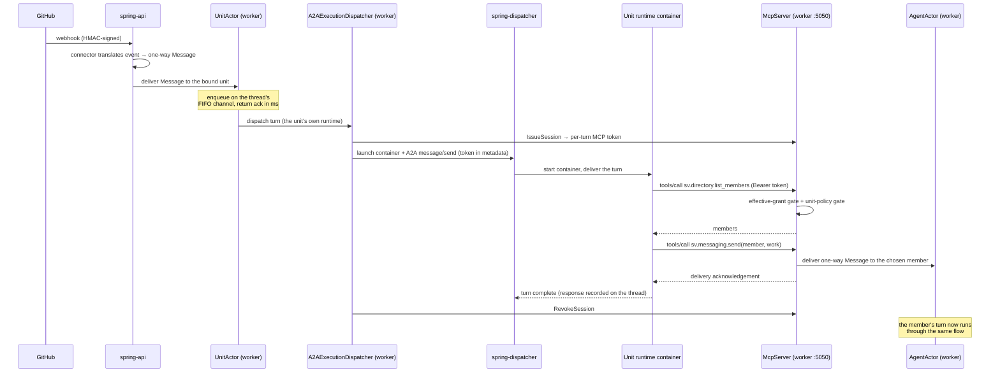
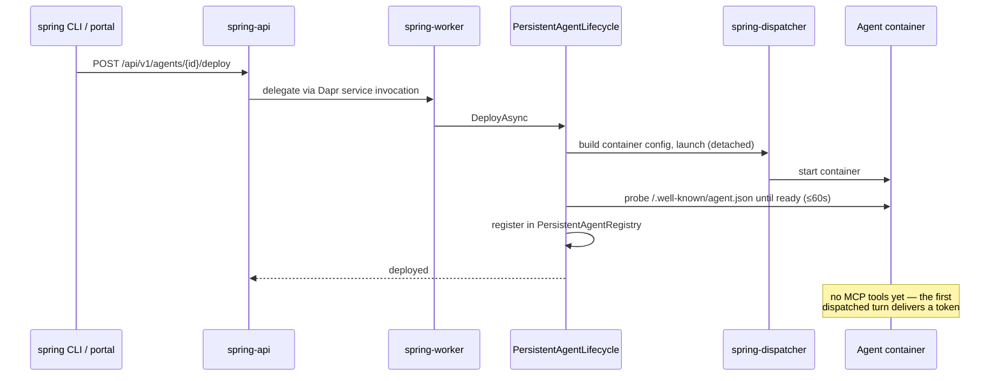
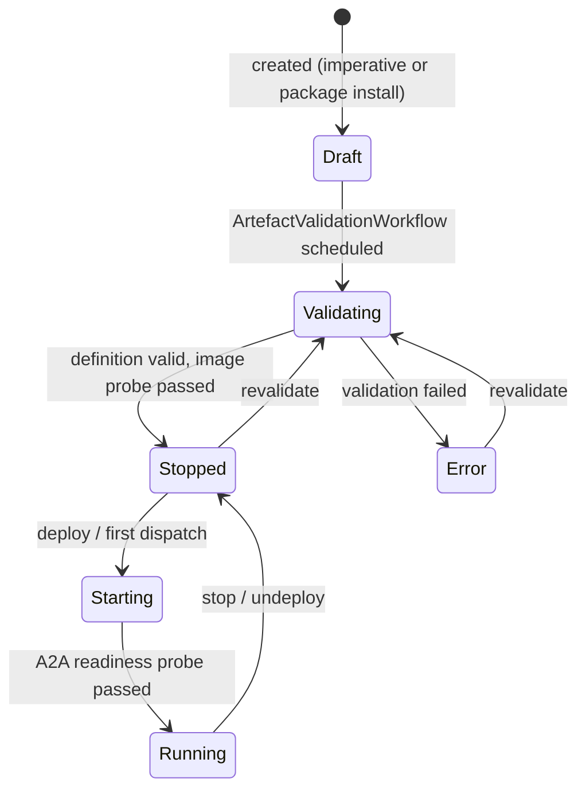

# Runtime flows

> **[Architecture index](README.md)** · Related: [Components](components.md), [Messaging](messaging.md), [Agent runtime](agent-runtime.md), [Units & agents](units-and-agents.md)

This page traces the principal end-to-end flows. Each is a sequence of hops
across the components in [Components](components.md). If you want to know "what
actually happens when X", start here.

---

## 1. Connector event → routing turn → dispatch → tool call

This is the central flow: an external event arrives, the platform delivers it to
a unit, the unit's runtime runs and decides to hand the work to a member, and
that member runs with its full tool surface.



Key properties:

- **The unit's own runtime runs.** There is no platform routing layer — the unit
  is an agent, and its runtime decides what to do with the inbound message
  ([ADR-0053](../decisions/0053-units-are-agents-and-one-way-delivery.md)).
- **"Delegation" is a message.** The unit hands work to a member by *sending it a
  message* via `sv.messaging.send`. The platform has no `delegate_to` tool.
- **The MCP token is per-turn.** It is issued at dispatch start, delivered in the
  A2A `message/send`, and revoked at turn-end. A turn with no inbound context
  (a just-deployed, never-dispatched agent) has no MCP tools.
- **Every `sv.*` tool call is gated** by the effective-grant gate and unit policy
  (see [Messaging](messaging.md) and [Security](security.md)).

---

## 2. Message delivery

What happens inside `sv.messaging.send` / `sv.messaging.multicast`. Delivery
returns a **delivery acknowledgement** — the message reached the mailbox — never
the recipient's reply ([ADR-0053](../decisions/0053-units-are-agents-and-one-way-delivery.md)).

```mermaid
sequenceDiagram
    participant RT as Calling runtime
    participant MCP as McpServer
    participant MDS as MessageDeliveryService
    participant HOP as ThreadHopActor
    participant TA as Target actor

    RT->>MCP: tools/call sv.messaging.send(recipients, message)
    MCP->>MDS: invoke (caller, upstream thread, messageId from session)
    MDS->>MDS: validate each recipient — tenant, not self, routable (rejects connector://)
    MDS->>HOP: increment hop counter (once per call)
    HOP-->>MDS: count (rejected if past the limit)
    MDS->>TA: enqueue Message on the shared thread's FIFO channel (one per recipient)
    Note over TA: fast enqueue + detached dispatch;<br/>returns in milliseconds
    TA-->>MDS: durably enqueued
    MDS-->>MCP: per-recipient delivery acknowledgements
    MCP-->>RT: ack (or a synchronous tool error)
```

Delivery is synchronous with bounded retry — there is no delivery queue. The
**fast-enqueue invariant** keeps it deadlock-free: an actor enqueues and returns
in milliseconds, never awaiting the recipient's runtime, so `A → B → A` is two
fast enqueues, not a turn-based-actor deadlock.

---

## 3. Persistent-agent deploy

A persistent agent is launched once and kept alive across turns. Deploy is
accepted by the front door and delegated to the worker
([ADR-0054](../decisions/0054-one-mcp-server-one-execution-host.md)).



Deploy issues **no** MCP session — there is no turn to authorise. The first
dispatched turn (flow 1) issues the per-turn token. `PersistentAgentRegistry`
health-checks the container and restarts it if it goes unhealthy; see
[Deployment](deployment.md).

---

## 4. Agent / unit lifecycle

Creating an agent or unit runs a validation workflow before the entity can run.



Validation runs as a **Dapr Workflow** (`ArtefactValidationWorkflow`), not as an
actor — it pulls the image and runs an in-container conformance probe as
durable activities ([ADR-0024](../decisions/0024-unit-validation-as-dapr-workflow.md)).
A unit and a leaf agent share this lifecycle; a unit additionally validates its
member graph. See [Units & agents](units-and-agents.md) for the full state DAG,
and [Agent runtime](agent-runtime.md) for the image conformance contract.

---

## 5. Connector outbound

An agent acts on an external system by invoking a connector **skill** — a tool in
its runtime's tool surface — not by sending a message to the connector. A
connector is a non-routable bridge ([ADR-0045](../decisions/0045-connector-domain-agnostic-platform.md)).

For GitHub specifically, the agent typically runs `gh` / `git` directly inside
its container; the connector's role on the outbound side is the label-roundtrip
subscriber that applies writes off the activity stream. See [Connectors](connectors.md).
