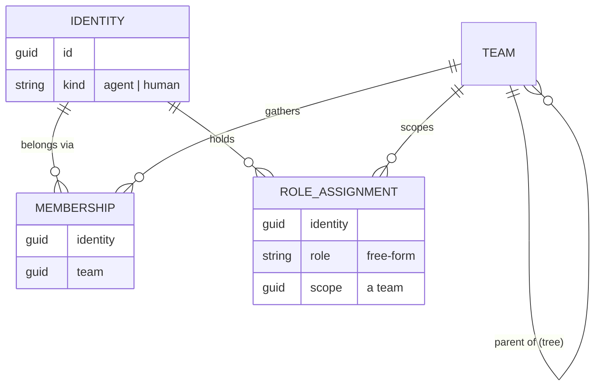

# 0070 — Subjects: Agent, Human, Team

- **Status:** Accepted (2026-07-31) — core decisions (§§1–8) are the direction ruled on [#3245](https://github.com/cvoya-com/spring-voyage/issues/3245); the resolution-and-policy semantics in §9 are recorded as proposed defaults, confirmed or adjusted at review of this record. **Supersedes [0017](archive/0017-unit-is-an-agent-composite.md)** (archived) and the unit-as-agent portions of [0053](0053-units-are-agents-and-one-way-delivery.md); **rebases [0062](0062-tenant-user-human-explicit-binding.md)** (Hat model retired; routable-`From` rule carried forward), **[0046](0046-unified-members-grammar.md)** (`- team:` replaces `- unit:`; human declarations become slots), and **[0044](0044-team-role-vs-platform-role.md)** (role orthogonality restated); **amends [0036](0036-single-identity-model.md)** and **[0040](0040-actor-state-ownership-matrix.md)** (actor kinds and state homes). First of a four-record stack: interactions ([#3249](https://github.com/cvoya-com/spring-voyage/issues/3249)), interaction ledger ([#3250](https://github.com/cvoya-com/spring-voyage/issues/3250)), and shared artifacts ([#3251](https://github.com/cvoya-com/spring-voyage/issues/3251)) are forthcoming companion records.
- **Date:** 2026-07-31
- **Related ADRs:** [0017](archive/0017-unit-is-an-agent-composite.md) — the composite pattern this record retires; [0053](0053-units-are-agents-and-one-way-delivery.md) — the one-way delivery substrate, which stands; [0062](0062-tenant-user-human-explicit-binding.md) — the Hat model retired here; [0046](0046-unified-members-grammar.md) / [0044](0044-team-role-vs-platform-role.md) — members grammar and role axes, rebased here; [0036](0036-single-identity-model.md) — Guid identity, unchanged and load-bearing; [0040](0040-actor-state-ownership-matrix.md) — state ownership, amended; [0030](0030-thread-model.md) — the participant-set conversation record selectors resolve into; [0021](0021-spring-voyage-is-not-an-agent-runtime.md) — the platform-is-not-a-runtime rule teams inherit.
- **Related docs:** [`docs/product/vision.md`](../product/vision.md) and [`docs/product/ux-vision.md`](../product/ux-vision.md) — the product and UX vision driving the redesign, whose [#3247 requirements](https://github.com/cvoya-com/spring-voyage/issues/3247#issuecomment-5156012565) this record folds in; [`docs/architecture/units-and-agents.md`](../architecture/units-and-agents.md), [`docs/concepts/units.md`](../concepts/units.md), [`docs/concepts/humans.md`](../concepts/humans.md), [`docs/architecture/open-questions.md`](../architecture/open-questions.md), [`docs/plan/v1.0-beta/areas/agent-human-team.md`](../plan/v1.0-beta/areas/agent-human-team.md).
- **Related code:** `src/Cvoya.Spring.Dapr/Actors/UnitActor.cs`; `src/Cvoya.Spring.Dapr/Data/Entities/Unit*.cs`; `src/Cvoya.Spring.Core/Units/*`; `src/Cvoya.Spring.Core/Messaging/Address.cs`; `src/Cvoya.Spring.Core/Agents/IExecutionConfigInheritanceResolver.cs`; `src/Cvoya.Spring.Dapr/Agents/ExecutionConfigInheritanceResolver.cs`; `src/Cvoya.Spring.Core/Units/IHatReachabilityService.cs`; `src/Cvoya.Spring.Dapr/Units/HatReachabilityService.cs`; `src/Cvoya.Spring.Dapr/Skills/SvDirectorySkillRegistry.cs`.
- **Related issues:** [#3247](https://github.com/cvoya-com/spring-voyage/issues/3247) (this record); [#3245](https://github.com/cvoya-com/spring-voyage/issues/3245) (plan of record); [#3249](https://github.com/cvoya-com/spring-voyage/issues/3249) / [#3250](https://github.com/cvoya-com/spring-voyage/issues/3250) / [#3251](https://github.com/cvoya-com/spring-voyage/issues/3251) (companion records).

## Context

The platform grew around one overloaded concept. A **unit** was simultaneously
three different things:

1. **An organizational grouping** — a named collection of members, nested
   recursively, carrying roles, expertise, and a boundary.
2. **An executing participant** — an agent with its own runtime, model, mailbox,
   lifecycle, and container ([0017](archive/0017-unit-is-an-agent-composite.md),
   re-baselined by [0053](0053-units-are-agents-and-one-way-delivery.md)).
3. **A policy and resource scope** — the home of secrets inheritance, budgets,
   connector bindings, permissions, and recursive policies.

The fusion was deliberate — "a unit is an agent that has children" bought a
uniform dispatch dimension — but three release cycles of dogfooding show each
role paying for the other two:

- **The grouping role does not want a lifecycle.** A unit's Started/Stopped
  state was never authoritative on the message path; stopped units kept
  receiving, dispatch resurrected them, and the portal fabricated status. There
  is nothing meaningful to "stop" about an organizational grouping.
- **The participant role forced identity workarounds.** Because humans joined
  *units*, one person acquired one `Human` row per context — the **Hat** model
  ([0062](0062-tenant-user-human-explicit-binding.md)) — and the platform grew
  a reachability gate, a disambiguation-label algorithm, per-Hat inbox lanes,
  and a from-selector to manage the multiplication. Dogfood runs showed agents
  mis-routing between Hats and teams burning turns reconciling that two Hats
  were the same person.
- **The scope role dragged execution config into the graph.** Membership-driven
  execution-config inheritance (0053 §6) produced multi-parent conflict
  detection, a resolver (`ExecutionConfigInheritanceResolver`), and manifest
  surface — machinery for a question ("which parent's model do I run?") that
  only exists because a grouping was also a runtime.

The redesign ruled on [#3245](https://github.com/cvoya-com/spring-voyage/issues/3245)
splits the fused concept into three subjects with sharp contracts, and lands as
four records. **This record owns the subjects**: who exists, how identity,
membership, and roles relate, and what an address can say. The **interactions**
record ([#3249](https://github.com/cvoya-com/spring-voyage/issues/3249)) owns
message semantics and the delivery contract; the **interaction ledger** record
([#3250](https://github.com/cvoya-com/spring-voyage/issues/3250)) owns history,
memory, and execution continuity; the **artifacts** record
([#3251](https://github.com/cvoya-com/spring-voyage/issues/3251)) owns shared
work products. Where this record touches delivery or history it states the
subject-side requirement and defers the contract to the companion record.

## Glossary

| Term | Definition |
|---|---|
| **Agent** | An AI individual: stable identity, executes on a runtime, sends and receives messages, owns memory. |
| **Human** | A human individual: stable identity, sends and receives messages. No runtime, no platform-managed memory. |
| **Team** | A recursive organizational, policy, and resource scope. Not a participant: no mailbox, no runtime, no lifecycle, never an author or recipient. |
| **Identity** | The unique, stable identifier (a `Guid`, per [0036](0036-single-identity-model.md)) of one agent or one human. The only routable terminus. |
| **Membership** | The `(identity, team)` relation: this agent or human belongs to this team. Role-less membership is first-class. |
| **Role assignment** | The `(identity, role, scope)` relation: this identity holds this free-form role within this team scope. 0..N per identity; multiple within one team allowed. |
| **Member** | An agent or human that belongs to a team — short for *team member*; the word always covers both kinds. Never a platform role. |
| **Platform role** | A human's deployment-level access role — **user**, **tenant administrator**, or **deployment administrator** — driving which surfaces they get. Orthogonal to team-scoped role assignments. |
| **Address** | A parsed expression naming a message target. Either a **direct address** or a **selector**. |
| **Selector** | An audience expression — a role within a team, or a team (optionally recursive) — statically non-routable, resolved to identities at send time. |
| **Policy scope** | The constraint-and-context surface a team applies to work performed by its members: allowlists, budgets, tool availability, instruction fragments. Never a grant of authority by itself. |

## Decision

### 1. Three subject concepts, one participant contract

The platform models exactly three top-level subject kinds:

- **Agent** — an AI individual. Stable identity, executes (runtime, model,
  container), sends and receives messages, owns memory.
- **Human** — a human individual. Stable identity, sends and receives messages.
- **Team** — a recursive organizational, policy, and resource scope.

**Teams are not participants.** A team has no mailbox, no runtime, and no
lifecycle — there is nothing to start or stop and no container to run. A team
never appears as the author or the recipient of a message in history. Messaging
*at* a team is expressed with a selector (§3), which resolves to the concrete
agent and human identities the message actually reaches.

Rejected: keep teams agent-shaped (the [0017](archive/0017-unit-is-an-agent-composite.md)/[0053](0053-units-are-agents-and-one-way-delivery.md)
status quo). The uniform dispatch dimension was elegant, but it priced every
grouping as a runtime: per-turn launcher cost for pure groupings, lifecycle
states with no enforceable meaning, and a "the team itself answered" ambiguity
in history. A grouping that needs a voice gets one honestly: create an agent,
make it a member. Coordination behaviour is an agent's job, per
[0021](0021-spring-voyage-is-not-an-agent-runtime.md) — the platform does not
grow a team-brain.

Rejected: teams as routable group mailboxes (a `team://` recipient the platform
fans out behind). That re-creates the platform-side orchestration layer 0053
deleted, and makes history lie — the recorded recipient would be an entity that
never read anything. Selectors keep audience expression *and* keep history
literal: what was resolved, who received.

### 2. Identity, membership, and role assignment are three separately managed relations

- **Identity** is unique and stable per agent and per human
  ([0036](0036-single-identity-model.md) is unchanged: one `Guid`, display
  names presentation-only). Identity is the **only routable terminus** — every
  delivered message terminates at agent and human identities, never at a team
  or a role.
- **Membership** is `(identity, team)`. It says "belongs here" and nothing
  more. **Role-less membership is first-class**: an agent or human can be on a
  team without holding any role, and gains whatever the team's policy scope
  provides to members.
- **Role assignment** is `(identity, role, scope)`. An identity holds 0..N role
  assignments; several within the same team are allowed ("fact-checker" and
  "archivist" on the editorial team). Role names are **free-form** — the
  platform ships no role vocabulary.

Roles are **descriptive and resolvable**: they answer "who is the fact-checker
here?" for other subjects and for selectors (§3). Roles **grant nothing**.
Authorization is a separate, fail-closed policy layer that reads whatever
relations it needs; holding a role never implies permission, and accumulating
roles never accumulates privilege (§9.5).

**Platform roles are the other axis, now named.** A human's deployment-level
access is a **platform role** — **user**, **tenant administrator**, or
**deployment administrator** — and platform roles drive *surface composition*:
which portals and focused views a human gets, with the CLI compartmentalized
identically ([`ux-vision.md`](../product/ux-vision.md)). One human may hold
several at once (§10). Platform roles are not relations to teams and never
appear in an address or selector; they are orthogonal to this section's
role-assignment relation ([0044](0044-team-role-vs-platform-role.md) §1,
restated with the taxonomy now named). **"Member" is never a platform role**:
the word means *team member* — an agent or human with a membership — and
always covers both kinds.

**Cloning creates a new individual; moving preserves one.** Cloning an agent
mints a **new identity** — never a second address for the progenitor. The
clone starts with a copy of the progenitor's memories at the moment of
cloning and diverges thereafter; the memory-copy mechanics are the ledger
record's ([#3250](https://github.com/cvoya-com/spring-voyage/issues/3250)).
Moving a member between teams is the inverse case: membership changes,
identity and memories travel unchanged. Neither operation ever creates a
Hat-style contextual identity (§5).

**Organizational evolution is a runtime operation.** Changing these relations
— growing and shrinking teams, moving members, cloning agents, assigning and
removing roles — is available at runtime to **authorized subjects, agents
included**, and every change is a recorded act (history contract:
[#3250](https://github.com/cvoya-com/spring-voyage/issues/3250)). Rebalancing
an organization against current priorities and budget is collaboration, not
administration. The dividing line ([`vision.md`](../product/vision.md)):
*organizational composition* — who is on which team, when to clone, when to
rebalance — is runtime and subject-performable; *mechanical configuration* —
policies, instructions, credentials — remains administrative.

**Interaction authorization is expressible from the start.** The policy
layer's required vocabulary includes **"who may interact with whom"** — not
"who may task whom": the platform gates the interaction; what an interaction
*means* is domain semantics. Not everyone may approach every agent. The
expression is designed now, and it fails closed (§10) even where enforcement
lands in a later band.

Rejected: fold roles into membership (a `roles: []` column on the membership
row, the [0046](0046-unified-members-grammar.md) shape). It couples two
lifecycles — joining a team and taking a role are different acts by different
actors at different times — and makes role-less membership look like a
degenerate case instead of the base case. Three relations keep each question
one query with one owner.

Rejected: roles as permission bundles (RBAC). The team-role vs platform-role
split ([0044](0044-team-role-vs-platform-role.md) §1) already proved its worth;
this record restates it structurally: role assignment is directory data,
authorization is policy. Conflating them turns every package's free-form role
vocabulary into an accidental security surface.

### 3. Addressing: direct addresses and selectors

An address is either **direct** or a **selector**:

- **Direct** — targets one identity: `agent://<id>`, `human://<id>`. Routable.
- **Role selector** — "the *fact-checker* @ *team*": all identities holding
  that role assignment in that team scope.
- **Team selector** — "*team*", with a recursive flag: the team's members,
  optionally including nested teams' members.

Selectors are **audience expressions, statically non-routable**. They are
resolved at send time through **one shared resolution-and-snapshot machinery**:
resolution expands the selector to concrete identities under the policy in
force, and the send-time record captures **both the selector as written and
the resolution it produced** — "to: the fact-checker @ editorial, delivered
to these identities at that moment" — so history records who a message
actually reached. The role-relation lifecycle guarantees that record: a role later
refilled, reassigned, or eliminated **never rewrites what was recorded**
(append-only history contract:
[#3250](https://github.com/cvoya-com/spring-voyage/issues/3250)). The
delivery contract itself — ordering, retries,
acknowledgement, how a resolved audience maps onto conversations — belongs to
the interactions record ([#3249](https://github.com/cvoya-com/spring-voyage/issues/3249));
this record fixes only what a selector *means* and that resolution is shared,
not per-surface.

**Role resolution is kind-agnostic.** A role may be filled by an agent or a
human; senders address the role without knowing or caring which. This is the
structural form of the platform's human-in-the-loop stance: swapping a human
fact-checker for an agent fact-checker changes a role assignment, not any
sender.

Rejected: separate resolution machineries per surface (API send path, agent
tool surface, connector inbound). Divergent expansion rules across surfaces is
exactly the class of drift the Hat reachability gate exhibited; one machinery,
one snapshot shape.

### 4. Team topology is a tree, rooted at the tenant

- Every team has **exactly one parent**: another team, or the tenant root.
  The topology is acyclic **by construction** — no cycle detection needed.
- **Subjects are M:N across teams**: one agent or human can be a member of any
  number of teams anywhere in the tree.
- **Multi-parent (DAG) teams are deferred**, with a recorded revisit trigger
  (see Revisit triggers): a real matrix-organization need where mirroring one
  team's roster into a second parent is demonstrably worse than membership
  M:N. Until then, "this group serves two parents" is modelled as two teams
  sharing members.

Rejected: DAG topology now. Multi-parent grouping doubles the cost of every
recursive question (policy composition, selector recursion, resource
inheritance walk) and the prior model's multi-parent execution-config conflict
machinery is the cautionary tale — built, complex, and consumed by nobody.

### 5. Hats are retired; package human declarations become slots

**One canonical routable Human per TenantUser.** The multi-Hat model of
[0062](0062-tenant-user-human-explicit-binding.md) — many `Human` rows per
authenticated user, each a contextual identity — is retired, together with its
support machinery: the reachability gate, disambiguated labels, per-Hat inbox
lanes, and from-selection. This record **rebases 0062**, carrying two of its
rules forward unchanged:

- `Message.From` carries **routable schemes only**.
- `tenant-user://` stays a **non-routable audit context** — the authenticated
  principal in the activity envelope, never a message-domain address.

Contextual presentation ("known as the reviewer here") moves onto the
membership and role-assignment relations, where it always belonged — it is
context *about a person in a team*, not a second person.

**Package human declarations become slots.** A package declares the human
positions a team needs (each slot naming roles, expertise, notification
interests). **Instantiation binds each slot to a real identity.** One human may
take several slots; the single-user install default is that the sole tenant
user takes all of them — producing **one membership + N role assignments**,
not N phantom identities. A package may opt into a **distinct-principals
constraint** ("these two slots must be different people" — e.g. author and
approver); instantiating such a package on a single-user install **fails with
a clear error** naming the constraint, rather than silently collapsing it.

Rejected: keep Hats as an opt-in presentation feature. Two identities for one
person is the bug, not the feature — the dogfooded failure mode was agents
(and their teammates) unable to see that two addresses were one accountable
person. Presentation context is relation data; identity is singular.

### 6. Execution configuration is intrinsic to the agent

An agent's execution configuration — runtime, model, image, hosting — lives
**on the agent** and nowhere else. Deleted with this record:

- Per-membership model overrides and membership-driven execution-config
  inheritance (0053 §6), including `IExecutionConfigInheritanceResolver` /
  `ExecutionConfigInheritanceResolver` and the manifest surface for inherited
  execution fields.
- The multi-parent conflict-detection rules that existed only to arbitrate
  inheritance.

A team's policy scope interacts with execution in exactly two ways:

- **Constrain** — model allowlists, budget ceilings, and similar limits a team
  applies to work performed in its scope.
- **Inject context** — tool availability and team-wide instruction fragments
  contributed to members' turns.

A team never configures an agent's identity or runtime. "Which model does this
agent run?" has a one-line answer (the agent's own config, within whatever
constraints apply); it is never a graph walk.

Rejected: keep inheritance as a defaulting convenience ("new members pick up
the team's model unless set"). Defaulting is a *creation-time* affordance —
templates and the create surfaces can prefill — not a live dependency from
graph shape to runtime behaviour. The live dependency is what made
re-parenting a dispatch-affecting operation.

### 7. Teams own resources without being participants

A team is the home of shared resources: **secrets** (scope-based resolution
replaces parent-chain inheritance), **packages** (what is installed into the
team), **budgets**, **connector bindings**, **dashboards**, and **artifacts**.
Owning a resource requires none of the participant contract — no mailbox, no
runtime — only scope: members reach team resources per policy; nested teams'
reach into ancestors is governed the same way.

The artifact contract — what an artifact is, versioning, who may read and
write — is the forthcoming artifacts record
([#3251](https://github.com/cvoya-com/spring-voyage/issues/3251)); this record
establishes only that the owning scope is the team.

### 8. `Unit` is eliminated everywhere — clean cut

The `Unit` concept is removed from every surface: schema, API, CLI, portal,
package YAML, and platform-generated prompts. This is a **clean cut**:

- **No alias.** No `unit://` scheme mapping to teams, no `/units` API alias,
  no `spring unit` shim. Old shapes fail with structured errors naming this
  record.
- **No data migration.** Alpha-era state does not carry into beta; release
  notes document the reset.
- **Package grammar:** `- team:` replaces `- unit:` in the
  [0046](0046-unified-members-grammar.md) members grammar; `kind: Team`
  replaces `kind: Unit`. Composition rules stay **uniform across all package
  artefact types** — teams, agents, skills, and templates share the same
  cross-package reuse grammar with no per-type carve-outs.

Rejected: transitional alias or dual-read window. The alpha licence to break
is the cheapest it will ever be, and a `unit`→`team` alias would freeze the
old fused semantics into the new vocabulary — precisely the confusion this
record exists to end.

### 9. Resolution and policy semantics (proposed defaults)

These defaults are recorded with rationale and the rejected alternative; they
are the reviewable subset of this record.

**9.1 Empty resolution is a hard error.** A team selector over a memberless
team, or a role selector with zero fulfillers, fails the send synchronously
with a structured error to the sender. *Rejected: silent drop or quiet
delivery-to-nobody* — the platform's worst historical bugs were messages that
disappeared without a sender-visible failure.

**9.2 Multi-fulfiller role sends deliver to all.** A role selector resolving
to several identities delivers to every one of them; the snapshot records the
full audience. An "any/one" mode (deliver to one fulfiller — load-balancing or
first-responder semantics) is recorded as an **open question**, not built
(see [`open-questions.md`](../architecture/open-questions.md)). *Rejected:
building any/one now* — it needs a claim/ack protocol that belongs to the
interactions record, and no current package needs it.

**9.3 Unqualified role sugar resolves only when unambiguous.** A bare role
reference (no team qualifier) resolves iff exactly one match exists across the
sender's teams; otherwise the send fails with an error listing the candidate
`role @ team` qualifications. *Rejected: picking a "nearest" team by some
proximity rule* — implicit precedence rules are how mis-routing hides.

**9.4 Selector recursion is symmetric and fail-closed.** Role and team
selectors mirror each other: both support scoping to one team or recursing
into nested teams. A nested team's own policy can **constrain expansion
initiated from an ancestor** — a team may declare that ancestor-initiated
selectors do not expand into it — and the constraint fails closed. *Rejected:
unconditional recursive expansion* — it makes every sub-team's roster
implicitly addressable by every ancestor forever, which contradicts teams
being the policy boundary.

**9.5 Policy composition across multiple teams.** For a subject in several
teams: instruction fragments compose **additively with team attribution**
(the turn context says which team contributed what); tool grants compose
additively; **explicit denies win** over any grant; and **role accumulation
never becomes privilege union** — holding roles in two teams grants nothing
that membership in each team does not already provide. *Rejected: precedence
by team "priority"* — ordering teams invents a global hierarchy the tree does
not have between siblings and hides why a tool was present.

**9.6 Team rename, delete, archive; membership history.** Rename is free —
identity is the id ([0036](0036-single-identity-model.md)); nothing cascades.
Delete **forces an explicit decision about owned resources** (§7): the
operation names what the team owns and requires a disposition, never a silent
cascade. Membership and role-assignment history is preserved in the
interaction ledger ([#3250](https://github.com/cvoya-com/spring-voyage/issues/3250)) —
**past deliveries must remain explicable**: "why did this identity receive
that message?" is answerable from the ledger even after the membership or the
team is gone. *Rejected: hard delete with cascading resource removal* — it
destroys the explanation for every historical resolution snapshot that named
the team.

**9.7 Roster disclosure: store the truth, project per policy.** The relations
store the full truth; what a given subject *sees* of a team's roster is a
policy-governed projection. Two projections ship first: **full disclosure**
(the single-user install default) and **self-only** (a subject sees its own
memberships and assignments). The projection seam is the extensibility point
for deployment-specific disclosure rules. *Rejected: encode disclosure in the
storage shape* — storage that lies cannot support audit, and the ledger (§9.6)
needs the truth.

**9.8 One address grammar; selector schemes are parser-enforced non-routable.**
Selectors share the URI grammar with direct addresses but use **distinct
schemes**, and the parser — not downstream validation — enforces that a
selector can never inhabit a direct-address position. A field typed "direct
address" cannot smuggle a selector, and vice versa. *Rejected: distinguishing
by payload shape or a boolean flag* — the `tenant-user://`-in-`From` incident
(0062) showed that scheme-level invariants are the ones that hold; type-level
enforcement at parse time makes the invalid state unrepresentable.

**9.9 Slot-binding validation at instantiation.** Package instantiation
validates that **every role referenced by the package's prose and
configuration resolves to at least one assignment** produced by slot binding.
A package whose instructions address "the archivist" cannot instantiate into a
team with no archivist. *Rejected: resolve-at-first-send* — it converts an
install-time authoring error into a runtime send failure days later, in
someone else's turn.

### 10. System invariants

- **The platform is never a participant.** It authors no messages, answers
  none, and intercepts none. There is no platform sender address. (The
  interactions record elaborates the delivery-side consequences; the invariant
  is stated here because subjects are the exhaustive list of who *can* speak.)
- **The single-user install is the degenerate case of the multi-user model** —
  one tenant user taking every slot and holding all three platform roles at
  once, cleanly — never a forked code path. Every multi-user mechanism (slot
  binding, disclosure projection, distinct-principals constraints) must
  collapse gracefully to one person.
- **Authorization is fail-closed and separate.** No relation in this record
  (membership, role assignment) grants authority; absence of an explicit
  policy answer is a denial.

### 11. Placeholders — need, requirements, sketch (deliberately not decided)

Per the project's incremental-design stance, these are recorded as placeholders,
not decisions:

- **Federation / remote execution.** *Need:* subjects whose execution or
  identity home is another deployment. *Requirements:* identity remains the
  routable terminus; teams remain non-participants across the boundary;
  resolution snapshots stay explicable. *Sketch:* a remote identity kind
  resolved through the same directory seam; nothing in this record's relations
  assumes locality.
- **Role catalogues.** *Need:* authoring affordances (autocomplete,
  validation) over free-form role names as the package ecosystem grows.
  *Requirements:* free-form stays legal; a catalogue is advisory metadata, not
  a constraint on assignment. *Sketch:* per-package or per-tenant declared
  vocabularies surfaced by the authoring tools.
- **DAG teams.** *Need + trigger:* see Revisit triggers. *Requirements if
  ever built:* cycle rejection at write time; policy composition and selector
  recursion defined over the lattice, not ad hoc. *Sketch:* membership stays
  M:N (unchanged); only the team-parent relation would widen.

## Supersessions and rebasing

| Record | Effect of this record |
|---|---|
| [0017](archive/0017-unit-is-an-agent-composite.md) | **Superseded; archived.** The composite "a unit IS an agent" pattern is retired with the unit concept. |
| [0053](0053-units-are-agents-and-one-way-delivery.md) | **Partially superseded.** §1 (unit-is-agent), the unit framing of §2, and §6 (execution-config inheritance) are superseded. §§3–5 — one-way delivery, delivery-acknowledgement tools, the fast-enqueue invariant, non-routable connectors — stand, pending the interactions record ([#3249](https://github.com/cvoya-com/spring-voyage/issues/3249)). |
| [0062](0062-tenant-user-human-explicit-binding.md) | **Rebased.** The Hat model (§§1–2, 5–6, 11) is retired: one canonical routable Human per TenantUser. §3's routable-`From` rule and §10's non-routable `tenant-user://` audit context carry forward. |
| [0046](0046-unified-members-grammar.md) | **Rebased.** `- team:` replaces `- unit:`; `- human:` declarations become slots bound at instantiation. The single `members:` list, key-prefix discriminator, and multi-valued roles/expertise stand. |
| [0044](0044-team-role-vs-platform-role.md) | **Restated.** §1's team-role vs platform-role orthogonality becomes structural: role assignment is a directory relation; authorization is a separate fail-closed layer. The platform-role axis gains its named taxonomy — user / tenant administrator / deployment administrator (§2). |
| [0036](0036-single-identity-model.md) | **Amended.** The actor-kind enumeration loses `unit`; `team` is a subject kind but not an actor. Guid identity, presentation-only display names, and graph-as-addressing-fabric are unchanged. |
| [0040](0040-actor-state-ownership-matrix.md) | **Amended.** Unit-scoped state homes (`unit_*` tables, `Unit:*` actor-state keys, `UnitActor`) are re-homed to team relations or deleted; teams, not being actors, have no actor state. |

## Consequences

**Easier:**

- One sentence per question: *who is this?* → identity; *who belongs here?* →
  membership; *who is the fact-checker?* → role assignment; *what does this
  agent run?* → the agent's own config; *what may happen here?* → the team's
  policy scope.
- "One accountable person, one identity" ends the Hat-era failure class:
  mis-routing between contextual identities, disambiguation machinery, and
  agents unable to connect two addresses to one teammate.
- Groupings become free: creating, nesting, and reorganizing teams touches no
  runtime, no container, no lifecycle.
- Role-addressed collaboration ("send to the fact-checker") works without the
  sender knowing whether a human or an agent fills the seat — the swap is a
  role-assignment edit.
- Organizational evolution — growing, shrinking, and reorganizing teams,
  cloning agents — is a recorded runtime capability of authorized subjects,
  agents included, not a detour through an administrative surface.
- History stays explicable by construction: selector snapshots plus ledger-
  preserved membership history answer "why did they get this?" forever.

**Harder / paid deliberately:**

- The rename is everywhere: schema, API, CLI, portal, package YAML, prompts,
  docs. The clean cut concentrates the cost in one release instead of
  amortizing it across an alias's indefinite half-life.
- Alpha-era state is reset; operators reinstall packages. Release notes carry
  the reset notice.
- A team that previously "answered as itself" needs an explicit member agent
  with that charter; operators who relied on the unit's own runtime re-model
  it as one more (visible, configurable) agent.
- Packages using the distinct-principals constraint do not instantiate on
  single-user installs — correct, but a new authoring consideration.

**Not abstracted (deliberately):**

- No "any/one" role-delivery mode (§9.2 — open question).
- No persona-level addressing — distinct routable aliases per slot are **not
  built**; recorded as an evidence-gated option (see Revisit triggers).
- No DAG teams (§4, §11).
- No role vocabulary enforcement (§11).
- No platform-modelled member–artifact relationship roles — involvement of
  members with an artifact is domain vocabulary, struck at the vision
  session; [#3265](https://github.com/cvoya-com/spring-voyage/issues/3265)
  records the deferred exploration of relationship primitives.

## Revisit triggers

- **DAG teams:** a concrete matrix-organization deployment where modelling a
  shared group as two teams with mirrored membership demonstrably fails —
  e.g. policy or resource scoping that must be single-homed across two
  parents. A revisit widens only the team-parent relation (§11).
- **Persona-level addressing:** repeated, evidenced operator demand to be
  *addressed as* distinct personas per slot (beyond presentation context on
  the relations) — for example, external-channel identity separation that
  membership-level display context cannot express. A revisit must preserve
  "one accountable identity" in the audit trail.
- **Any/one role delivery:** a package whose workflow needs single-fulfiller
  claim semantics (dispatch queues, on-call rotation). Design lands in the
  interactions record's frame, not as a selector variant alone.
- **Role catalogues:** the free-form vocabulary produces real cross-package
  collision pain (same word, incompatible meanings) at catalogue scale.
