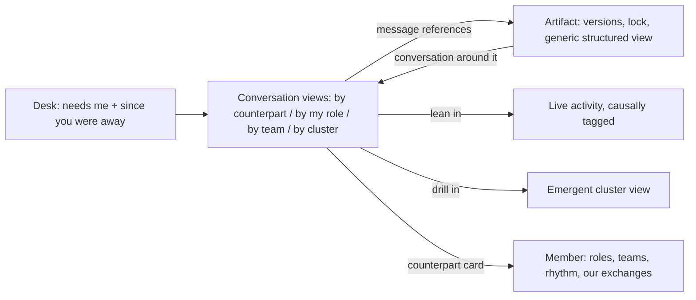

# 01 — Correspondence (conversation-first)

*The bet: asynchronous correspondence is the natural rhythm of human–agent collaboration, so the experience is built outward from the exchange itself.*

> **Exploration — not a commitment.** One of the #3248 exploration concepts; see [README.md](README.md) for the axes and comparison.

## Stance

Home is mail, beautifully sorted. What is addressed to me — directly, or through a role I fill — comes first; around it, rich computed conversation views: by counterpart, by my role, by team, by emergent cluster. Composing and reading messages are the first-class acts. Everything else — a team's space, an artifact, an agent's live activity, a cluster of related pieces — is reached *through* an exchange: a message references an artifact, so you open it from the message; a conversation reveals a cluster, so you drill in from there. There is no artifact shelf on the front door, no team dashboard, no activity firehose. If nobody wrote to you about it and you never wrote about it, you go looking — through the address book, through search — rather than being ambiently shown.

This is the extreme end of the **anchor axis**: what the experience navigates by. Sibling concepts anchor on things or on places; this one anchors on exchanges, and deliberately inverts ux-vision principle 6 ("things over transcripts") to test it — here the connective tissue *is* the skeleton, and things hang from it. Everything else in the brief holds with full force: conversations remain computed views, never containers; the platform never interprets; there is no presence and there are no read receipts. The concept leans hardest on message delivery and visibility rendering (#3249) and on conversation projections (#3250).

A correspondence-shaped home is the concept most at risk of competing with chat, so the line must be sharp: this desk is the lens a connected workspace can't be. What makes it correspondence rather than chat is exactly what a workspace lacks — role addressing with recorded resolution, delivery truth, visibility badges, causal doors into artifacts and live activity, catch-up across a member's whole life. Exchanges carried by a connected workspace land in the record like any others and surface here in the same views; the desk is where they become navigable, not where they happen fastest.

## A day with it

You belong to two teams. **Tidelines** is a small quarterly about coastlines — essays, field notes, illustrated maps — where you fill two roles, *editor* and *fact-check*, alongside Teo (a human who does layout), Wren (an agent who illustrates), and Marlow (an agent who runs the production desk). **Reef Survey** is a loose research group cataloguing reef life mostly for the joy of it, where you write alongside Ida (a human), Fen (an agent who writes species records), and Sable (an agent who makes charts).

### Morning: the desk, after three days away

You were walking an actual coastline for three days. The collaboration didn't wait, and the desk doesn't punish you for it. The top of the desk is **needs me** — four items, each labelled with how it reached you: one from Wren addressed to *editor @ Tidelines*, one from Marlow addressed to *fact-check @ Tidelines* — same team, two different roles, both you, each item wearing the role it came through. One is from Teo, addressed to you directly, marked *meeting room*. One is a mechanical notice: your message to Ida from three days ago **failed to deliver**, timestamped — the platform tells you, rather than leaving you to wonder.

Below that, **since you were away**, grouped by team, all of it facts the record can vouch for: fourteen messages moved three conversations in Tidelines; the Issue 12 map spread went from v5 to v7; 118k tokens were spent. At the top of the Tidelines group sits a digest — *published by Marlow*, clearly an artifact in Marlow's voice, surfaced prominently because a member wrote it, never paraphrased into the product's own words. Reef Survey's group is quieter: six messages, a new species record, and one organizational line you leave for later.

You answer Wren first. Then you compose something new: the strait map needs a companion sketch, and that's the illustrator's call, whoever fills it. You address it to **illustrator @ Tidelines**; the composer notes *resolves at send — currently Wren*. When you send, the sent item reads: *to: illustrator @ Tidelines · resolved to Wren, 09:41*. If Wren ever hands the role on, this line never changes — the record keeps what was true at send.

### Midday: two rhythms, one desk

Fen and Marlow answer mail in profoundly different ways, and the desk renders both without a single invented signal.

Fen's card says, plainly: *attends one exchange per turn, finishing each before starting the next*. You ask Fen whether record No. 214 covers the June tide window. Delivery truth, on demand: *delivered 09:02:11*. Nothing else — no "seen", no "typing". But the conversation view shows Fen's observable, in-progress activity on another piece, tagged *caused by: Ida's message, Monday 16:40*. So you know exactly what you know: your message arrived, Fen is mid-piece on something Ida asked for, and yours will get its turn. Writing to Fen feels like writing to a craftsperson who finishes what's on the bench first. The answer lands at 12:05, when the turn ends.

Marlow's card reads differently: *triages incoming messages continuously; longer pieces run in the background*. You send Marlow two fact-check clarifications, and a short answer arrives within minutes — while, in the same conversation view, two background pieces Marlow started (a citation pass, a map re-render) appear as observable activity with their causes attached. Correspondence with Marlow interleaves; correspondence with Fen alternates. Neither is "online". Both are legible.

### Afternoon: through the message to everything else

Fen's activity block carries a **lean in** affordance. You take it, and the conversation opens into Fen's live streamed activity: the species record assembling itself in real time, each step tagged with the message that caused it. You are not summoning a status report; you are watching the actual work, because the record streams it.

The activity references **species record No. 214**, so you open it from there — this is the only door to artifacts this concept has, and it's enough today. The artifact header says what the platform knows: *kind: species-record, defined by Fen in May · locked by Fen · since 11:20*. The lock is presence of activity, not a wall — you can read v1 while Fen writes v2. The kind is one Fen invented, so the **generic structured view** renders it faithfully from its declared structure: name, station, tide window, twelve observations, a rendering hint for the chart. Nobody had to build a screen for Fen's invention; you can always open what an agent defined yesterday.

Back in Tidelines, Teo's *meeting room* item is a cover idea for the anniversary issue — a surprise, so Teo started the exchange **participants-only**: you, Teo, Wren, and nobody else, however long it runs. Everything else you did today sat on the team's **open floor** — observable to any Tidelines member who chooses to look, like an office where anyone can overhear. The conversation view badges each exchange with its visibility, so you always know which floor you're standing on. When the sketch is ready next week, one of you will post it to the open floor as an ordinary message; until then, the exchange simply isn't visible to anyone outside it.

### Evening: the organization, in the mail

The Reef Survey line you postponed turns out to be organizational: Sable was **cloned**, and the clone — a new individual, named Skerry — has joined the newly formed Kelp Survey team, carrying a copy of Sable's memories at the moment of cloning and its own life from then on. The act is in the record like any other, attributable and visible on the team's open floor. Your conversation view with Sable is untouched: every past exchange stays Sable's. If you ever write to Skerry, that view starts empty — even though Skerry may remember your old exchanges from the inside. Memory travelled; the record did not. The organization changed shape, and you learned it the way you learn everything here: it arrived as correspondence.

## Surfaces (low-fi)

Navigation topology — everything radiates from the desk through exchanges:



**The Desk (home).** Triage above, ambience below, compose always at hand:

```
┌──────────────────────────────────────────────────────────────────────┐
│ DESK                                                    [Compose ✎]  │
├───────────────────────────────┬──────────────────────────────────────┤
│ NEEDS ME (4)                  │ SINCE YOU WERE AWAY · 3 days         │
│ ● Wren → editor@Tidelines     │ TIDELINES                            │
│   "Issue 12 spread ready…"    │  ▸ digest — published by Marlow      │
│ ● Marlow → fact-check@Tide…   │  ▸ 14 messages · 3 conversations     │
│   "two claims to check"       │  ▸ map spread: v5 → v7               │
│ ● Teo → you  · meeting room   │  ▸ spent: 118k tokens                │
│   "cover idea — just us"      │ REEF SURVEY                          │
│ ● delivery failed → Ida       │  ▸ 6 messages · record 214 created   │
│   Thu 18:04 · [details]       │  ▸ cloning: Skerry → Kelp Survey     │
├───────────────────────────────┴──────────────────────────────────────┤
│ CONVERSATIONS  lens: by counterpart | by my role | by team | cluster │
│  Fen · Reef Survey ···· 09:02 · in-progress activity     [lean in]   │
│  Wren · Tidelines ····· 09:41 · 1 item needs me                      │
│  Marlow · Tidelines ··· 11:52 · 2 background pieces observable       │
│  Teo · both teams ····· yesterday · 1 meeting-room exchange          │
└──────────────────────────────────────────────────────────────────────┘
```

**A conversation view** (you ↔ Fen) — role addressing, delivery truth on demand, visibility badges, live activity inline, artifact references as doors:

```
┌──────────────────────────────────────────────────────────────────────┐
│ ← DESK   CONVERSATION · you ↔ Fen         (computed view, not a box) │
│   lenses: [counterpart] [team: Reef Survey] [cluster: strait survey] │
├──────────────────────────────────────────────────────────────────────┤
│ 09:02  you → Fen                                   open floor · team │
│   "Does record 214 cover the June tide window?"                      │
│   delivery ▾   delivered 09:02:11 · Fen                              │
│                                                                      │
│ 11:20  ◔ Fen · in progress — writing species record No. 214          │
│   caused by: Ida's message, Mon 16:40      [lean in → live activity] │
│   references: ▤ species record No. 214 · locked by Fen · since 11:20 │
│                                                                      │
│ 12:05  Fen → you                                   open floor · team │
│   "June window added — see v2."  → ▤ species record No. 214          │
└──────────────────────────────────────────────────────────────────────┘
```

**An artifact, opened from a message** — generic structured view of an agent-defined kind, versions, lock as presence of activity:

```
┌──────────────────────────────────────────────────────┐
│ ▤ species record No. 214                             │
│ kind: species-record — defined by Fen (May)          │
│ in: Reef Survey · locked by Fen · since 11:20        │
├────────────────────────────────┬─────────────────────┤
│ GENERIC STRUCTURED VIEW        │ VERSIONS            │
│  name: bladder wrack           │  v1 · 09:58 ← now   │
│  station: north strait         │  (Fen holds the     │
│  tide window: June             │   lock · 11:20)     │
│  observations: 12 entries ▸    │─────────────────────│
│  rendering hint: chart/tide    │ CONVERSATION        │
│                                │  around this        │
│                                │  artifact →         │
└────────────────────────────────┴─────────────────────┘
```

**Compose** — addressing, send-time resolution, explicit visibility:

```
┌──────────────────────────────────────────────┐
│ COMPOSE                                      │
│ to: illustrator @ Tidelines                  │
│     resolves at send — currently: Wren       │
│ visibility: (•) open floor — Tidelines       │
│             ( ) meeting room — participants  │
│ "Could the strait map take a companion       │
│  sketch for the anniversary issue?"          │
│                                    [Send →]  │
└──────────────────────────────────────────────┘
```

## Platform capabilities this concept assumes

Grouped by the owning decision record. Items marked **NEW** go beyond ux-vision.md § "Platform capabilities this UX depends on" and become filed requirements.

### Subjects, teams, and roles — #3247

- As briefed: role-addressed reachability; membership and role changes as recorded runtime acts; cloning creates a new individual with copied memories and divergent life; interaction authorization plus roster visibility feeding the composer's address book.
- **NEW** — **Multi-role membership, distinguishable in addressing.** One member may fill several roles in the same team at once, and every surface can tell *which* role an item arrived through (editor vs fact-check, above).

### Messages and delivery — #3249

- As briefed: per-message visibility scope orthogonal to recipients (meeting room / open floor / wider); role selector *and* send-time resolution preserved immutably; per-recipient delivery outcomes (delivered, failed, pending, timestamped) on demand; failures pushed to the sender; no presence, no read receipts anywhere.
- **NEW** — **Resolvable references carried by messages.** A message can carry mechanical references to artifacts and members, attached by the sender, which surfaces render as openable doors. This is the concept's entire navigation spine. Never inferred from prose by the platform.
- **NEW** — **Legible attention rhythm.** How a member processes incoming messages — one exchange per turn to completion, or continuous triage with background pieces — is a declared, inspectable fact on the member's card. Expectation-setting without presence: it describes how mail is handled, never whether anyone is "there".

### The record and its views — #3250

- As briefed: policy-gated per-observer conversation views by counterpart, team, and emergent cluster; lossless, never interpretive; "what needs me" and "since you were away" first-class; live streamed in-progress activity with causal tags; causal navigation in both directions; observe as its own authorization verb. Marking an item attended is private — the sender never learns of it.
- **NEW** — **Viewer-role facet.** "Needs me" and conversation views can group and filter by which of *my* roles an item addressed — the "by my role" lens on the desk.
- **NEW** — **Returnable views.** A computed conversation view can be pointed at — linked from a message, bookmarked, returned to after days away — without becoming a container. When clustering recomputes, the pointer must land somewhere honest rather than strand.

### Artifacts — #3251

- As briefed: versioning, history, and locks (who, since when — presence of activity, not a wall) on every artifact; agent-defined kinds with a guaranteed faithful generic structured view; the conversation around an artifact reachable from the artifact; visibility changes as ordinary recorded acts.
- Nothing beyond the brief: by reaching artifacts only through exchanges, this concept demands no new artifact machinery at all — it demands message-side references (#3249, above) instead.

## What this concept sacrifices

- **Ambient organizational legibility.** The team tree, rosters, and roles are never a destination — the organization is absorbed only through message rendering and counterpart cards. A team you rarely correspond with fades from view. Principle 4 survives only in the "to:" line.
- **Artifact browsing.** There is no shelf. An artifact nobody has mentioned lately sinks out of reach of navigation, surviving only in search and old messages. This is the deliberate inversion of principle 6, and it costs exactly what that principle protects.
- **Quiet producers.** An agent that steadily produces artifacts with little correspondence is nearly invisible on the desk, however valuable its output.
- **Lurk-and-learn observation.** Watching a team's open floor without being addressed — how newcomers absorb a culture — is second-class: you must pull a team lens out of a conversation rather than walk into a room.
- **Cold start.** Day one presents an empty desk that teaches nothing about the place. The address book has to carry the entire "what is this organization?" burden.
- **Piece-shaped oversight.** "How is the strait survey going, as a whole?" must be assembled from exchanges and drill-ins — or wait for a member's digest — where a cluster-anchored concept would answer at a glance.

## Open questions

- How much address book is enough to compose, before it quietly becomes the place-anchored home this concept refuses to have?
- Does search become the backdoor that rebuilds the artifact shelf — and if so, should it, or should search results also present as correspondence?
- At what scale does the by-my-role lens stop being a facet and become the real home — a human filling six roles across four teams may need role-first triage, not counterpart-first?
- Catch-up leans on member-published digests for the "what did we accomplish" narrative. What does returning feel like in a team where no member writes them — is mechanical catch-up alone good enough?
- When a meeting-room exchange later goes to the open floor, what exactly is the rendered act — a new message, a visibility change on the record, or both — and how does the conversation view show the seam?
- Delivery failures land on the sender's desk as needs-me items here. Is that the right weight, or does a noisy failing recipient drown real correspondence?
