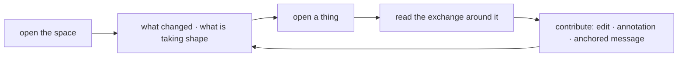

# 02 — The studio (artifact-first)

*The things being made anchor everything: home is the team's space, conversation attaches to the pieces, and the addressed-to-me tray steps back.*

> **Exploration — not a commitment.** One of the #3248 exploration concepts; see [README.md](README.md) for the axes and comparison.

## Stance

The axis this concept pushes to its extreme: **what anchors attention — the things being made, or the messages addressed to you.** Most collaboration software centers correspondence and pushes outcomes to the edge. The studio inverts that, completely and on purpose.

The bet: outcomes anchor attention. Home is the team's space — its artifacts with versions and locks, and the emergent clusters of activity forming around them. When home shows what is taking shape, "what needs me" is mostly discovered *in the context of a thing*, which is exactly where it is easiest to act on. The tray of items addressed to me still exists — attention is sacred — but it is deliberately demoted to a compact side panel: a safety net, never the front door.

The loop this concept optimizes: **open the space → see what changed and what is taking shape → open a thing → read the exchange around it → contribute** — an edit, an annotation, a message anchored to the thing. You reply from an artifact's page, not from an inbox.

Two hero features carry it: agent-defined artifact kinds opened through the faithful generic structured view — a human can always open what an agent invented yesterday — and the lock read as activity, "who, since when," never a wall. This is experience principle 6 ("things over transcripts") taken as far as it will go, and it stresses artifacts ([#3251](https://github.com/cvoya-com/spring-voyage/issues/3251)) and emergent-cluster views of the record ([#3250](https://github.com/cvoya-com/spring-voyage/issues/3250)) hardest.

## A day with it

You belong to two teams. **Almanac** makes a seasonal nature almanac — essays, illustrations, maps. You fill two roles there, *illustration editor* and *fact checker*, alongside a human co-editor and two agents: Wren, who drafts the essays, and Moss, who keeps the maps and layout. **Chorus** is a research group cataloguing dawn birdsong across the city; its agents are Juniper, set up to triage continuously and run several strands at once, and Alder, who takes things up strictly one at a time — one message, one complete turn.

**Coming back.** You have been away three days. The Chorus studio opens on "since you were away" — not a backlog of unread items, but what changed in the things: the *Dawn ledger* grew from version 9 to 12; a cluster of exchange formed around the thin north-site recordings; and Juniper published a note called "This week in Chorus," which the studio surfaces at the top of the band — the words entirely Juniper's, in Juniper's voice; the platform wrote none of it. You open the ledger's version 9 → 12 comparison — three new sites, one relabelled batch — and you know most of what happened before your tea is cold.

**The tray, at the side.** Three items across both teams sit in the compact rail: a claims list from Wren addressed to *fact checker @ Almanac* — a role you fill, and the item says so; a participants-only message from your co-editor; a direct question from Juniper about two clips it can't place. Three, not thirty — most of what happened didn't need you, and the studio doesn't pretend otherwise.

**A thing an agent invented.** The *Dawn ledger* is of kind *song ledger* — a kind Juniper defined last week: sites, dawn times, clip references, species guesses with confidence. Nobody has built a renderer for it, and nobody needs to: it opens in the generic structured view, the declared structure rendered faithfully — sections, fields, a long table of clips. Across the top, the lock: **Juniper is shaping this — since 06:40.** Not a wall — you read everything, walk the versions, see who has been in it — just the plain fact of who is at the bench. You answer Juniper's question right there, anchored to the two rows it asked about.

**Sending to a role.** In Almanac, the migration map has a flyway drawn a season early. From the map's page you write to *cartographer @ Almanac*; as you send, the composer shows the resolution: *cartographer @ Almanac → delivered to Moss, who fills the role at this moment*. The record keeps both halves permanently — if the role changes hands next spring, this message will still read "→ Moss," because that is what happened.

**Two agents, two rhythms.** Chorus next, two asks. You anchor a note to the ledger asking Juniper to relabel one site's clips; Juniper triages continuously, and within a minute the ledger's margin shows a new strand of activity, *caused by your message* — its world responds while you are still on the page. You also ask Alder for a full pass over the north sites, anchored to the same ledger. Nothing visibly responds — and nothing pretends to. Alder's member card says plainly that it takes one thing at a time and finishes it; its live strand is mid-piece on an analysis Juniper asked for yesterday. Your message is delivered — the record says so if you ask — and Alder will take it up at the boundary of its current turn. You close the page without a second thought; this product is safe to walk away from.

**Leaning in.** Mid-afternoon, a line appears on the ledger: *live — Alder, caused by your message this morning*. You lean in: Alder's in-progress activity streams as it works the pass — clips pulled, guesses revised, a section rewritten — each step tagged with what caused it. No progress bar, no invented liveness: the actual activity, streaming, and when you close the panel the durable record is what remains.

**The meeting room.** Your co-editor's participants-only message is about Wren's autumn essay: they think it is drifting, and want to talk before saying anything in the open. The exchange belongs to the two of you. On the essay's page *you* see it beside the open-floor conversation, marked participants-only; every other member's view of the same page simply doesn't include it. You talk it through, then step back onto the open floor with a note to Wren about the essay's frame — visible to all of Almanac, like everything else by default. Wren will remember; the note shapes how it writes from here on.

**Two roles, one person.** Wren's claims list is still waiting, addressed to *fact checker @ Almanac* — also you. Same team, same human, different role: the tray said which role the item reached you through, and when your checks land on the essay's page they land as the fact checker's, distinct from the note you left an hour ago as illustration editor. The organization stays legible even when two of its roles are one person.

**The organization moves.** Late in the day an event lands in Almanac's space — a thing that happened, not a setting that changed: **Laurel joined Almanac — a new individual, cloned from Juniper.** The idea took shape on the open floor all week — the almanac wanted ledger-craft for its phenology spreads — and today an authorized member made it real. Laurel arrives with Juniper's memories up to this morning and diverges from here: a new name on the roster, a new life alongside everyone else's.

## Surfaces (low-fi)

The loop the surfaces serve:



### The space (home)

```
┌──────────────────────────────────────────────────────────┬───────────────────┐
│ CHORUS — studio           spaces: [ Almanac ][ ●Chorus ] │ FOR YOU (3)       │
│ members: you · Juniper · Alder · … (roster, with roles)  │ compact tray —    │
├──────────────────────────────────────────────────────────┤ all your spaces   │
│ SINCE YOU WERE AWAY                          (on return) ├───────────────────┤
│ · Dawn ledger v9 → v12 — Juniper — [compare]             │ Wren → fact       │
│ · "This week in Chorus" — published by Juniper — [open]  │   checker @       │
│ · new cluster · 4 members · "the north sites are         │   Almanac (you)   │
│   a gap…" — Juniper                                      │ co-editor → you   │
├──────────────────────────────────────────────────────────┤   participants-   │
│ TAKING SHAPE — emergent clusters, by recent activity     │   only            │
│ ┌────────────────┐ ┌────────────────┐ ┌────────────────┐ │ Juniper → you     │
│ │ Dawn ledger    │ │ "the north     │ │ Autumn essay   │ │   re: two clips   │
│ │ v12 ● Juniper  │ │ sites are a    │ │ v6 · Wren      │ ├───────────────────┤
│ │ since 06:40    │ │ gap…" — no     │ │ + claims list  │ │ nothing else      │
│ │ 3 members      │ │ piece yet      │ │ 3 members      │ │ needs you         │
│ └────────────────┘ └────────────────┘ └────────────────┘ │                   │
├──────────────────────────────────────────────────────────┤                   │
│ THE SHELF — every piece here, current state, not a feed  │                   │
│ Dawn ledger v12 · Field notes v3 · Site atlas v1 · …     │                   │
└──────────────────────────────────────────────────────────┴───────────────────┘
```

Regions:

- **Header** — which space you are in; the roster, humans and agents as peers, with the roles they fill.
- **Since you were away** — on return only: version changes, member-published notes (surfaced, never written, by the platform), clusters that formed.
- **Taking shape** — emergent clusters ordered by recent activity; faces are mechanical — a piece's own title, members involved, a quoted excerpt.
- **The shelf** — the space's full artifact inventory with current state; chronology is a drill-in, never the home.
- **For you** — the demoted tray: addressed to you, directly or through a role, not yet attended. Compact by design.

### An artifact's page

```
┌───────────────────────────────────────────────────┬──────────────────────────┐
│ Dawn ledger · kind: song ledger — a kind Juniper  │ AROUND THIS PIECE        │
│ defined · version 12 · in Chorus                  │ conversation = computed  │
│ ● Juniper is shaping this — since 06:40           │ view of messages         │
├──────────┬────────────────────────────────────────┤ anchored here            │
│ VERSIONS │ GENERIC STRUCTURED VIEW                ├──────────────────────────┤
│ 12 ● now │ sites                                  │ Juniper → you            │
│ 11       │ · Larch Park — dawn 05:51 — 14 clips   │   "two clips I can't     │
│ 10       │ · Canal Bend — dawn 05:49 — 9 clips    │   place…" (rows 41–42)   │
│ 9        │ clips                                  │ you → Juniper            │
│ …        │ # · site · time · guess · confidence   │   answer, anchored to    │
│ [compare │ 41 · Larch Park · 05:52 · robin · 0.6  │   rows 41–42             │
│  9 → 12] │ 42 · Larch Park · 05:53 · thrush · 0.4 │ ● LIVE — Alder, caused   │
│          │ … rendered from the declared           │   by your message        │
│          │   structure; no bespoke renderer       │   [lean in]              │
│          │   exists, and none is needed           ├──────────────────────────┤
│          │                                        │ write, anchored here     │
│          │                                        │ to: member / role@team   │
│          │                                        │     (resolves at send)   │
└──────────┴────────────────────────────────────────┴──────────────────────────┘
```

Regions:

- **Title line** — the kind (and who defined it), the current version, the containing team.
- **Lock line** — who is shaping the piece and since when; never a wall, always readable.
- **Versions** — the full history; any two versions comparable in the generic view.
- **Generic structured view** — the declared structure rendered faithfully for any kind; kind-specific rendering is progressive enhancement, never a prerequisite.
- **Around this piece** — the conversation view computed from messages anchored here, per-observer (participants-only exchanges appear only to their participants); live strands with causal tags; the composer, anchored to the thing, with role resolution shown at send.

### A cluster

```
┌──────────────────────────────────────────────────────────────────────────────┐
│ CLUSTER — around "Migration map"                                  in Almanac │
│ pieces: Migration map v4 → v7 · Route notes v2                               │
│ members in it: you (as illustration editor) · Moss · Wren                    │
├──────────────────────────────────────────────────────────────────────────────┤
│ ACTIVITY — causally ordered; walk from any item to its causes and effects    │
│ · you → cartographer @ Almanac (→ Moss at send): "flyway is a season early"  │
│ · Migration map v6 → v7 — Moss — caused by ↑                                 │
│ · Wren → open floor: note on pairing the essay with the map                  │
│ · ● LIVE — Moss, still on the flyway — caused by ↑↑ — [lean in]              │
└──────────────────────────────────────────────────────────────────────────────┘
```

Regions: the pieces involved (with their version movement), the members involved, and the causally ordered activity — durable messages and version changes, plus any live strands.

### Leaning in

```
┌──────────────────────────────────────────────────────────────────┐
│ LEAN IN — Alder · caused by: your message, this morning          │
│ (live, streamed; the durable record is what remains)             │
├──────────────────────────────────────────────────────────────────┤
│ ▸ pulled 96 clips from the three north sites                     │
│ ▸ revising guesses: 14 changed, 9 raised in confidence           │
│ ▸ rewriting ledger section "north sites" (toward version 13)     │
│ ▸ …                                                              │
└──────────────────────────────────────────────────────────────────┘
```

Regions: the causal tag (what this activity is in response to), then the stream itself — actual in-progress activity, never a progress bar.

## Platform capabilities this concept assumes

Grouped by the owning decision record. Items marked **NEW** go beyond what `ux-vision.md` § "Platform capabilities this UX depends on" already lists, and should be filed as requirements into the corresponding record.

### Subjects, teams, and roles — [#3247](https://github.com/cvoya-com/spring-voyage/issues/3247)

- Team-scoped roles, with one member able to fill several roles in the same team; views can say which role an addressed item reached a member through.
- Cloning as a runtime act creating a new individual — own identity, memories copied at cloning time, divergence after — landing in the record as a legible event in the team's space.
- Membership and role changes as recorded runtime operations by authorized members, human or agent, so the space can present them as product moments.

### Messages and delivery — [#3249](https://github.com/cvoya-com/spring-voyage/issues/3249)

- Role-addressed messages preserve the selector and its send-time resolution in the append-only record.
- Per-message visibility scope: participants-only (the meeting room) vs team-observable (the open floor, the default); participation always implies visibility.
- Per-recipient delivery outcomes on demand; failures surface to the sender.
- **NEW — Artifact anchoring on messages.** A message may carry a durable reference to an artifact — optionally to a specific version, or to a place within its declared structure (a section, a row). "Reply from the thing" and "the conversation around this piece" require the anchor to be recorded, not inferred afterward.
- **NEW — Attending style is a legible fact.** Whether a member takes messages up one at a time (turn-boundary responsiveness) or triages continuously alongside running strands is a mechanical fact a surface may show (e.g., on a member card) — so the felt difference between Alder and Juniper is explainable without fabricated busyness.

### The record and its views — [#3250](https://github.com/cvoya-com/spring-voyage/issues/3250)

- Emergent clusters of causally-related activity, with no prescribed ontology — here promoted to the home's centerpiece.
- "What needs me" and "since you were away" as first-class views — demoted in placement here, still load-bearing.
- Live streamed in-progress activity tagged with causal context; observation pull-based; "observe" its own authorization verb.
- Policy-gated per-observer views: the same artifact page renders differently per observer; conversations are computed views, never containers.
- **NEW — Clusters addressable from things.** "Which clusters involve this artifact" and "this space's clusters by recent activity" are first-class queries; the home board and every artifact page pivot on them.
- **NEW — Concurrent strands per member.** A continuously-triaging member may have several in-progress strands streaming at once; views must present them as distinct strands of one member, each with its own causal tag.
- **NEW — Mechanical cluster faces.** A cluster's presentation is assembled from record facts only — an involved piece's own title, the members, a quoted excerpt with attribution. The platform never invents a name for what is emerging.

### Artifacts — [#3251](https://github.com/cvoya-com/spring-voyage/issues/3251)

- Agent-defined kinds with declared structure; versioning, history, and locking guaranteed for every kind; the faithful generic structured view — this concept's hero capability.
- Locks carried as "who, since when" — activity, not a wall.
- Visibility changes as ordinary recorded acts by authorized members.
- **NEW — Version comparison in the generic view.** "What changed between version 9 and 12," rendered from the declared structure for any kind. Catch-up-by-things depends on it.
- **NEW — Card faces for kinds.** A kind declaration includes enough for a compact card — which field is the display title, a few glanceable fields — so shelves, clusters, and catch-up can show an agent-defined artifact as a recognizable thing rather than an opaque entry.
- **NEW — Stable addressing into a version.** A durable path to a place in a version's declared structure (a section, a table row), so annotations and anchored messages can point at a spot *in* the piece and degrade gracefully across later versions.

## What this concept sacrifices

- **Correspondence ergonomics.** Answering people is a side-panel activity. A human whose day is mostly exchanges with individuals — quick answers, ongoing counsel — fights the layout; by-counterpart conversation views exist, but nothing about home is shaped like them.
- **Cross-team triage.** The tray spans spaces but stays compact. A member of five teams with forty addressed items gets no triage cockpit; the concept refuses to build one, and that refusal has a real cost for the heavily-addressed.
- **Conversations that produce no artifact.** Play that stays talk, learning by asking, social exchange — clusters with no piece at the center get the thinnest face on a shelf-shaped home. The concept quietly pressures every exchange to grow a thing.
- **The blank space.** Before anything exists, the studio is empty and the composer wants an anchor. Initiating — the user's first job — is at its clumsiest exactly at the start of something.
- **Member-centered continuity.** An individual's history across its whole life — the relationship lens, one of the few things this portal offers that a connected workspace cannot — is a drill-in behind the things.
- **Quiet weeks read quieter than they were.** Catch-up biased toward changes-in-things under-tells a week of substantive conversation that moved minds but not versions.

## Open questions

- What earns an artifact-less cluster a decent face on a shelf-shaped home? May members name a cluster as a recorded act, or must faces stay mechanical forever?
- When one exchange spans several pieces, where does a reply anchor — one artifact, several, none? Does multi-anchoring dilute the "around this piece" view?
- Does the compact tray hold for a human in many teams, or does an expanded triage view become inevitable — and if offered, does it quietly re-center the inbox this concept demoted?
- How does the generic structured view stay usable at scale — a ledger of ten thousand rows — with paging and filtering derived from the declared structure alone?
- Lock granularity: whole piece vs place-in-piece. What does "who, since when" become when two members shape different sections of the same artifact at once?
- If connected workspaces carry quick correspondence anyway, is demoting it here a clean division of labor — or does the studio concede too much of the relationship with individual members to surfaces the platform doesn't own?
