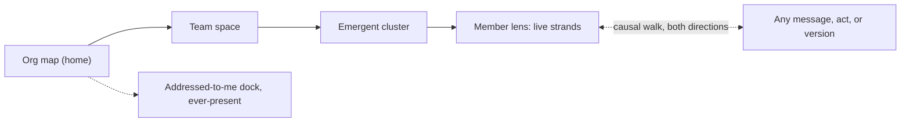

# 03 — The observatory (organization-first)

**The organization itself is the home surface: you arrive at a living map of teams, members, roles, and what is in flight — and everything else, including what is addressed to you, is a drill-in or a dock.**

> **Exploration — not a commitment.** One of the #3248 exploration concepts; see [README.md](README.md) for the axes and comparison.

## Stance

The bet: Spring Voyage's durable differentiator is not a better chat and not a better task list — it is **legibility of a living organization**. Nothing else can show humans and agents as peers on one map, the roles that route their collaboration, what is in flight in each team as emergent clusters, the platform-trackable facts underneath (who is active on something, what has queued, what was produced and its state, what was spent), and the organization itself changing shape as it happens. So this concept makes the organization the home surface and spends its entire novelty budget there.

On the axis *what is the center of gravity — what needs me, my exchanges, the things produced, or the organization producing them?* — this concept sits hard at the organizational end. Watching and steering is the core loop. Triage is a compact, ever-present dock, deliberately not the home. Conversations and artifacts are reached *through* the organization, never beside it. Organizational evolution — a member moving teams with their memories, an agent cloned into a new individual, a team growing — is the product's signature moment, not an administrative footnote.

What home is *not*, then, is equally deliberate: not a list of what needs me, not a stack of conversations, not a gallery of artifacts. All three exist and are one gesture away — but arriving always means arriving at the organization, because the concept believes that is the thing you cannot get anywhere else.

The name is literal: an observatory is a place built for looking. It does not summarize the sky; it grinds very good lenses.

## A day with it

You belong to two teams. **Field Notes** is a small zine about the city's river — essays, ink drawings, a birdsong page. You fill two roles there, *coordinator* and *proofreader*, alongside one other human and two agents: **Iris** (editor) and **Tam** (illustrator). **Riverbank** is a study group surveying life along the same river for the joy of knowing it; its field agent **Wren** runs the standing survey.

**08:40 — coming back.** Four days away. The observatory opens on the map, with the *since you were away* overlay on: each team wears its delta. Field Notes: nine messages on the open floor, two new versions of the autumn issue layout, 4% of the month's budget spent. Riverbank: one cluster grew noticeably, one artifact changed state. All of it mechanical and lossless — what arrived, what changed, what was produced, what was spent — and none of it a backlog of unread items demanding penance.

The one piece of narrative sits where the map surfaces it but did not write it: *"Week 31, while you were out"* — an artifact Iris published, in Iris's own voice, rendered as hers. The platform's catch-up told you what happened; a member tells you what it meant.

**08:55 — the dock.** The addressed-to-me dock sits along the bottom edge, three items deep. Two arrived through roles: *to: proofreader @ Field Notes → you (at send time)* — Iris sending the galley of the essays section, the correction pass it asks for being the message's meaning, not a platform type — and *to: coordinator @ Field Notes → you (at send time)*, the other human asking about the print date. One is to you directly, from Wren. Both desks resolve to you today; the dock says so per item. The same two messages, sent next month, might have found two different people — the map is how you know that without being told.

**09:20 — sending to a role.** You send the autumn cover brief. The compose line reads *to: illustrator @ Field Notes*, and beneath it, the resolution the send would record: *today that's Tam*. You send; the record keeps both the selector and its resolution, permanently. If you care to look, the delivery facts are one tap deep — *delivered 09:20* — and that is the last the product will ever say about it unless something goes wrong, in which case it comes to you.

**09:30 — two rhythms, felt.** On the map, Iris and Wren are visibly different kinds of busy. Iris attends in turns — one message, one turn, in order. Her tile reads *active on the essays pass · queued: 3*, and your galley reply is third; nothing will happen to it until the current turn ends, and the map does not pretend otherwise. Wren is dispatch-configured: it triages continuously and runs background passes. Your heron question from 09:31 was picked up mid-flight while the standing survey kept streaming. Iris's tile is a queue you can read; Wren's tile is three concurrent strands you can open.

**09:40 — leaning in.** You open Wren's lens. Live activity streams as strands, each tagged with its cause: one *caused by: standing survey brief*, one *caused by: your message 09:31*. You watch the heron count assemble — gauge data read, grid cells updated — and you steer: *skip the north bank until the construction ends*. No receipt comes back, and none is needed; two minutes later a new strand starts, tagged *caused by: your message 09:42*, re-planning the route. The answer to "did it land?" is the follow-on activity, on the record.

**10:30 — noticing drift.** The core loop is a sweep of the map, and this one catches something: the *birdsong page* cluster in Field Notes has grown — eleven messages, a new artifact version — around recordings from the wrong stretch of the river. Nobody asked you; you looked, and the shape of the activity told you. One open-floor message to the cluster — *the piece is about the estuary, not the weir* — and you move on. Watch, notice, steer, leave. The map made the drift visible before anyone had to escalate it, because escalation is a concept this product doesn't have.

**11:00 — artifacts, held and invented.** In Field Notes' space, the autumn issue layout shows *locked: Tam, since 09:12* — presence of activity, not a wall. You open version 6 read-only, step back through versions 5 and 4 to see the spread change. Then, over in Riverbank, you open the *survey grid* — a kind Wren defined itself last month. The generic structured view renders its declared fields faithfully — site, species, count, confidence, sketch reference — no custom renderer, nothing lost. You annotate one cell's confidence and move on.

**13:30 — the meeting room.** Wren's morning message on Riverbank's open floor set something in motion: the survey is doubling to a second site, and the zine wants to publish the findings as drawings. Should Tam move to Riverbank? You, the other human, and Tam take that question to a participants-only exchange — three participants, visible to exactly those three. On the open floor, for everyone else, this exchange simply does not appear. Participation implies visibility: no policy can hide from Tam a conversation Tam is part of. Everything else today happened in the open, like an office; this is the exception, chosen.

**14:00 — the organization moves.** This is the hour this concept exists for. First, the clone: Wren, authorized for its team's composition, clones itself for the second site. On the map, a new member chip appears in Riverbank: **Rook**, *cloned from Wren today* — a new individual with its own identity, carrying a copy of Wren's memories at cloning time and diverging from now on. Rook's first strand starts inside a minute; it already knows the survey brief and this morning's north-bank steer, because Wren knew them. You did nothing. You watched a member reshape the team it belongs to — a legible, recorded act, causally linked to Wren's 13:47 message, exactly as visible to you as your acts are to it.

**14:26 — and you move it.** The move is yours to make, because here you are authorized: the act card on Tam's chip offers it, and after the meeting-room conversation you take it. Tam's chip crosses the map from Field Notes to Riverbank; identity and memories travel intact — the drawing style the zine spent months shaping arrives at the survey on day one. Field Notes now shows *illustrator — unfilled*, honestly, until someone fills it. Your 09:20 cover brief still reads *to: illustrator @ Field Notes → delivered to Tam (at send time)*; the record never rewrites what was true. And on the other human's map, the same two moments appeared as they happened — not actions for them, but never a mystery either.

**17:10 — walking the causes.** Rook publishes the second-site grid, version 1. You walk backward from it: the version ← Rook's strand ← the cloning act ← Wren's open-floor message ← the doubled survey brief. Then forward from your own 09:42 steer: three route passes it caused. Before closing, you drag the replay handle back four days: the map reshapes into the organization you left — no Rook, Tam in the zine — then steps forward through the recorded acts to now. The organization is not a diagram in a settings page. It is the story, and today you watched a chapter.

## Surfaces (low-fi)

**The observatory (home).** Regions: **[A]** map canvas, **[B]** facts rail for the selected node, **[C]** addressed-to-me dock (ever-present), **[D]** time controls.

```
┌───────────────────────────────────────────────────────────────┬───────────────────┐
│ THE OBSERVATORY        [D]  ● live | ⟲ replay | ◉ since away  │ [B] RIVERBANK     │
│ [A]                                                           │ members        4  │
│  ┌ FIELD NOTES ────────────────────┐                          │ active now     2  │
│  │ ○ you    coordinator·proofreader│  ┌ RIVERBANK ─────────┐  │ queued         1  │
│  │ ○ human  essays                 │  │ ● Wren  surveyor   │  │ artifacts      7  │
│  │ ● Iris   editor                 │  │   dispatching ·    │  │  survey grid v9   │
│  │   in turns · queued 3           │  │   3 strands        │  │  locked: Rook     │
│  │ ● Tam    illustrator            │  │ ● Rook  surveyor   │  │  since 14:02      │
│  │   active on a piece since 09:12 │  │   cloned today     │  │ spent this wk 12% │
│  │ ~ cluster: autumn issue         │  │ ○ you              │  │                   │
│  │ ~ cluster: birdsong page        │  │ ~ cluster: second  │  │ member-authored:  │
│  └─────────────────────────────────┘  │   site survey      │  │ "Week 31" — Iris  │
│          Tam ── moving (recorded act) └────────────────────┘  │ (artifact)        │
├───────────────────────────────────────────────────────────────┴───────────────────┤
│ [C] ADDRESSED TO ME (3)                                                           │
│ • to: proofreader @ Field Notes → you (at send)   from Iris    galley, essays     │
│ • to: coordinator @ Field Notes → you (at send)   from human   print date         │
│ • to: you                                         from Wren    heron count        │
└───────────────────────────────────────────────────────────────────────────────────┘
```

Legend: `●` active on something / `○` not currently active — activity states the record supports, never social presence. `~` marks an emergent cluster.

**A team's space (drilled from the map).** Regions: **[E]** roster as peers, **[F]** emergent clusters, **[G]** artifact shelf, **[H]** recorded organizational acts.

```
┌ RIVERBANK — team space ──────────────────────────────────────────────┐
│ [E] ROSTER (peers)          [F] CLUSTERS (emergent)  [G] ARTIFACTS   │
│ ● Wren  surveyor            ~ second-site survey     survey grid  v9 │
│   dispatching · 3 strands     Wren, Rook, you          locked: Rook  │
│ ● Rook  surveyor · new        14 msgs · 2 artifacts    since 14:02   │
│   cloned from Wren today    ~ heron count            route map    v1 │
│ ● Tam   illustrator           you, Wren · 6 msgs     week notes   v3 │
│   joined from Field Notes                             (grid kind is  │
│ ○ you                       open floor, gated by      agent-defined; │
│                             your authorized view      generic view)  │
├──────────────────────────────────────────────────────────────────────┤
│ [H] 14:01 recorded act — Wren cloned → Rook (new individual;         │
│     memories copied at cloning time) ← caused by Wren's msg 13:47    │
└──────────────────────────────────────────────────────────────────────┘
```

**The evolution moment (act cards on the map).** The concept's signature surface. Regions: **[M]** the recorded act, legible to anyone whose view includes it; **[N]** action affordances, present only where the viewer is authorized — otherwise the card is purely an event.

```
┌ ORGANIZATIONAL ACTS ─────────────────────────────────────────────────┐
│ [M] 14:01  RIVERBANK                                                 │
│      Wren cloned → Rook — a new individual                           │
│      own identity · memories copied at cloning time · diverges now   │
│      by Wren (authorized) · caused by ← Wren's message 13:47         │
│      ▸ open Rook's lens   ▸ walk the cause                           │
│──────────────────────────────────────────────────────────────────────│
│ [M] 14:26  FIELD NOTES → RIVERBANK                                   │
│      move Tam (illustrator) — identity and memories travel           │
│      leaves illustrator @ Field Notes unfilled                       │
│ [N]  you are authorized for this:                                    │
│      ▸ move now   ▸ talk it over first (opens a conversation)        │
└──────────────────────────────────────────────────────────────────────┘
```

**A member's lens (drilled from roster or cluster).** Regions: **[I]** trackable facts, **[J]** live strands with causal tags, **[K]** conversation as a computed view, **[L]** causal walk.

```
┌ WREN — lens ─────────────────────────────────────────────────────────┐
│ [I] dispatching continuously · strands 3 · queued 0 · spent 3% wk    │
│ [J] LIVE STRANDS (streamed)                                          │
│  ▸ caused by: standing survey brief                                  │
│      14:06 reading gauge data → 14:07 survey grid v9 cell updates …  │
│  ▸ caused by: your message 09:42 ("skip the north bank…")            │
│      re-planning route → route map v1 created                        │
│ [K] CONVERSATION — computed view, counterpart: you ⇄ Wren            │
│  09:31 you → Wren   heron question         delivered 09:31           │
│  09:40 Wren → you   count so far…                                    │
│ [L]  ◀ what caused this        what did it cause ▶                   │
└──────────────────────────────────────────────────────────────────────┘
```

**The drill model.** One gesture, four depths; the dock floats beside all of them.



## Platform capabilities this concept assumes

Grouped by the owning decision record. Unmarked items are already in ux-vision.md § "Platform capabilities this UX depends on"; **NEW** items go beyond it and become filed requirements.

### Subjects, teams, and roles — #3247

- Membership and role changes as runtime operations by authorized subjects, including agents (Wren clones itself; you move Tam); cloning creates a new individual with copied memories; a move preserves identity and memories. All per the brief.
- Platform roles composing surfaces; the single-human deployment as the degenerate case that must work.
- **NEW** — A member's *attendance model* is a platform-visible fact: attends-in-turns (one message, one turn) versus continuous dispatch with background activity. Without it the map cannot honestly render "queued: 3, third in line" versus "picked up mid-flight."

### Messages and delivery — #3249

- Visibility scope orthogonal to recipients (participants-only exchange vs the open floor); role-addressed messages preserving selector and send-time resolution, never rewritten; per-recipient delivery outcomes on demand; failures surfaced to the sender; no presence anywhere.
- **NEW** — Role resolution is queryable at compose time without sending ("illustrator @ Field Notes — today that's Tam"), using the same resolution a send would record.
- **NEW** — Sending to a role with no current filler has a defined outcome surfaced to the sender. This concept makes unfilled roles visible on the map, so the case is reachable on purpose, not an accident.

### The record and its views — #3250

- Policy-gated per-observer views, identical machinery for humans and observing agents; lossless views only; emergent clusters without a modeled container; "what needs me" and "since you were away" as first-class views; live streaming of in-progress activity tagged with causal context (concurrent strands separable by their tags); causal navigation in both directions; observe as its own authorization verb.
- **NEW** — Org-scale live trackables: the cross-cutting facts (activity state, queue depth, artifact inventory and states, spend) aggregated across a team subtree and deliverable as one live subscription per map. A home surface cannot be built on per-member polling.
- **NEW** — Structure as of a moment: team tree, membership, and role fillers reconstructable at any past time from the recorded acts, and steppable between moments (the map replay). The acts are already recorded under #3247; the reconstruction *view* is the new demand.

### Artifacts — #3251

- Agent-defined kinds with a faithful generic structured view (the survey grid); versioning and history; locks surfaced as who-and-since-when, never a modal wall; team as the artifact's scope; visibility changes as ordinary recorded acts. Nothing beyond the brief — this concept deliberately asks the least of artifacts.

## What this concept sacrifices

- **The intimacy of a single conversation.** Everything is reached through the organization; "I just want to talk with Iris" is a drill, and correspondence is a computed view inside a lens, never a cozy first-class room. Someone whose day is one long exchange with one agent will feel held at telescope distance.
- **The single-human deployment starts on this concept's weakest ground.** One human, four agents, one team is a map of a village — the observatory earns its keep as organizations grow. The degenerate case must still work, which here means collapsing gracefully into a single team space without the map feeling like ceremony.
- **Artifact depth.** Artifacts are facts on shelves: versions, locks, states, the generic view. Deep authoring and review — long documents side by side, rich annotation — get a viewer, not a studio. The humans of a publication team would feel this within a week.
- **Triage is demoted by design.** The dock is compact and cannot grow into a home. On a day that is mostly "twelve things need me," this concept makes you work from a strip at the edge of a map you don't currently care about.
- **Honest decluttering is hard.** The platform never interprets, so the map may rank and fade only by lossless facts — recency, volume, spend. Busy is not important, and the platform is forbidden to know the difference; at scale, a noisy trivial cluster will outshine a quiet load-bearing one.
- **The map's promise is expensive to keep.** Every other concept can tolerate a stale corner; this one cannot — a home surface that claims "this is your organization, alive" while showing facts minutes old is the exact status theater the vision forbids. The concept stakes itself on the heaviest live-view machinery of any exploration, and degrades worst if that machinery underdelivers.

## Open questions

- What captions an emergent cluster on a map that never interprets — a quoted excerpt, a touched artifact's own title, or a member-authored label as a recorded act? (If the last: a small addition to #3250/#3251.)
- Scale: at forty teams and two hundred members, is level-of-detail by subtree, ranked only by lossless facts, legible enough — or does the map need member-authored curation to stay honest *and* readable?
- Where does "just start talking to somebody" live? A flat people shortcut beside the map risks quietly re-growing a conversation-first product inside the dock; omitting it makes casual exchange expensive.
- When a public recorded act (Tam's move) was caused by a participants-only exchange, what does a non-participant see walking the causal chain backward — a stub, a gap, or nothing? Does even a count of invisible exchanges leak what the meeting room exists to protect?
- Is map replay (structure as of a moment) worth its record machinery in a first cut, or is a legible feed of organizational acts enough until replay is demonstrably missed?
- Where exactly is the line between this surface and the management portal for organizational creation? Moving and cloning members is collaboration; is creating a brand-new team on the map also collaboration, or mechanical configuration?
- For a human filling several roles in one team, should the dock attribute the role on every item, or only when attribution changes the answer — is per-item attribution how users absorb the organization, or noise?
