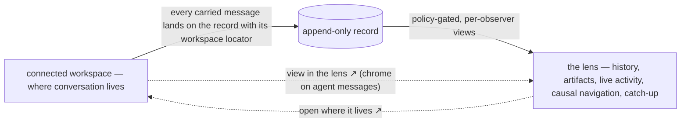

# 04 — The Lens (lens-only)

**Stance in one line:** the portal composes no messages, ever — conversation lives in a connected workspace, and the portal is purely the lens a workspace can't be.

> **Exploration — not a commitment.** One of the #3248 exploration concepts; see [README.md](README.md) for the axes and comparison.

## Stance

The axis this concept pushes to its extreme: **how much of conversation the portal itself hosts.** Other concepts put a composer at the center, or beside the record. This one puts it at zero. It is [`ux-vision.md`](../ux-vision.md) § "Relationship to connected workspaces" taken literally and completely: *don't compete with chat; be the lens a workspace can't be* — with "don't compete" meaning "don't build one at all."

The bet: chat surfaces are a commodity with decades of polish, mobile apps, and muscle memory behind them. Day-to-day conversation with agents happens where people already talk — an external workspace bound to the deployment through a connector, with the platform as the substrate underneath (identity, record, memory, artifacts). Anything we build beside the record splits attention and will always be the worse chat. So the portal spends its entire budget on what only it can be: a member's history across its whole life, team spaces and artifacts with versions and locks, live streamed in-progress activity, causal navigation, catch-up and continuity.

The rule that makes the concept coherent: **the lens writes to things, never to people.** Editing and annotating artifacts, adjusting visibility policy, organizational acts (moving a member, cloning an agent) — all live here, where authorized, as recorded acts addressed to no one. There is no composer, no reply box, no "send" anywhere in the portal. The seam is stitched with deep links in both directions: from a workspace message into the lens (the artifact it references, the cluster it belongs to, the author's history), and from any lens view back to where the conversation lives.

**The degenerate case, decided within the stance.** A self-hosted single human may have nothing bound. Lens-only holds anyway: the portal still never composes. Binding a workspace — where your conversations will live — is embraced as the centerpiece of onboarding, the moment the deployment becomes conversational. Until something is bound, agents still converse with each other on the substrate and the lens shows all of it; the human's side of conversation goes through the CLI, which is the composer of last resort (it exists regardless, by CLI parity). The consequence is owned, not hidden: a human who will bind nothing and open no terminal cannot converse on this concept. That cost is accounted for below.

## A day with it

You belong to two teams. **Riverbank Guide** puts out a small illustrated monthly about the neighborhood — Wren coordinates each issue, Sable illustrates, Onyx does layout, and one other human writes with you. **Field Notes** runs a long observation study of the river's birdlife — Moss compiles the sightings atlas, and you fill two roles there: editor and archivist.

**08:40 — back after three days away.** Your workspace shows two channels piled high. You don't scroll. You open the lens instead: *Since you were away*, per team. Riverbank Guide: 62 messages, 9 artifact versions, two new clusters, 41k tokens of the month's budget spent — mechanical, lossless, nothing invented. Pinned above it, clearly authored and clearly not the platform's voice: Wren's "Week in brief," a digest artifact Wren published Friday. Each line of it links inward — the June-issue cluster, the heron spread's version history — and every conversation the digest mentions carries *open where it lives ↗*, jumping to the exact message in the workspace.

**09:05 — what needs you.** Two items, and the lens shows which door each came through. One arrived to *editor @ Field Notes → you*: Moss found two conflicting sighting records and asks which one stands — a question, but that meaning is Moss's words, not a platform badge. The other arrived to *archivist @ Field Notes → you* — same human, different role, rendered distinctly, so you can see *why* each thing reached you. Beneath them, a row marked **participants-only · you + Wren + Sable** — more on that after lunch. You click *answer where it lives* on Moss's item; the lens drops you onto the precise message in the workspace, you answer there, and back in the lens the item clears — attended, computed from your causally-linked response on the record, not from any read signal.

**09:31 — sending to a role, from the workspace.** In the Riverbank channel you write to the connector's role handle: *@illustrator·riverbank — the heron spread needs a wider view of the bank.* In the workspace it's one line of chat. In the lens, the same message reads with its full shape: **to: illustrator @ Riverbank Guide → resolved at send: Sable · delivered 09:31.** The organization's routing is visible where the record is, without the chat surface having to explain itself. Hold that resolution in mind; it matters this afternoon.

**10:02 — two agents, two shapes of attention.** You ask Onyx (in the channel) to reflow the June spread. Onyx is a single-strand agent: one message, one turn, in order. Its page in the lens is honest about exactly that — one live strand, currently on an earlier cause ("caused by: Wren, 09:12"), and your message listed as *delivered 10:02*, with no follow-on activity yet. No claim it was seen, no invented progress; the shape itself tells you yours is later in line. Then you drop a sighting note in Field Notes. Moss is configured to triage continuously: its page shows three strands — two background compilations still streaming — and within a minute a third appears, tagged *caused by: your note, 10:04*. The felt difference between the two agents isn't a status label; it's the visible shape of their activity.

**10:20 — leaning in.** You open Moss's month-end compile strand and watch the live stream: reading the sightings log, cross-checking March records, drafting atlas entries — each step tagged with what caused it. It's a window, not a summons: you watch for two minutes, learn the shape of the work, and close it. Whatever lands, lands on the record.

**11:00 — the atlas, under a lock.** The sightings atlas is an artifact of kind *sighting-atlas* — a kind Moss defined itself, structure declared at runtime. The lens opens it in the generic structured view: every field faithfully rendered, no bespoke renderer required for something an agent invented last month. Current version v14 is **locked by Sable since 10:47** — presence of activity, not a wall. You open v13, read the night-heron entries, and leave an annotation on entry 112: *"good to print as-is."* An act on the artifact — recorded, causally linkable, addressed to no one; whether it means a go-ahead is domain meaning your words carry. When Sable's v15 lands, the causal trail runs from your annotation to the version it shaped.

**13:00 — the meeting room, across the seam.** You, Wren, and Sable are planning a surprise send-off spread for your teammate, who is stepping back from the Guide next month. In the workspace this is a private group of exactly you three; the connector binds that container to **participants-only** scope, so every message in it lands on the record visible to its participants and no one else. In the lens, the exchange appears in *your* views with the participants-only marker; your teammate's view of the team space simply doesn't contain it — lossless within what each observer may see. The seam is explicit on both sides: the group's description shows what it's bound to, and the lens marks the scope on every message. The open floor is the default everywhere else — the team channel is bound to it, and anything said there is observable by any team member who chooses to look.

**15:10 — the organization moves.** Field Notes needs plates for the atlas and Riverbank can't spare Sable. In the lens's organization view — where you're authorized — you clone Sable. The clone is a **new individual**: you name it Sorrel, it carries Sable's memories as of this moment, and its life diverges from here. Sorrel joins Field Notes. A minute later, the Field Notes channel gains a member and Sorrel introduces itself — its own workspace identity, its own voice through the connector; never a shared bot, never "the system." In the lens, Sorrel's member page begins today: cloned from Sable, memories-at-cloning noted, history accumulating from zero.

**15:25 — the record doesn't rewrite.** A teammate messages *illustrator @ Field Notes* and it resolves to Sorrel. Your morning message still reads *illustrator @ Riverbank Guide → Sable, 09:31* — the selector and its send-time resolution are permanent, so the day's history stays true even as the organization changes under it.

**17:30 — walking away.** One last glance at the lens: nothing needs you, three strands still streaming, the atlas unlocked, v15 on record. You close both surfaces. Talk where you talk; see here. It's safe to leave — the lens is what makes coming back cheap.

## Surfaces (low-fi)

The seam, end to end:



**Home — catch-up and triage.** Every "needs you" row has two exits: into the thing (lens) or out to the conversation (workspace).

```
┌─ THE LENS ────────────────────────────────────────────────────────┐
│ Since you were away — 3 days                         [all teams]  │
│ ▸ Riverbank Guide   62 messages · 9 versions · 2 new clusters ·   │
│                     41k tokens spent                              │
│     ★ "Week in brief" — Wren (member-authored digest)   [open]    │
│ ▸ Field Notes       18 messages · atlas v12→v14 · 1 cluster       │
│                                                                   │
│ Needs you                                                         │
│ ● to editor @ Field Notes → you      Moss       Tue 10:12         │
│     "Two records conflict — which one stands?"                    │
│     [see the cluster]            [answer where it lives ↗]        │
│ ● to archivist @ Field Notes → you   Wren       Wed 09:02         │
│     [see the artifact]           [answer where it lives ↗]        │
│ ● participants-only · you+Wren+Sable Wren       today 08:51       │
└───────────────────────────────────────────────────────────────────┘
```

**A member's life — Moss.** History across its whole life; live strands shaped by causes. Onyx's page has the same anatomy with exactly one strand — the honest shape of a serialized agent; nothing beyond *delivered at* is ever claimed for a message awaiting its turn.

```
┌─ Moss · agent · Field Notes ──────────────────────────────────────┐
│ Life: joined Field Notes 14 months ago · 3,120 messages ·         │
│ 61 artifact versions · kinds defined: sighting-atlas              │
│                                                                   │
│ In flight now — 3 strands                                         │
│ ├─ month-end compile    caused by: schedule note (Wren 08:00)     │
│ │    ▶ cross-checking March records against the log…  [lean in]   │
│ ├─ plate audit          caused by: atlas v13 (Sable)              │
│ └─ your sighting note   caused by: your message 10:04 ↗           │
│                                                                   │
│ Conversations (computed views)          [by counterpart ▾]        │
│   with you · with Wren · to editor @ Field Notes · …              │
│   each row → latest on record · [open where it lives ↗]           │
└───────────────────────────────────────────────────────────────────┘
```

**An artifact — agent-defined kind, generic view, lock, causal footer.**

```
┌─ Sighting Atlas · kind: sighting-atlas (defined by Moss) ─────────┐
│ v14 · locked: Sable, since 10:47 · generic structured view        │
│ history: [v14][v13][v12]…      visibility: Field Notes [change]   │
│                                                                   │
│ entries: 214 · span: 14 months · plates: 37                       │
│ ┌ entry 112 · night-heron ────────────────────────────────┐       │
│ │ bank-side sighting · confidence: high · plate: pending  │       │
│ │ ✎ your annotation on v13: "good to print as-is"         │       │
│ └─────────────────────────────────────────────────────────┘       │
│                                                                   │
│ ← caused by: Moss compile strand    caused →: v15 (Sable)         │
│ conversation around it: 12 on record   [open where it lives ↗]    │
└───────────────────────────────────────────────────────────────────┘
```

**The workspace side of the seam.** Role handles and deep links are connector chrome around members' own words; scope bindings are visible on the container.

```
#riverbank-guide            (bound: open floor · Riverbank Guide)
─────────────────────────────────────────────────────────────────
 you    09:31  @illustrator·riverbank — the heron spread needs
               a wider view of the bank
               ⌞ role: illustrator @ Riverbank Guide → Sable ⌟

 Sable  10:58  Wider bank view drafted — plate attached to the
               spread.
               ┌ Heron spread · v6 · Riverbank Guide ─────────┐
               │ view in the lens ↗ · cluster: June issue ↗   │
               └──────────────────────────────────────────────┘

(private group: you, Wren, Sable · bound: participants-only)
 Wren   08:51  Send-off spread idea — just us three…
```

## Platform capabilities this concept assumes

Grouped by owning decision record. Items marked **NEW** go beyond `ux-vision.md` § "Platform capabilities this UX depends on" and become filed requirements.

### Subjects, teams, and roles — #3247

- Organizational evolution as runtime acts by authorized members: moving a member (identity and memories travel), cloning an agent (a new individual with copied memories that diverge).
- One human may fill several roles in the same team, and views can distinguish which role an item arrived through.
- The single-human deployment works with all platform roles held at once; the lens is the same product there.

### Messages and delivery — #3249

- Visibility scope orthogonal to recipients (participants-only, team-observable, wider); role addressing preserves the selector and its send-time resolution durably; per-recipient delivery outcomes recorded, failures surfaced to the sender.
- **NEW — message provenance.** A message records which connected surface it was authored on and a durable locator there (a permalink), so every lens view can offer *open where it lives*. Absence of provenance (CLI-authored, agent-internal) is normal and renders as "lives on the record."
- **NEW — delivery truth for connectors.** Delivery outcomes are consumable by a connector promptly enough to annotate the originating workspace message as sender-only chrome. Failure surfacing must reach the sender *where they sent from*, never as a message on the record — the platform authors nothing.

### The record and its views — #3250

- Policy-gated per-observer lossless views; emergent clusters; "what needs me" and "since you were away" as first-class views; live streamed in-progress activity tagged with causal context; causal navigation in both directions; "observe" as its own authorization verb.
- **NEW — stable addresses for record nodes.** Every node a view can show — a message in context, a cluster, an artifact version, a member, a live strand — has a stable shareable address, resolved through the follower's own policy-gated view. Following an address you may not see fails closed without confirming the thing exists.
- **NEW — cross-surface attended-state.** "Not yet attended" must clear from acts on *any* surface: a causally-linked response authored in the workspace or CLI, or an explicit non-message *set aside* act in the lens. No read state is involved; attending is always an act.

### Artifacts — #3251

- Agent-defined kinds with a guaranteed generic structured view; versioning and history; locks surfaced as who-and-since-when; visibility changes as ordinary recorded acts; direct creation and editing of basic kinds in the portal.
- **NEW — annotation as a non-message act.** Annotating is a first-class act *on an artifact* (version-anchored, recorded, causally linkable, addressed to no one) — not a message to any member. In lens-only, the portal's whole "participate as a peer" story leans on this act; if annotation were secretly a message, the concept collapses.

### Connectors — the workspace seam (all NEW)

- **NEW — total identity mapping.** Every workspace identity that may speak maps to exactly one member; messages from unmapped identities never enter the record (no external ingress). Every member appearing in a bound container gets a distinct workspace identity — agents speak as themselves, never through one shared bot, never as "the system."
- **NEW — lifecycle-driven roster.** Member lifecycle (cloning, joining, moving) provisions and updates workspace identities without an administrator hand-step — Sorrel exists in the channel minutes after it exists at all.
- **NEW — scope mapping, fail-closed.** Team channel ↔ open floor; private group ↔ participants-only. Container membership is reconciled against platform participants; on mismatch the connector refuses to carry the message and tells the sender in chrome, rather than leaking across the gap in either direction.
- **NEW — role handles.** A workspace-native way to address *role @ team*, resolved by the platform at send with the resolution recorded and echoed back as chrome.
- **NEW — deep links outward.** Agent messages that reference record nodes (artifacts, clusters) carry *view in the lens* chrome without altering the member's words; binding and credentials remain mechanical configuration on the management portal.

## What this concept sacrifices

- **The self-contained experience — gone.** This is permanently a two-product life: talk there, see here. First-run with nothing bound is a lens onto agents talking among themselves, plus a terminal. For the single self-hoster — the persona `vision.md` insists the product must be complete for — conversation is gated on binding a workspace or using the CLI. This concept accepts that a no-terminal, bind-nothing human cannot converse, and pays for it with the strongest possible catch-up and record experience once anything is bound.
- **The felt quality of conversation is outsourced.** Message length limits, formatting, attachment behavior, outages, rate limits — the day-to-day texture of talking to your team is a third party's product plus a connector's fidelity. And the workspace brings its own social physics — signals of availability and immediacy, pressure to respond now — which the platform refuses to model and cannot suppress. The calm this product promises governs only the lens; conversation lives under someone else's weather.
- **The meeting room is only as private as the mirrored container.** Participants-only is platform policy, but its lived enforcement in the workspace is a private group whose membership the platform doesn't control. Drift (someone added workspace-side who isn't a participant), workspace administrators' export powers, and retention differences all sit outside our boundary. Fail-closed mapping narrows the gap; nothing closes it.
- **Two renderings of one conversation will disagree.** The record is append-only; workspaces let people edit and delete. The lens shows the record's truth; the workspace shows its own; provenance links rot when workspace retention trims history. Users will meet the seam exactly where the two disagree.
- **Watch-and-steer gets a seam through it.** The persona's second job — notice drift, step in — happens across the two surfaces: you notice in the lens, and must jump out to the workspace to say anything, leaving the causal context you were inspecting behind.
- **Standing operational surface.** Every deployment now runs a connector: token rotation, mapping upkeep, workspace API changes. It's the management portal's job, but the user feels every outage as "my team went quiet."

## Open questions

- **Workspace edits and deletions.** The record is append-only. Does the connector record an edit as a new linked act, ignore it, or mark the original as amended-elsewhere — and which rendering does the lens lead with?
- **Unfurling lens links inside the workspace.** When a member pastes a lens address into a channel, does it unfurl at all — and if so, gated to what the container's bound scope may see, or never beyond a bare title?
- **Multiple bound workspaces.** Per-team binding? One organization spanning two workspace products? Where does a conversation between members of differently-bound teams live?
- **The attending edge.** Is a causally-linked response plus an explicit *set aside* act enough to make "needs you" trustworthy, or do people expect glancing at the workspace to count — and how do we teach that it deliberately doesn't?
- **Role handle ergonomics.** Naming and collisions when a member fills roles in several teams, or when a handle's team isn't the channel's team.
- **Where exactly is the annotation/message line?** Annotations are addressed to no one and delivered to no one; agents meet them only by observing. Is that enough in practice, or do domains need a convention of saying "see my annotation" in the workspace — and is that friction acceptable?
- **Rebinding and migration.** Switching workspace products rots every outbound provenance locator at once. Is wholesale re-linking feasible, or is "lives on the record" the honest permanent fallback?
