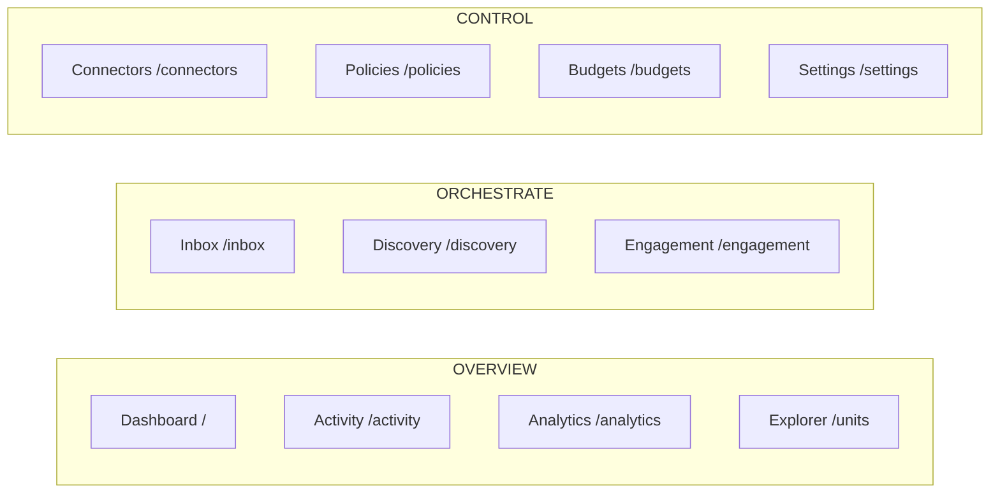

# Spring Voyage Portal — Design System

> **Status.** v2.0 — describes the portal as shipped on `main`. Every retained surface now speaks the v2 design language; no route ships tokens-only. Capability follow-ups (keyboard tree navigation, write API on the Memory tabs, real traces endpoint, lazy tenant-tree expansion) are scoped to v2.1 and noted where relevant.
>
> **Scope.** `src/Cvoya.Spring.Web/` — the Next.js 16 / React 19 / Tailwind 4 portal. The CLI and marketing surfaces consume the same token catalog (`--sv-*`) but are out of scope for this document.
>
> **Authority.** Read alongside `AGENTS.md` and `CONVENTIONS.md`. This file describes *what the code paints today*; update it in the same PR that changes a visual pattern.

---

## 1. Overview

The portal is a dark-first operations console for a platform engineer watching agents and units run. Ethos: **calm, terse, information-dense**.

- A neutral slate/zinc canvas so coloured signals (status, severity, cost) stay legible without fighting each other.
- A single blue accent (`--color-primary`, same as `--sv-primary`) for primary actions, active nav, links, and focus rings.
- A small brand-extension palette (voyage cyan, blossom pink, starfield / hull) used exclusively for marketing-derived chrome — logo, halo, brand-forward highlights.
- Short copy. No marketing voice. Empty states explain the next action in one sentence.
- Cards, tables, and tree rows over hero sections; lucide line icons at 3.5–5×5 for context.

The portal is **shadcn-flavoured** (class-variance-authority variants, `cn()` helper, `components/ui/*` primitives) but deliberately trimmed — no Radix-for-every-primitive. Dialogs are focus-trapped `<div>`s, tabs are an in-house ARIA-compliant implementation, and sidebar chrome is custom.

Canonical surfaces:

- **`/explorer`** — the Explorer nav entry point (#2517). The nav item is labelled "Explorer"; clicking it lands here. Renders `<ExplorerSurface>` with no node pre-selected.
- **`/units`** — legacy Explorer host kept for backward compatibility. Legacy `?node=<id>` bookmarks redirect to the canonical path form; direct hits render the Explorer canvas.
- **`/explorer/units/<id>`** — canonical path-based entity URL for units/agents (#2473). `<id>` is a no-dash UUID. Tab state stays in `?tab=<Tab>`.
- **`/explorer/humans/<id>`** — canonical Explorer entry for human members (#2517). Renders `<ExplorerSurface>` with the human node selected so the left-rail tree stays visible.
- **`/explorer/agents/<id>`** — redirects to `/explorer/units/<id>` (agents live in the tenant tree).
- **`/explorer/tenants/<id>`** — stub; redirects to `/explorer` pending a dedicated tenant detail view.
- **`/humans/<id>`** — human entity detail. Accepts both dashed and no-dash UUID forms.
- **`/settings`** — a dedicated hub route. Tenant-panel cards plus tile links into the catalog/admin subpages.
- **`/inbox`**, **`/discovery`**, **`/analytics`** and the Control surfaces (`/connectors`, `/policies`, `/budgets`) stay top-level. See § 3.

---

## 2. Tokens and Tailwind 4 `@theme` mapping

Defined in [`src/app/globals.css`](src/app/globals.css). Two token families coexist:

1. **Tailwind utility tokens** (`--color-*`, `--font-*`, `--radius-*`) inside a `@theme` block. Tailwind 4 derives its utility classes from these — every `--color-X` generates `bg-X`, `text-X`, `border-X`, `ring-X`, `from-X`, etc.; `--font-sans` drives `font-sans`; `--radius-lg` drives `rounded-lg`.
2. **Spring Voyage design-system tokens** (`--sv-*`) — a mirror catalog used by surfaces that can't reach through Tailwind (hand-written CSS for the terminal skin, marketing pages, CLI-adjacent chrome). Values are identical to the `@theme` palette so `bg-background` and `background: var(--sv-bg)` paint the same pixel.

### 2.1 Surface + action palette (dark default)

| Tailwind token                 | `--sv-*` mirror    | Hex       | Role                                                                 |
| ------------------------------ | ------------------ | --------- | -------------------------------------------------------------------- |
| `--color-background`           | `--sv-bg`          | `#09090b` | Page canvas. Pinned as the `themeColor` meta.                        |
| `--color-foreground`           | `--sv-fg`          | `#fafafa` | Default text.                                                        |
| `--color-card`                 | `--sv-card`        | `#0a0a0f` | Card, dialog, toast, sidebar surface.                                |
| `--color-card-foreground`      | `--sv-card-fg`     | `#fafafa` | Text on cards.                                                       |
| `--color-popover`              | `--sv-popover`     | `#0a0a0f` | Floating panel reserve — no popover primitive ships today.           |
| `--color-primary`              | `--sv-primary`     | `#3b82f6` | Primary action — buttons, active nav, links.                         |
| `--color-primary-foreground`   | `--sv-primary-fg`  | `#fafafa` | Text on primary surfaces.                                            |
| `--color-secondary`            | `--sv-secondary`   | `#1e1e2e` | Secondary buttons and badges.                                        |
| `--color-muted`                | `--sv-muted`       | `#18181b` | Skeleton loaders, tab-list background, inline `<pre>`.               |
| `--color-muted-foreground`     | `--sv-muted-fg`    | `#a1a1aa` | Labels, helper copy, inactive nav.                                   |
| `--color-accent`               | `--sv-accent`      | `#1e1e2e` | Hover surface for ghost / outline affordances.                       |
| `--color-destructive`          | `--sv-destructive` | `#ef4444` | Destructive button, error badge.                                     |
| `--color-border`               | `--sv-border`      | `#27272a` | Card borders, dividers, inputs, scrollbar thumb.                     |
| `--color-input`                | `--sv-input`       | `#27272a` | Input / select border.                                               |
| `--color-ring`                 | `--sv-ring`        | `#3b82f6` | Focus ring (matches primary).                                        |
| `--color-success`              | `--sv-success`     | `#22c55e` | Running / healthy badge.                                             |
| `--color-warning`              | `--sv-warning`     | `#eab308` | Starting / degraded badge.                                           |
| `--color-info`                 | `--sv-info`        | `#3b82f6` | Info-severity log rows.                                              |
| `--color-debug`                | `--sv-debug`       | `#a1a1aa` | Debug-severity log rows.                                             |
| `--color-brand`                | `--sv-primary`     | `#3b82f6` | Intent alias — `bg-brand` reads as "paint this brand-action blue".   |
| `--color-brand-fg`             | `--sv-primary-fg`  | `#fafafa` | Text on brand surfaces.                                              |

### 2.2 Brand-extension palette

Marketing-derived hues named after the design assets they originated from — `voyage` (halo cyan), `blossom` (cherry-blossom sail), `starfield` / `hull` (logo backdrop). Exposed both as Tailwind utilities (`bg-voyage`, `text-blossom-deep`) and as `--sv-*` variables.

| Tailwind token          | `--sv-*` mirror          | Hex       |
| ----------------------- | ------------------------ | --------- |
| `--color-voyage`        | `--sv-voyage-cyan`       | `#5ee8ee` |
| `--color-voyage-soft`   | `--sv-voyage-cyan-soft`  | `#8ff4f7` |
| `--color-blossom`       | `--sv-blossom`           | `#f4b6c9` |
| `--color-blossom-soft`  | `--sv-blossom-soft`      | `#ffd7e1` |
| `--color-blossom-deep`  | `--sv-blossom-deep`      | `#d87a9a` |
| `--color-starfield`     | `--sv-starfield`         | `#0b1028` |
| `--color-starfield-mid` | `--sv-starfield-mid`     | `#182044` |
| `--color-hull`          | `--sv-hull`              | `#0f1530` |

Brand hues carry the same values across themes on purpose — the halo and sail are identity, not chrome. Use them sparingly: the mark's backdrop, a one-off brand-forward highlight. Never substitute for `--color-primary` in interactive UI.

### 2.3 Light theme

Re-points the `--color-*` utilities and `--sv-*` mirrors together. The brand-extension hues stay; only the dark hulls keep their dark values so the logo still paints correctly on a light canvas.

| Token                          | Light hex |
| ------------------------------ | --------- |
| `--color-background`           | `#ffffff` |
| `--color-foreground`           | `#09090b` |
| `--color-card`                 | `#ffffff` |
| `--color-primary`              | `#2563eb` |
| `--color-secondary` / `muted`  | `#f4f4f5` |
| `--color-muted-foreground`     | `#71717a` |
| `--color-destructive`          | `#dc2626` |
| `--color-border` / `input`     | `#e4e4e7` |
| `--color-success`              | `#16a34a` |
| `--color-warning`              | `#ca8a04` |

### 2.4 Theme switching

Two conventions coexist and are kept in lockstep:

- **`<html class="dark|light">`** — the portal's `ThemeProvider` hydrates from `localStorage` (`spring-voyage-theme`). The root layout ships `class="dark"` as the SSR default so tokens paint consistently before hydration.
- **`[data-theme=dark|light]`** — the design-kit convention used by marketing/docs. The `globals.css` selectors `[data-theme="dark"]` and `[data-theme="light"]` mirror the class selectors so both mechanisms reach the same cascade.

A terminal-skin opt-in exists: `[data-theme="light"][data-term="light"]` swaps the `--sv-term-*` tokens to the Solarized-light palette. Default in light mode is still the dark terminal — teams keep their consoles dark.

### 2.5 Status + severity palette (applied, not tokenised)

Small non-interactive signals use Tailwind palette colours directly for visual punch where semantic tokens would look muddy. Keep this mapping consistent when adding indicators:

| Concept                                      | Applied colour                                                 |
| -------------------------------------------- | -------------------------------------------------------------- |
| Unit status — `running`                      | `bg-success` dot / `text-success` icon                         |
| Unit status — `starting`                     | `bg-warning` dot                                               |
| Unit status — `paused`                       | `bg-warning/70` dot                                            |
| Unit status — `error`                        | `bg-destructive` dot                                           |
| Unit status — `stopped`                      | `bg-debug` dot                                                 |
| Activity severity — `Info`                   | `bg-info` / `text-info`                                        |
| Activity severity — `Warning`                | `bg-warning` / `text-warning`                                  |
| Activity severity — `Error`                  | `bg-destructive` / `text-destructive`                          |
| Activity severity — `Debug`                  | `bg-debug` / `text-debug`                                      |
| Runtime status — `idle`                      | `border-border bg-muted/40 text-muted-foreground`              |
| Runtime status — `busy`                      | `border-warning/50 bg-warning/10 text-warning` (icon `animate-spin`) |
| Runtime status — `queued`                    | `border-primary/40 bg-primary/10 text-primary`                 |
| Runtime status — `unavailable`               | `border-destructive/50 bg-destructive/10 text-destructive`     |

Prefer the semantic `success` / `warning` / `destructive` tokens for badges and buttons. Use the brand-extension palette only for brand-facing chrome.

The runtime-status palette ships through `<RuntimeStatusBadge>` (`src/components/runtime-status-badge.tsx`, #2100). It renders next to every agent / unit name across the portal — engagement-timeline header and bubbles, agent/unit cards, member rosters, mention chips — and polls `GET /api/v1/tenant/{kind}/{id}/runtime-status` at ~2s cadence. Two variants:
- `size="default"` — pill with icon + text label (cards / drawer panels).
- `size="dot"` — colour-only chip with ARIA label + tooltip (chrome-tight surfaces such as the engagement-timeline message-bubble header).
Status is conveyed by both colour AND a Lucide icon (per § 14 — never colour-only) so colour-blind operators can still resolve the state.

---

## 3. Geist typography

The portal ships `next/font`-hosted Geist Sans and Geist Mono via the [`geist`](https://vercel.com/font) package.

### 3.1 Wiring

`src/app/layout.tsx` imports `GeistSans` and `GeistMono` from `geist/font/{sans,mono}` and attaches their CSS-variable wrappers to `<html>`:

```tsx
<html className={`dark ${GeistSans.variable} ${GeistMono.variable}`}>
```

That registers `--font-geist-sans` and `--font-geist-mono` on the element. The `@theme` block in `globals.css` then maps them to the Tailwind family tokens, each with a full system-stack fallback so the portal still renders if the Geist payload is blocked:

```css
--font-sans: var(--font-geist-sans), system-ui, -apple-system, "Segoe UI", Roboto, sans-serif;
--font-mono: var(--font-geist-mono), ui-monospace, "SF Mono", Menlo, Consolas, monospace;
```

The `--sv-font-sans` / `--sv-font-mono` / `--sv-font-display` mirrors carry the same stacks for non-Tailwind consumers.

### 3.2 Default application

`<body>` sets `font-family: var(--font-sans)` directly (plus the `font-sans` utility class, so Tailwind-aware children inherit through the utility namespace as well). Monospace is opt-in via `font-mono` — used for code, addresses (`agent://`, `unit://`, `from://`), env pills, and numeric columns that want tabular-nums rhythm.

### 3.3 Scale and weight

Tailwind 4 defaults are unchanged; `--sv-*` mirrors carry named sizes for non-Tailwind callers.

| Utility       | Size / line-height | Typical use                                                       |
| ------------- | ------------------ | ----------------------------------------------------------------- |
| `text-[10px]` | 10px               | Env pill, sidebar section labels, timestamp pills.                |
| `text-xs`     | 12px / 16px        | Helper text, card footers, meta rows, badge contents.             |
| `text-sm`     | 14px / 20px        | Body text, table cells, buttons, description under H1.            |
| `text-lg`     | 18px / 28px        | Sidebar brand, section H2s, dialog titles.                        |
| `text-2xl`    | 24px / 32px        | Page H1s (`text-2xl font-bold`), stat-card values.                |

Weights used: `font-medium` (500), `font-semibold` (600), `font-bold` (700). `font-regular` is the default. Do not introduce heavier weights.

The `.sv-h1` / `.sv-h2` / `.sv-h3` / `.sv-body` / `.sv-helper` / `.sv-code` helper classes in `globals.css` provide the same roles for hand-written non-Tailwind surfaces (CLI-adjacent marketing copy).

---

## 4. Information architecture

Eleven items, three groups. The sidebar groups them visually; a hosted `settings` cluster is reserved for tenant-management surfaces that the hosted build layers on via `registerExtension(...)` — empty in the OSS build.



The `NavSection` union (`src/lib/extensions/types.ts`) declares the four groups (`overview | orchestrate | control | settings`) and `NAV_SECTION_ORDER` fixes their render order. Every route registers its membership via `navSection`; the sidebar groups routes by section, sorts within a section by `orderHint`, and renders the group header from `NAV_SECTION_LABEL`.

**Why the groups split this way.**

- **Overview** answers "what's happening?" — at-a-glance and deep-dive views, plus the Explorer as the canonical browsing surface for units and agents.
- **Orchestrate** answers "what do I need to act on right now?" — Inbox (conversations awaiting a response), Discovery (the expertise directory), Engagement (start or resume a conversation).
- **Control** answers "what's the long-lived configuration?" — Connectors, Policies, Budgets, Settings. These are deliberately top-level because they're high-touch admin surfaces checked daily; burying them inside `/settings` would add friction.

`/inbox` lives with Orchestrate (not Overview) because it reads better next to the surface where the operator takes the next action. `/analytics` stays in Overview as the canonical deep-dive surface: the Tenant Budgets and Tenant Activity tabs inside the Explorer carry *summary* rollups; `/analytics`, `/analytics/costs`, `/analytics/throughput`, and `/analytics/waits` carry the full charts, filters, and per-axis breakdowns. The Explorer (`/units`) moves to Overview (#2512) so Dashboard, Activity, Analytics, and Explorer all live under the same "what's happening?" cluster — the Explorer is primarily a browsing and monitoring surface, not an action triage queue.

### 4.1 Route manifest

The OSS manifest lives in `src/lib/extensions/defaults.tsx` as `defaultRoutes`. Every entry carries `{ path, label, icon, navSection, orderHint?, permission?, keywords?, description? }`. Hosted extensions layer in additional entries through `registerExtension({ routes })` without patching OSS files — the sidebar reads the merged registry.

Palette actions (`defaultActions`) live next to the route manifest and use the same type shape, plus an optional `explorerNodeId`. When that field is set, activating the entry dispatches into a mounted `<UnitExplorer>` via the `<ExplorerSelectionProvider>` bridge; when no Explorer is mounted it falls through to `router.push("/explorer/units/<id>")` so the Explorer picks the node up on first render (#2473).

---

## 5. Brand mark

A theme-aware sailboat mark rendered as a circular badge. Both assets ship at `public/brand/sailboat-{dark,light}.png` and depict the same cherry-blossom-sailed boat on reflective water — `sailboat-dark.png` sits inside a neon-cyan ring over a starfield/Milky-Way sky tuned for dark surfaces, `sailboat-light.png` sits inside a blush ring over a pale peach sunrise sky tuned for light surfaces. Square PNGs at 1024×1024, intended to be rendered at the source aspect (1:1) so the disc reads as a self-contained mark rather than an inset illustration.

`<BrandMark>` (`src/components/brand-mark.tsx`) reads the active theme from `useTheme()` and switches assets via an exhaustive `switch` over the `Theme` union:

```tsx
const src = (() => {
  switch (theme) {
    case "light": return "/brand/sailboat-light.png";
    case "dark":  return "/brand/sailboat-dark.png";
  }
})();
```

The exhaustive form — no `default:` branch — means adding a third theme value to the `Theme` union produces a compile error here, so the asset set is forced to keep up with the union. The component forwards `size`, `label` (default `"Spring Voyage"` for the alt text), and `className`.

The mark appears in the sidebar header at `size={24}`. Do not use it as a decorative flourish — it's identity, not chrome.

---

## 6. Sidebar chrome

`src/components/sidebar.tsx` renders the fixed left nav at **224px** expanded / **56px** collapsed. The collapse preference persists in `localStorage` under `spring-voyage-sidebar-collapsed`.

Layout:

- **Header** — `<BrandMark size={24}>` + wordmark ("Spring Voyage") + monospace env pill (`env · local-dev` in the OSS build). Collapses to the mark alone.
- **Nav** — one `<SidebarSection>` per populated group in `NAV_SECTION_ORDER`. Each section carries a `text-[10px] uppercase tracking-wider` label (hidden when collapsed) above its links. Active route uses `bg-primary/10 text-primary font-medium`; inactive uses `text-muted-foreground hover:bg-accent`.
- **Footer** — user block (initial avatar + display name + email + success dot), theme toggle (`Sun` / `Moon` at `h-3.5 w-3.5`), version pill (`v{version}` from `/platform/info`), collapse toggle. A `sidebarFooter` shell slot lets extensions render content above the user block.

Mobile (`<md`): the sidebar becomes a slide-over drawer triggered from a fixed `Menu` button at `top-3 left-3`. Backdrop is `bg-black/50`; drawer closes on route change.

Collapsed-rail polish (56 px):

- **Tooltips replace the native title.** When collapsed, each nav link is wrapped in `<Tooltip>` (`src/components/ui/tooltip.tsx`) with `side="right"`. Hover opens after a 200 ms delay; focus opens immediately so keyboard users get the label without waiting. The bubble fades + translates in over 150 ms, and `Esc` / blur / `mouseleave` dismiss it. `aria-describedby` wires the anchor to the bubble only while visible. The tooltip is disabled (not rendered) when the sidebar is expanded.
- **Status-dot / unread pattern.** `NavItemBadge` anchors badges at the top-right of the icon (`absolute -top-1 -right-1`) with a `ring-2 ring-card` outline that keeps them legible against hover states and the group divider. Callers pass `{ ariaLabel, tone, count? }`; omit `count` for a status dot (`h-2 w-2`), supply a number for a numeric pill (caps at `99+`). Tones map to `primary | success | warning | destructive`. Every badge carries `data-slot="badge"` — the CSS/testing hook. The footer user block's success dot uses the same slot contract.
- **Focus rings.** Collapsed nav links and the collapse / theme toggles use `focus-visible:ring-inset` so the 2 px outline doesn't get clipped by the 56 px rail's right border.

A11y:

- `role="tree"`-style landmarks aren't used for the sidebar — it's a list of links with `aria-current="page"` on the active entry.
- Skip link (`Skip to main content`) sits first in DOM order; visible on focus via `focus:not-sr-only`.
- The mobile trigger sets `aria-expanded` + `aria-controls="mobile-sidebar"`.
- Theme toggle and collapse toggle both ship `aria-label` describing the action (`"Switch to dark mode"`, `"Collapse sidebar"`). The collapse toggle also carries `aria-expanded` against the sidebar's collapsed/expanded state.
- Collapsed nav links surface their label via `<Tooltip>` + `aria-describedby` (visible only while the bubble is open) — AT hears the label on focus without duplicating it permanently.

Cross-cutting accessibility rules (landmarks, one `<h1>` per page, `aria-label` on every icon-only button, `aria-live` regions on streaming surfaces, reduced-motion guard) stay as documented in § 12 below.

---

## 7. The Explorer surface

`/units` *is* the Explorer. `src/app/units/page.tsx` mounts `<UnitExplorer>` (`src/components/units/unit-explorer.tsx`) inside a Suspense boundary. The Explorer is the canonical surface for browsing units and agents; there is no separate `/agents`, `/conversations`, or `/units/[id]` route.

### 7.1 URL contract

Selection and active tab live in the query string:

- `?node=<id>` — the selected node. Defaults to the tenant root.
- `?tab=<TabName>` — the active tab (one of the kind's catalog entries; see § 9). A stale `tab` value snaps to the kind's first visible tab.

The route writes both via `window.history.replaceState` so deep-links round-trip without a history push or an App Router server-component navigation; a small URL snapshot subscription re-renders the Explorer immediately after local query updates.

### 7.2 Shape

A small page header bar above the two-pane grid hosts the primary **New unit** CTA (mirrors the dashboard's `dashboard-new-unit` button styling); the Explorer fills the remaining viewport height.

Two panes in a `grid-cols-[280px_minmax(0,1fr)]`:

- **Left** — a search input (`aria-label="Search units & agents"`) above a scrollable `<UnitTree>`. Typing applies a **case-insensitive substring filter** (#1624) over each node's `name`, matching units, agents, and humans alike. Matching ancestors stay visible so the tree remains navigable mid-search; surviving branches auto-expand so operators see the path to every hit. When nothing matches, the left pane renders a `data-testid="unit-explorer-no-matches"` empty-state in place of the tree. Substring (not fuzzy) is the v0.1 choice — predictable, dependency-free, easy to upgrade later. Humans render under every unit they are a team-role member of (#2466); duplicates across units are intentional (one row per `(unit, human)` row) and clicking any of them navigates to `/explorer/humans/<guid>` (#2517) so the tree stays visible.
- **Right** — a `<DetailPane>` with breadcrumb + status dot + kind icon + title + status badge, the per-kind tab strip (visible tabs + an optional separator-prefixed overflow strip), and a `role="tabpanel"` body that renders the registered tab component (or a `<TabPlaceholder>` fallback). An icon-only **Copy address** button sits inline with the breadcrumb (mirrors the dashboard's `dashboard-copy-address` swap-to-`Check` pattern); it copies the canonical address of the active selection — `tenant://…`, `unit://…`, `agent://…`, or `human://…` — so a Cmd-K teleport, tree click, or deep-link all keep the copy target in sync.

### 7.3 ARIA contract

- The tree container carries `role="tree"` with an `aria-label`.
- Every row is `role="treeitem"` with `aria-level`, `aria-selected`, and (for branches) `aria-expanded`.
- The detail tab strip is `role="tablist"` (with a second tablist `aria-label="More detail tabs"` for overflow tabs). Each trigger is a `role="tab"` `<button>` with `aria-selected`, `aria-controls`, and a roving `tabIndex` (`0` on the selected tab, `-1` on the rest).
- The tab body is `role="tabpanel"` with `aria-labelledby` pointing to the active trigger's id, and `tabIndex={0}` so keyboard focus can land on the panel itself.

Arrow-key / Home / End navigation on the tree is intentionally deferred to v2.1 — the static roles ship now so screen readers work in v2.0.

### 7.4 Tree data — single-payload budget

`GET /api/v1/tenant/tree` returns the entire synthesized tenant tree in one response (no pagination, no lazy expand). The tree carries Tenant, Unit, Agent, and Human nodes — humans (#2466) render under every unit they are a team-role member of, with the canonical `human://<guid>` id so the Explorer routes tree-row clicks to `/explorer/humans/<guid>` (#2517) keeping the tree visible. The frontend calls it via `useTenantTree()` (`src/lib/api/queries.ts`) and pipes the result through `validateTenantTreeResponse` so stray `kind` / `status` values from the server coerce to safe defaults before the Explorer renders.

Budget for v2.0: **≤500 nodes per tenant** (units + agent membership rows + human membership rows). Above that the endpoint must keep working but the Explorer degrades — server-side flattening plus `?expand=<unitId>` lazy loading will land as a v2.1 follow-up. The endpoint pins `Cache-Control: private, max-age=1` to absorb Cmd-K bursts.

### 7.5 Cmd-K teleport bridge

`<ExplorerSelectionProvider>` (`src/components/units/explorer-selection-context.tsx`) sits inside the shell and exposes a ref-backed `registerListener` / `dispatchSelect` pair. When the Explorer mounts, it registers its `setSelected` callback in a `useEffect`; the callback unsubscribes on unmount.

The command palette routes node-targeted entries as follows:

- If `hasListener()` returns true (an Explorer is mounted on the current route), the palette calls `dispatchSelect(id)` — the Explorer snaps to the node without a navigation.
- Otherwise it pushes `/explorer/units/<id>` (path-based, no dashes; #2473) and lets the Explorer read the URL on first render.

Ref-backed, not React state — the palette reads the current listener synchronously at dispatch time without triggering re-renders on Explorer mount / unmount.

---

## 8. Agent membership rules

The backend contract that lets the Explorer be the canonical agent surface:

1. **Agents may be tenant-parented or unit-parented.** `POST /api/v1/tenant/agents` accepts `unitIds: []` for a top-level tenant-parented agent, or one-or-more unit ids for membership at create time. Multi-parent membership is allowed — an agent can belong to several units simultaneously. Two portal surfaces follow this rule: the standalone `/agents/create` page (`src/app/agents/create/page.tsx`) and the unit Members-tab `Add agent` dialog (`AgentCreateDialog`, wrapping the shared `<AgentCreateForm>`; the tab was renamed from `Agents` under #2270 / #2427 to cover agents, sub-units, and human team-role members). Both funnel through `src/lib/agents/create-agent.ts`, which owns the direct create body assembly (`displayName`, `description`, `role`, `unitIds`, nullable `definitionJson`) so the on-disk agent record matches one written by `spring agent create`. Per-membership edits use the edit-only `<MembershipDialog>`; the old add-mode picker is not part of the Members tab flow.
2. **Membership is a first-class many-to-many.** Agents register via `unitIds[]: string[]`; an empty array means tenant-parented. The persistence side for non-empty parent sets is a dedicated `agent_unit_membership` table (`agent_id`, `unit_id`, `created_at`, `is_primary`); there is no `unitId` legacy alias on the agent row — the column was dropped in the membership migration and the CLI / OpenAPI / DTOs all speak the array shape.
3. **Tenant root is synthesized, not persisted.** A tenant can have many top-level units. `GET /api/v1/tenant/tree` builds a synthesized `kind: "Tenant"` root whose children are the tenant's top-level units. The Explorer renders the tree verbatim — it never synthesizes a root itself.
4. **`primaryParentId` disambiguates multi-parent aggregation.** When an agent belongs to multiple units, its `primaryParentId` marks the canonical parent whose subtree roll-ups count it. The response also includes alias edges so the same agent can surface under each parent in the tree, and selection by agent id always opens the single canonical detail regardless of which alias was clicked.

The aggregator (`src/components/units/aggregate.ts`) walks the tree along the canonical parent set only, so cost / message-volume roll-ups don't double-count multi-parent agents. `NodeStatus` is ranked `error > starting > paused > running > stopped`, and a collapsed branch paints its status dot with the *worst* descendant status — a failing agent buried four levels deep still paints the root row red.

---

## 9. Tab catalog

Per-kind tab sets are declared in `src/components/units/aggregate.ts` as `TENANT_TABS`, `UNIT_TABS`, and `AGENT_TABS`. Each catalog carries a `visible` strip and an `overflow` strip. The `TabsFor<K>` conditional type binds tabs to their kind, so every registry call (`registerTab`, `lookupTab`, card tab-row entry) is checked at compile time — `("Tenant", "Skills")` won't typecheck.

**Canonical alignment direction.** The implementation sub-issues under [#2252](https://github.com/cvoya-com/spring-voyage/issues/2252) converge the three per-kind catalogs on a single canonical order — same conceptual tab in the same position, same control inside, same content groupings — wherever the tab conceptually applies to that subject. Subject-unique tabs (Skills/Traces/Clones/Deployment on Agent; Agents on Unit; Budgets on Tenant) keep their content and are positioned within the canonical order, not bolted on at the end. Settings that exist at multiple scopes (cloning policy, budgets, tenant-default credentials, agent-scope secret overrides) have one canonical home — Tenant × Config, Unit × Config, or Agent × Config — and every other surface (`/settings` cards, the tenant-defaults panel, the agent-overrides panel) embeds the canonical body rather than re-implementing it. Alignment never costs an option: every setting reachable today stays reachable post-alignment. See **[`docs/design/canonical-tabs.md`](../../docs/design/canonical-tabs.md)** for the full audit, subject × tab matrix, per-tab content map, and migration checklist keyed to the implementation sub-issues. The disposition tables below describe the current shape; they will be updated as the sub-issues land.

### 9.1 Per-kind disposition

**Tenant** — 4 visible + 1 overflow (`Config`). Synthesized root only. Per `docs/design/canonical-tabs.md` § 1 / § 4.1 the Memory, Messages, Agents, Skills, Traces, Clones, and Deployment slots are intentionally absent — Tenant does not participate in threads, does not compose thread participants, does not have memory, and is not addressable as an agent.

| Tab        | Content                                                                                                                         |
| ---------- | ------------------------------------------------------------------------------------------------------------------------------- |
| Overview   | Optional description line + top-level units grid (one `<UnitCard>` per top-level unit). Renders through the shared canonical `<OverviewTab>` control (#2258); tenant-wide stat tiles and a cost-over-time card are tracked as separate canonical-tabs follow-ups. |
| Activity   | Tenant-wide event feed. Deep-link to `/analytics/throughput` for the filterable view.                                           |
| Policies   | Tenant-scope policy view via the canonical `<PoliciesTab kind="Tenant" id={...} />` (#2255). Renders the Cloning summary against the existing tenant cloning-policy endpoint plus "set via CLI" placeholders for the dimension panels whose tenant-scope read endpoint has not landed yet (Skill / Model / Cost / ExecutionMode / Initiative — see `docs/design/canonical-tabs.md` § 5.9). The deep-link to `/policies` is preserved for the cross-unit roll-up. |
| Budgets    | Tenant-wide cost summary card (today / 7d / 30d + sparkline). Deep-link to `/analytics/costs`.                                  |
| **Config** (overflow) | Three sub-tabs: Secrets, Budget, Cloning. New tab under #2254 — surfaces the tenant-scope settings reached today via `/settings` inside the Explorer Detail Pane. Bodies are the existing `<TenantDefaultsPanel>` (fixed-list LLM credentials), `<BudgetPanel>` (daily-budget editor), and `<CloningPolicyPanel>` (read-only summary; editor rides `spring agent clone policy set --scope tenant`). Renders through the shared canonical `<ConfigTab>` control. The `/settings` cards keep rendering — they embed the same panel bodies, so there is exactly one canonical implementation per panel and two access paths. URL contract `?tab=Config&subtab=<name>`. |

**Unit** — 8 visible + 2 overflow (`Config`, `Deployment`). Order follows the canonical reading→composition→constraint→wiring sweep in `docs/design/canonical-tabs.md` § 3.1. The composition slot is `Members` (renamed from `Agents` under #2270 / #2427) — it surfaces agents + sub-units + human team-role members in one grid.

| Tab           | Content                                                                                                                          |
| ------------- | -------------------------------------------------------------------------------------------------------------------------------- |
| Overview      | Optional description line + `<ValidationPanel>` (Error only) + `<IssuesPanel>` + stat tiles (cost 24h, msgs 24h, sub-units, agents, worst status) + "Cost over time" sparkline card (7d / 30d toggle, `GET /api/v1/tenant/analytics/units/{id}/cost-timeseries`, inline SVG polyline, no charting library) + read-only Expertise card (own + deduped subtree chips, "Manage" deep-links to Config → Expertise) + engagement-portal link. Renders through the shared canonical `<OverviewTab>` control (#2258). The compact `<LifecyclePanel>` embed (canonical-tabs design § 5.1) is deferred to #2274 — `<LifecyclePanel>` is keyed strictly on `agentId`. |
| Activity      | Unit-scoped event feed with expandable-row affordance — rows that carry a `details` payload reveal the structured JSON inline (#1665). Shares the canonical `<ActivityTab>` control with the agent surface (#2253).                                                                                                          |
| Messages      | Single 1:1 engagement timeline + persistent inline composer (`<UnitAgentMessagesView>` body via the canonical `<MessagesTab kind="Unit" id={...} />`; #2256). Shares the same control with the agent surface — only the address scheme changes. See § 9.3 for the timeline + composer contract. |
| Memory        | Unit-scoped read-only memory inspector (see § 10). Shares the canonical `<MemoryTab>` control with the agent surface (#2257).    |
| Members       | Composition slot for the unit (#2270 / #2427 / ADR-0046 Phase 4). Surfaces three card kinds in a single grid: agent members (one card per `UnitMembershipResponse` — edit / remove inline), sub-units (one `<UnitCard>` per child of kind `Unit`; click drills into the sub-unit's own Members tab via the explorer-selection bridge), and human members (one `<HumanMemberCard>` per `UnitHumanMemberResponse` from `GET /api/v1/tenant/units/{id}/members/humans` — display name + multi-valued role chip row + expertise / notifications chip lists + edit / remove). ADR-0046 collapsed the previous role-per-row shape into one row per `(unit, human)` carrying `roles: string[]`. Add affordances: `Add agent` (existing `AgentCreateDialog`) + `Add human` (existing `<HumanMemberDialog>` — in OSS the Human field is auto-filled with the operator's own id and rendered as the "You" badge). The dialog drives `roles` / `expertise` / `notifications` through the shared `<TagChipEditor>` primitive (chip wrap + × delete + textbox + Add + case-insensitive dedup): `roles` uses `variant="row"` because role names are short and the set wraps cleanly; `expertise` and `notifications` use `variant="stack"` because individual entries can be long. Renamed from `Agents` under #2270 / #2427; no `?tab=Agents` shim — the DetailPane's invalid-tab effect bounces stale deep-links to Overview. |
| Skills        | Equipped-skills editor (#2362). Shares the canonical `<EquippedSkillsTab>` control with the agent surface — list of currently-equipped bundles on top with a per-row Remove button (`<ConfirmDialog>`-gated), and an `Equip a skill` button that opens a focus-trapped `<Dialog>` enumerating every `kind: Skill` bundle across installed packages. The drawer derives its catalog client-side from `usePackages()` → `usePackage(name)` for packages with `skillCount > 0`; bundles already equipped are pinned with a muted `Equipped` pill instead of an Equip button. Mutations seed the cache from the server-returned full list so the panel refreshes without a roundtrip. |
| Traces        | Mock-backed in v0.1 (same fixture the agent surface uses); real `/api/v1/traces?unit=…` is a v0.2 follow-up. Shares the canonical `<TracesTab>` control with the agent surface (#2272). |
| Policies      | Unit policies (Skill / Model / Cost / ExecutionMode / Initiative dimension panels + Effective-policy footer) via the canonical `<PoliciesTab kind="Unit" id={...} />` (#2255). Shares the same control with Tenant and Agent — variance is per dimension, not per chrome. |
| **Config** (overflow) | Eight sub-tabs: Boundary, Execution, Connector, Skills, Secrets, Expertise, Budget, Debug. Renders through the shared canonical `<ConfigTab>` control (#2254). Existing six sub-tabs preserved; Budget + Debug added under alignment for parity with Agent × Config — per `docs/concepts/units-vs-agents.md` rule 3 a unit *is* an agent, so the Budget sub-tab applies to both subjects. Budget body is a "Manage via CLI" placeholder pending the unit-scope budget endpoint (#2280); Debug renders an empty `<details>` body with copy describing the gap. Sub-tab selection is URL-owned via `?subtab=<name>`. Execution edits unit defaults and shows member-agent hosting with deep links to each agent's Config tab. Cross-links out to `/settings/skills` and `/connectors?unit=…`. |
| **Deployment** (overflow) | Same canonical `<DeploymentTab>` control the agent surface uses (#2273). In v0.1 the body is a "Deploy via CLI for now" placeholder pending unit-keyed lifecycle endpoints (#2274); the canonical tab position is honored. |

**Agent** — 8 visible + 2 overflow (`Config`, `Deployment`). Mirrors the Unit shape; Config + Deployment are deep editors / lifecycle surfaces and sit in overflow per `docs/design/canonical-tabs.md` § 3.3.

| Tab        | Content                                                                                                                      |
| ---------- | ---------------------------------------------------------------------------------------------------------------------------- |
| Overview   | Optional description line + `<IssuesPanel>` + compact `<LifecyclePanel>` embed + cost summary card (totals, input/output tokens, record count) + engagement-portal link. Renders through the shared canonical `<OverviewTab>` control (#2258); the lifecycle embed is the same component the Deployment tab surfaces, deep-linked via `?tab=Deployment`. |
| Activity   | "Cost over time" sparkline card (7d / 24h toggle, `GET /api/v1/tenant/analytics/agents/{id}/cost-timeseries`, inline SVG polyline, no charting library) + "Model cost breakdown" table (`GET /api/v1/tenant/cost/agents/{id}/breakdown`, columns: Model, Kind, Cost, Requests, hidden when empty) + agent-scoped event feed with Refresh + expandable-row affordance — rows that carry a `details` payload reveal the structured JSON inline (#1665). Shares the canonical `<ActivityTab>` control with the unit surface (#2253); the cost cards render only for the agent subject. |
| Messages   | Single 1:1 engagement timeline + persistent inline composer (`<UnitAgentMessagesView>` body via the canonical `<MessagesTab kind="Agent" id={...} />`; #2256). Same control as the unit surface — only the address scheme changes. See § 9.3 for the timeline + composer contract. |
| Memory     | Agent-scoped read-only memory inspector (see § 10).                                                                          |
| Skills     | Equipped-skills editor (#2362) via the canonical `<EquippedSkillsTab kind="Agent" …>`. Same control as the Unit surface — equipped list with Remove + an `Equip a skill` dialog browsing every installed package's `kind: Skill` bundles. Agent variant additionally overlays bundles equipped on the parent unit: those rows render `opacity-60`, carry an outline `Inherited from <unit>` badge that links back to `?node=<parentUnitId>&tab=Config&subtab=Skills`, and offer no Remove button (operator detaches by visiting the parent unit). Direct-on-agent rows win when both lists carry the same `<pkg>/<skill>` — the inherited duplicate drops. Equipped agent bundles feed Layer 4 of the assembled prompt; inherited unit bundles feed Layer 2. |
| Traces     | Mock-backed in v2.0; a real `/api/v1/traces?agent=…` endpoint is a v2.1 follow-up.                                           |
| Clones     | Per-agent clones table.                                                                                                      |
| Policies   | Agent Policies (Initiative + Cloning) via the canonical `<PoliciesTab kind="Agent" id={...} />` (#2255). Same chrome as Unit and Tenant; the dimension set is agent-scope — Initiative (shared panel with Unit) + Cloning (agent-only, read-only summary). Cost / Model / Skill / ExecutionMode dimensions are declared on the owning unit by design and intentionally absent here. |
| **Config** (overflow) | Seven sub-tabs: Execution, Budget, Connector, Skills, Secrets, Expertise, Debug. Renders through the shared canonical `<ConfigTab>` control (#2254). **Structural promotion**: the legacy stacked layout (four sections — Execution / Budget / Expertise / Debug — rendered vertically) is replaced with the sub-tab strip Unit × Config uses, so the per-subject sub-tab catalog reads consistently across subjects. Connector, Skills, and Secrets are added under alignment for parity with Unit × Config. Connector body is a "Manage via CLI" placeholder pending the agent-scope connector wire (#2279); Skills embeds the canonical `<EquippedSkillsTab kind="Agent" …>`; Secrets embeds `<AgentOverridesPanel agentId={…}>` (same panel `/settings` renders, with the agent picker hidden when scoped to a single agent). Sub-tab selection is URL-owned via `?tab=Config&subtab=<name>`. Initiative still lives on the Policies tab. |
| **Deployment** (overflow) | Full-fidelity persistent-agent lifecycle surface (#1119). Mirrors `spring agent deploy / undeploy / scale / logs` 1:1. Destructive verbs (Undeploy, Scale to 0) require confirmation. The Overview tab embeds a compact version; this tab is the canonical deep-link target (e.g. from the AgentCard "Deployment" quick-action). |

**Human** — 2 visible + 1 overflow (`Config`). Fourth Explorer subject established in #2266 / #2267. Humans implement only `IMessageReceiver` per [`docs/concepts/humans.md`](../../docs/concepts/humans.md) and ADR-0044 — they participate in threads but do not have runtime, memory, skills, traces, clones, budgets, or policies. The tab catalog mirrors the v0.2 design in [`docs/design/canonical-tabs.md`](../../docs/design/canonical-tabs.md) § 4.1: Overview + Messages visible, Config in overflow. Memory, Agents, Skills, Traces, Clones, Policies, Budgets, and Deployment slots are intentionally absent (matrix § 4).

Humans are reached from two canonical entry points. The standalone `/humans/<guid>` route renders a detail-pane-only view (no tree navigation, used from activity feeds and direct deep-links). The canonical Explorer entry is `/explorer/humans/<guid>` (#2517) — this renders `<ExplorerSurface>` with the human node selected so the left-rail tree stays visible, consistent with `/explorer/units/<id>`. The tenant-tree payload renders a Human child under every unit a human is a team-role member of (#2466), so the left-rail tree is also a reachable entry point — duplicates across units are intentional (one row per `(unit, human)` membership) and clicking any of them navigates to `/explorer/humans/<guid>` via `window.history.replaceState` without leaving the Explorer. Cmd-K teleport, activity-feed `human:` rows, tree-row clicks, and unit-membership card clicks from #2270 + #2427 funnel through the appropriate entry point. The Detail Pane chrome is the same `<DetailPane>` the Explorer mounts — same address-copy affordance, same tab strip — minus the lifecycle status badge (humans don't have a runtime lifecycle).

| Tab        | Content                                                                                                                                |
| ---------- | -------------------------------------------------------------------------------------------------------------------------------------- |
| Overview   | Personal info card (display name, username, email, platform role, created-at) + compact 4-cell facts grid + caveat copy. The display-name row carries a "You" badge when the loaded human matches the currently-authenticated caller (Id-keyed match per `<ParticipantRef>`'s #2082 identity contract, not display name). Renders through the shared canonical `<OverviewTab kind="Human" node={...} />` control (#2258 / #2267). No `<IssuesPanel>`, lifecycle embed, cost summary, or engagement link — humans don't have those surfaces. Memberships drill-down is deferred to v0.2 (no `GET /humans/{id}/memberships` endpoint in v0.1). |
| Messages   | View-only conversation timeline for threads where this human is an addressed participant (#2268). Filters via `useThreads({ participant: "human:<id>" })` — the server's participant filter (#2082) parses the address to a typed Guid identity, so the canonical `human:<guid>` form is sufficient. The most-recently-active matching thread is shown inline through the canonical `<ConversationView>` primitive (same control the Unit/Agent Messages tabs and the inbox right pane use). **No composer**: unlike Unit/Agent surfaces, the Human page is an observer-view ("the operator looking at this person's threads") — there is no meaningful outbound recipient for "send a message to this human from their own page". The "You" hint convention from the Overview tab is implicit through `<ConversationView>`'s default `layout="dialog"`: the human-under-view's own bubbles align to the right axis automatically when the conversation includes the caller. Empty state: "No messages yet for <name>." Loading: skeleton row triple under `data-testid="tab-human-messages-loading"`. Container `data-testid="tab-human-messages"`, timeline `data-testid="tab-human-messages-timeline"`, empty `data-testid="tab-human-messages-empty"`. |
| **Config** (overflow) | Three sub-tabs: **General**, **Identity**, and **Connector** (Identity + Connector landed under #2269; General added under ADR-0046 Phase 4 once humans gained editable `displayName` / `description` parallel to agents and units). The shell mirrors the canonical `<ConfigTab>` chrome (sub-tab strip + URL contract `?tab=Config&subtab=<name>` + `useSyncExternalStore` snapshot of the live URL) but builds its own body because the canonical `<ConfigTab>` is typed against Tenant \| Unit \| Agent — Humans have no budgets, secrets, expertise, or instructions to factor in. **General is the default sub-tab** so the most common edit (renaming oneself / setting a description) is one click in. The shell header surfaces a "You · <displayName>" outline `Badge` when the active human's id matches the currently-authenticated caller (same Id-keyed match the Overview tab's "You" hint uses). **General sub-tab**: card-form with `displayName` `Input` + `description` textarea; dirty-detection + Save + Revert wired through `useUpdateHuman` against `PATCH /api/v1/tenant/humans/{id}`. Layout mirrors `<AgentGeneralPanel>` / `<UnitGeneralPanel>` so the three Config-General panels stay coherent. **Identity sub-tab**: list of `(connectorId, connectorUserId, displayHandle?)` rows from `GET /api/v1/tenant/humans/{id}/identities` (PR #2420). Each row carries an inline outline-style Remove button that opens the shared `<ConfirmDialog>` with destructive copy and DELETEs against the same endpoint (connector + user id passed as query parameters per `HumanIdentityEndpoints.cs`). Below the list, a four-control inline form (connector `<select>` populated from `useConnectorTypes`, connector-user-id `Input`, optional display-handle `Input`, Submit) POSTs new rows; the connector select pre-selects the first installed connector once the catalog resolves and survives form resets so the operator can add multiple identities under the same connector. 409 conflicts surface as ProblemDetails copy inline below the form and as a destructive toast; success fires a confirmation toast. **Connector sub-tab**: caveat-only for v0.1 — per-Human connector bindings ship in v0.2 (#2375) and a per-Human memberships aggregator does not exist yet (#2452 is the v0.2 follow-up to wire the read-only summary). The body links both issues and points the operator at the owning unit's Config → Connector sub-tab for unit-scoped binding edits today. |

### 9.2 Registry

Each tab implementation is a dedicated module under `src/components/units/tabs/` (`unit-overview.tsx`, `agent-config.tsx`, etc.). Every module calls `registerTab(kind, tab, Component)` at top-level, and `src/components/units/tabs/register-all.ts` imports each module so the Explorer route mounts with every tab wired. `lookupTab(kind, tab)` returns the registered component or `null`; the `DetailPane` substitutes `<TabPlaceholder>` for the `null` case so the surface stays testable.

The overflow strip (Unit / Agent `Config` + `Deployment`; Tenant `Config`) renders as a second `role="tablist"` after a `bg-border` separator. Triggers are functionally identical to visible tabs — same `onTabChange` callback, same URL shape — so a deep-link to `?tab=Config` just snaps to the overflow trigger.

### 9.3 Pane header actions and compose

The right-hand detail pane's header hosts a status-gated action cluster. Unit nodes render `<UnitPaneActions>` (`src/components/units/unit-pane-actions.tsx`); agent nodes render `<AgentPaneActions>` (`src/components/agents/agent-pane-actions.tsx`, #2372). The two components share the same shape, lifecycle-status reads, and verb gating so muscle memory carries across kinds. Both expose the Day-2 verbs the CLI already ships:

- **Unit** — `Validate` (shown on `Draft`), `Revalidate` (shown on `Error` / `Stopped`), `Start` (shown on `Stopped`), `Stop` (shown on `Running`), and `Delete` (always shown, guarded by a confirmation dialog whose confirm button reads "Permanently delete"). The tenant-tree endpoint pins every node to `"running"` for aggregation purposes, so the gate reads the real `UnitStatus` from `useUnit(id)` rather than the tree status. **Stuck-transient advisory (#1145)**: when the unit has been continuously in `Starting` or `Stopping` for more than 90 seconds, a warning banner renders inline in the action cluster. The banner uses the Warning palette (§ 12.4) and provides two affordances: **Force delete** (opens the existing #1137 force-delete dialog — no new mutation surface) and **Dismiss** (hides the banner until the next status change). The timer resets whenever the status changes, so a retry gets a fresh window.
- **Agent** — `Validate` (shown on `Draft`), `Revalidate` (shown on `Error` / `Stopped`), `Run` (shown on `Stopped` — the label maps to `POST /api/v1/tenant/agents/{id}/start`), `Stop` (shown on `Running`), and `Delete` (always shown, confirmation-guarded as on units). Same lifecycle-state machine as units (#2364, #2371); the gate reads `lifecycleStatus` from `useAgent(id)` because the tenant tree pins agents to `"running"` for aggregation. No stuck-transient advisory — agents run inside their host unit's container, so a wedged agent is observed via the unit-side surface.

Every mutation invalidates `queryKeys.units.detail(id)` / `queryKeys.agents.detail(id)`, `queryKeys.tenant.tree()`, `queryKeys.activity.all`, and `queryKeys.dashboard.all` so the status badge and the tree refresh in place. After a successful delete the pane routes back to `/explorer` so the stale selection does not trap the Explorer.

The Messages tab renders all threads involving the hosting unit/agent via `GET /api/v1/threads?unit=<id>` or `?agent=<id>` (#1459 / #1460, fixed #1472). The most-recently-active matching thread is shown inline as a single timeline plus a persistent composer. There is no master/detail list and no modal "+ New conversation" dialog — the engagement is conceptually a single thread per pair. Sending a message when no thread exists posts `/api/v1/messages` with `to: { scheme: "unit"|"agent", path }`, `type: "Domain"`, and a null `threadId`; the server auto-generates a fresh id and the next refetch picks it up. Subsequent sends append to that thread via `POST /api/v1/threads/{id}/messages`. On successful send, the sent text is **optimistically injected** into the timeline as a synthetic `MessageArrived` event (source `human://me`) so the user sees their message immediately (#1473). Non-dialog events (tool calls, lifecycle transitions) render as collapsible call-outs inside the same timeline. **Participant filter dropped (#1472)**: the tab filters by agent/unit id only — `UserProfileResponse.address` is not on the wire in v0.1, so the previous `participant` filter always produced an empty list.

**Timeline filter dropdown (#1482).** A dropdown at the top-right of the timeline area lets the user switch between **Messages** (default — only `MessageArrived` events) and **Full timeline** (all events including tool calls, lifecycle transitions, and system events). The dropdown appears in both the inbox right-pane (`<ThreadTimeline>`) and the unit/agent Messages tab (`<UnitAgentMessagesView>`). Trigger: small `text-xs` button with a chevron, styled `hover:bg-accent`; menu: `min-w-[10rem] rounded-md border bg-popover shadow-md` with per-option `py-1.5 px-3` rows. Default selection: Messages. `data-testid="timeline-filter-dropdown"` on the container; `data-testid="timeline-filter-trigger"` on the button; `data-testid="timeline-filter-label"` on the label span; `data-testid="timeline-filter-option-{messages|full}"` on each option.

**Message bubble source label (#1482).** The per-event meta-header row (in both `<InboxEventRow>` and `<ThreadEventRow>`) now shows the **display name** (address path, e.g. `ada` from `agent://ada`) instead of the full address string. The full address is available via the `(i)` metadata toggle or the "View in activity" link. `data-testid="inbox-event-source-name"` / `data-testid="conversation-event-source-name"` on the name span.

---

## 10. Memory tab contract

The `GET /api/v1/units/{id}/memories` and `GET /api/v1/agents/{id}/memories` endpoints ship in v2.0 with the full read contract and a stub backing store that returns empty short-term + long-term lists. The frontend calls them via `useMemories(scope, id)` (`src/lib/api/queries.ts`).

The Memory tab bodies render a populated empty state in v2.0:

> No memory entries yet — write API ships in v2.1.

Read-only on purpose — no add / edit / evict / pin controls. The write API plus the editor UI are scoped as a v2.1 follow-up; the v2.0 contract exists so the tab's wiring is complete and the follow-up ships as a pure backend-plus-UI promotion.

---

## 11. Dashboard, Settings, and the Control cluster

### 11.1 Dashboard — `app/page.tsx`

Header, a four-card stat grid (Units, Agents, Running, Cost 24h), a two-column split with the **Top-level units** widget and the **Activity** card, and a **Budget (24h)** card at the bottom. Top-level unit cards come from the shared `<UnitCard>` primitive and deep-link into the Explorer via both a primary "Open" affordance and the `CardTabRow` footer chips. The "Open explorer →" header button routes to `/explorer`.

The standalone agent grid is not part of the dashboard — operators reach agents through the Explorer.

### 11.2 Settings hub — `app/settings/page.tsx`

`/settings` is the Control hub. No in-shell drawer; the hub is a plain page.

Layout:

1. **Tenant panels** — a responsive grid (`grid-cols-1 md:grid-cols-2`) of `<Card>`s, one per registered drawer-panel. The merged registry is read via `useDrawerPanels()`, so hosted extensions that register additional panels (tenant secrets, Members / RBAC, SSO) surface here too. OSS ships **Tenant budget**, **Tenant defaults**, **Account**, **About**.
2. **Catalog & admin tiles** — a `grid-cols-1 sm:grid-cols-2` tile set linking to the Settings subpages: `/settings/skills`, `/settings/packages`, `/settings/agent-runtimes`, `/settings/system-configuration`.

Each subpage hosts the content that used to live at the retired top-level `/skills`, `/packages`, `/admin/agent-runtimes`, and `/system/configuration` routes. The admin surfaces follow the AGENTS.md "admin is CLI-only" carve-out: the portal renders visibility-only tables plus a credential-health badge; install / configure / credential-validate ride `spring`. Shared chrome (CLI callout, credential-health badge, tables) lives in `src/components/admin/shared.tsx`; the page bodies live in `src/components/admin/agent-runtimes-page.tsx`, `packages-page.tsx`, `package-detail-client.tsx`, `template-detail-client.tsx`, and `system-configuration-page.tsx`.

**Embedding relationship with Config tabs (#2254).** Tenant × Config (Secrets / Budget / Cloning) and Agent × Config → Secrets surface the same panel bodies the `/settings` hub renders — `<TenantDefaultsPanel>`, `<BudgetPanel>`, `<CloningPolicyPanel>`, and `<AgentOverridesPanel>`. There is exactly one canonical implementation of each panel; both surfaces embed it. `/settings` stays as the entry point for the first-time tenant-setup workflow (set LLM credentials before picking a unit in the Explorer); the per-subject Config tab is the entry point for operators already inspecting a subject. `<AgentOverridesPanel>` accepts an optional `agentId` prop — when passed (Agent × Config → Secrets) the panel hides its agent picker and scopes the CRUD form to that agent; when omitted (`/settings` standalone) the panel keeps the picker so the operator can reach into any agent. See `docs/design/canonical-tabs.md` § 5.11 and § 6.1.

### 11.3 Drawer-panel extension contract

Panels register via `registerExtension({ drawerPanels: [...] })`. Each `DrawerPanel` declares `{ id, label, icon, orderHint?, permission?, description?, component }`; OSS's defaults live in `src/lib/extensions/defaults.tsx` (`defaultDrawerPanels`).

- **Ordering.** `orderHint` alone; hosted panels conventionally use `>= 100` to sit after OSS defaults.
- **Permission gating.** Panels with a `permission` the active auth adapter rejects disappear silently. OSS's default adapter grants every permission, so OSS panels omit the field.
- **CLI parity rule.** Every interactive control in a panel must have a matching CLI verb. Budget ↔ `spring cost set-budget`; About ↔ `spring platform info`; Account tokens ↔ `spring auth token {create,list,revoke}`. Panels whose controls lack CLI parity are dropped and a CLI follow-up is filed first.

The registry key stays `drawerPanels` for backwards compatibility with hosted extensions — the name no longer implies a drawer surface.

The full contract (ordering algorithm, CLI parity audit table, generalisation notes) lives in **[ADR-0032](../../../docs/decisions/0032-drawer-panel-extension-slot.md)**.

### 11.3.1 One-shot reveal pattern (token / secret)

Used when the server returns a secret or token exactly once (e.g. `POST /api/v1/auth/tokens` returns the plaintext token only in the creation response). The portal surfaces it via an inline warning block that gives the operator a single window to copy the value, then scrubs it.

Shape:

```
┌─────────────────────────────────────────────────────┐
│ Copy this token now — it will not be shown again.   │
│ Token: <name>                                        │
│ ┌──────────────────────────────────┐ [Copy] [Dismiss]│
│ │ <plaintext>                      │                  │
│ └──────────────────────────────────┘                  │
└─────────────────────────────────────────────────────┘
```

Tokens: `role="alert"`, `border border-warning/50 bg-warning/10`, warning-tinted heading, monospace code pill for the value, an icon-only Copy button (swaps to a `Check` glyph for 1.5 s after copy), and an icon-only Dismiss button.

Implementation rules:
- Hold the plaintext **only** in a local `useState` slot, never in a ref, context, or query cache.
- The dismiss callback zeroes the slot synchronously before the next render.
- The `useEffect` cleanup zeroes the slot on unmount so it does not sit in the React fiber tree after the enclosing component is removed.
- Do not persist the plaintext in `localStorage`, `sessionStorage`, or any other browser store.

A design-system primitive that extracts this shape is tracked in [#1385](https://github.com/cvoya-com/spring-voyage/issues/1385). Until it lands, implement inline following the shape above — see `src/Cvoya.Spring.Web/src/components/settings/auth-panel.tsx` for the reference implementation.

### 11.4 Connectors, Policies, Budgets

All three stay at top-level under Control:

- **`/connectors`** — connector catalog + bindings. The credential-health content surfaces via an internal Health tab (`?tab=health`).
- **`/policies`** — tenant-wide policy rollup across every unit.
- **`/budgets`** — tenant-wide and per-unit spend caps, rendered with the same budget-bar + sparkline pattern as the Tenant Budgets tab. Per-unit cost rows resolve source GUIDs through the tenant tree for display names, falling back to the raw GUID only when the tree has no matching node.

### 11.5 Analytics as deep-dive

`/analytics` and its sub-routes (`/analytics/costs`, `/analytics/throughput`, `/analytics/waits`) are the canonical deep-dive surfaces. Charts adopt the brand palette and the brand-extension hues; KPIs use `<StatCard>`; tables match the Explorer chrome; filter chips replace the legacy chrome. Cost source labels resolve raw source GUIDs through the tenant tree and fall back to the raw GUID only when no tree node is available.

The Tenant Budgets and Tenant Activity tabs render *summary* rollups and cross-link into the matching `/analytics/*` view for the filterable version. Deep-dive lives in Analytics on purpose — the Explorer tabs are for "what do I see for this node right now?", not for per-axis breakdowns.

---

## 12. Component patterns

Primitive library: `src/components/ui/`. Composites: `src/components/`. Entity cards: `src/components/cards/`. Explorer bits: `src/components/units/` with per-tab modules under `src/components/units/tabs/`.

### 12.1 Core primitives

- **`button.tsx`** — CVA variants `default` / `destructive` / `outline` / `secondary` / `ghost` / `link`. Sizes `default` (`h-9 px-4`), `sm` (`h-8 px-3`), `lg` (`h-10 px-8`), `icon` (`h-9 w-9`). Always `rounded-md`, `text-sm`, `font-medium`, visible focus ring via `focus-visible:ring-2 focus-visible:ring-ring focus-visible:ring-offset-2`.
- **`input.tsx`** — Fixed `h-9`, `rounded-md`, `border border-input bg-background`, `text-sm`, thinner focus ring (`ring-1`) on purpose — inputs live in dense forms.
- **`card.tsx`** — `Card` is `rounded-lg border border-border bg-card text-card-foreground shadow-sm`. `CardHeader` is `p-4 space-y-1.5`, `CardContent` is `p-4 pt-0`, `CardTitle` is `text-sm font-semibold leading-none tracking-tight`.
- **`badge.tsx`** — `rounded-full px-2 py-0.5 text-xs font-medium`. Variants `default` / `success` / `warning` / `destructive` / `secondary` / `outline`. Semantic badges tint the background at 15 % opacity and paint text at full strength for legibility on dark.
- **`dialog.tsx`** / **`confirm-dialog.tsx`** — In-house modal (no Radix). `role="dialog" aria-modal="true"`, focus trap, ESC closes, backdrop mousedown closes, body scroll locked. Panel is `w-full max-w-lg rounded-lg border border-border bg-card p-6 shadow-xl`; backdrop is `bg-black/50 z-50`.
- **`table.tsx`** — Wrapped in `<div className="relative w-full overflow-auto">`; rows are `border-b border-border transition-colors hover:bg-muted/50`. For simple lists, prefer a `<ul className="divide-y divide-border">` inside a `Card`.
- **`data-table.tsx`** — Virtualised data-table (#911, `@tanstack/react-virtual`). Use for any list that can exceed ~50 rows (analytics breakdowns, large rosters). `role="grid"` with `aria-label`, sticky header row, row-level `role="row"` + `aria-rowindex`, cell `role="gridcell"`. Arrow-key / Home / End keyboard navigation. Props: `aria-label`, `columns`, `rows`, `renderCell`, `estimateSize` (default 48 px), `height` (default 320 px), `getRowKey`. Columns declare a `key`, `header`, and optional `className` applied to both `<th>` and all `<td>` in that column.
- **`tabs.tsx`** — In-house `Tabs` / `TabsList` / `TabsTrigger` / `TabsContent` with full WAI-ARIA roles, `aria-selected`, `aria-controls`, roving `tabindex`, and arrow-key / Home / End navigation. Controlled mode (`value` + `onValueChange`) is available for pages that mirror tab state into the URL.
- **`toast.tsx`** — `ToastProvider` at the root; `useToast()` returns `toast({ title, description?, variant })`. Stack at `fixed bottom-4 right-4 z-50`; auto-dismiss at 4 s; `animate-in slide-in-from-bottom-2`.
- **`api-error-message.tsx`** — Shared destructive alert for translated API `ProblemDetails`. It renders friendly title + next-step copy up front and keeps trace id / raw envelope in a collapsed `Show details` disclosure for support correlation. Use this for inline API failures in forms and dialogs; toast-only surfaces use the same translator via `formatTranslatedError()`.
- **`skeleton.tsx`** — `animate-pulse rounded-md bg-muted`. Mirror the post-load layout so the page doesn't shift.
- **`tag-chip-editor.tsx`** — Shared chip-set editor (ADR-0046 Phase 4). Props: `values: string[]`, `onChange(next)`, `variant: "row" | "stack"`, `caseSensitive?`, `placeholder?`, `addButtonLabel?`, `disabled?`, `testId?`, `aria-label?`. Renders each value as a `<Badge variant="secondary">` with an inline ×-button (lucide `X`, `aria-label="Remove {value}"`); below the chip area a single-line `<Input>` + Add `<Button>` row appends new values (Enter in the input also adds). Whitespace-trimmed; case-insensitive dedup by default; rejecting a duplicate paints a destructive ring on the input and surfaces an "Already added." microcopy line. `variant="row"` lays chips out as `flex flex-wrap gap-2` (multi-line wrap); `variant="stack"` is `flex flex-col gap-1.5` for cases where individual values are long enough that wrapping inline reads poorly. The Unit × Members `HumanMemberDialog` drives roles (row) + expertise (stack) + notifications (stack) through this primitive.

### 12.2 Entity cards — `src/components/cards/`

Every card in this directory composes the base `<Card>` chrome. Whole-card click targets stretch across the card via an `::after` overlay on a `relative` card; descendant interactive controls promote to `relative z-[1]` to stay reachable.

**Click-target contract for non-overlay rows.** Sibling rows below the overlay link paint above the `::after` pseudo in the same stacking context, so a wrapper `<div>` / `<p>` with no `pointer-events-none` will silently swallow whitespace clicks instead of letting them fall through to the overlay (#2390, #2441). Every non-overlay row on every card primitive in this directory carries `pointer-events-none`; interactive descendants (links, buttons, the parent-unit chip on `<AgentCard>`, the `from://` link on `<InboxCard>`, action slots, the cross-link icons, the `Open` link, the unit-card `Delete` button) restore `pointer-events-auto`. New rows must follow the same pattern — a row that displays text-only data should set `pointer-events-none` on its wrapper; a row with interactive children should set `pointer-events-none` on the wrapper *and* `pointer-events-auto` on each interactive child.

- **`<UnitCard>`** — Name + display name, registered-at, status dot, optional cost badge + sparkline. Tab-chip footer via `<CardTabRow>` with `UNIT_CARD_TABS = [Members, Messages, Activity, Memory, Policies]` (renamed from `Agents` under #2270 / #2427) when `onOpenTab` is provided; the legacy cross-link strip renders as a fallback when the prop is omitted so non-dashboard callers keep working. The card's primary click renders as a Next.js `<Link>` by default; the optional `onSelect(unit.name)` prop swaps the navigation for an in-place selection dispatch (Explorer-bridge use, see § 7.5).
- **`<AgentCard>`** — Same chrome; tab set is `AGENT_CARD_TABS = [Messages, Activity, Memory, Skills, Traces, Clones, Config]`. `actions` prop appends caller-supplied controls (edit, remove, mute) alongside the primary "Open" link. Carries the same `onSelect(agent.name)` opt-in as `<UnitCard>` (#2464). Members-tab usages set it so the click dispatches through `<ExplorerSelectionProvider>` instead of triggering an App Router same-route RSC navigation — the navigation kicks off a React transition that pins the visible state until it settles, eating the first click and leaving the card "highlighted but not navigated".
- **`<HumanMemberCard>`** — Used by the Members tab to render `(unit, human)` rows. Display name + multi-valued role chips + expertise / notifications chip lists + inline edit / remove buttons. The card's primary surface is a click-through `<Link>` to `/humans/<guid>`; the edit / remove buttons sit on `relative z-[1]` + `pointer-events-auto` so the navigation overlay does not swallow their clicks.
- **`<CostSummaryCard>`** — Three `<StatCard>` tiles (Today / 7 d / 30 d) with a sparkline on the 30 d tile by default. Read-only; "Open analytics" cross-links to `/analytics/costs`. Used on the dashboard, the Tenant Budgets tab, and `/budgets`.
- **`<InboxCard>`** — Inbox icon + summary + `Awaiting you` warning badge on the top row; **monospace `from://` address** on the meta row (cross-linked to `/explorer/units/<id>` when the scheme is `agent://` or `unit://`; `human://` stays plain mono). Still exported as a primitive but no longer used by the `/inbox` page (see § 12.14 below).
- **`<ConversationCard>`** — Title + status pill (status variant map: `open` → `default`, `active` → `success`, `waiting-on-human` / `waiting` / `blocked` → `warning`, `completed` → `secondary`, `error` → `destructive`), mono participants list, `timeAgo(lastActivityAt)` outline badge.

### 12.3 `<CardTabRow>` / `<TabChip>` — `src/components/cards/card-tab-row.tsx`

Icon-only footer chip row used by `<UnitCard>` / `<AgentCard>` (and the Explorer's `<ChildCard>`). Each chip renders a 28×28 ghost button with a lucide glyph; clicking dispatches `onOpenTab(id, tab)`. Chips `stopPropagation` so the chip click never also triggers the card's whole-card primary action.

Every chip carries an `aria-label` (default: `"Open {tab} tab"`) so screen readers hear the verb; the icon itself is `aria-hidden`. The chip `tab` type aliases `TabName`, so adding a tab to any per-kind catalog forces a matching entry in `TAB_ICON` — an unknown tab name fails type-checking rather than silently rendering an iconless chip.

### 12.4 Alert banners (shared pattern, not a component)

Shared banner styling for "this thing needs operator attention" callouts inside wizard steps and tab bodies. Same token pairs everywhere so one axe pass covers them:

- **Warning** — `rounded-md border border-warning/50 bg-warning/15 px-3 py-2 text-sm text-warning`, body copy in `text-foreground`. `role="alert"`. Prefix with `AlertTriangle` at `h-4 w-4 aria-hidden`. Include an actionable control when possible.
- **Success** — `rounded-md border border-emerald-500/40 bg-emerald-500/10 px-3 py-2 text-sm text-emerald-900 dark:text-emerald-200`. `role="status"`. Prefix with `CheckCircle2`. A success banner may carry a secondary "Override" `<button>` with `underline underline-offset-2` — never a `div` with `onClick` (axe catches that).
- **Info / context** — `rounded-md border border-primary/40 bg-primary/10 px-3 py-2 text-sm`, body copy in `text-foreground`. `role="status"`. Prefix with a contextually relevant lucide icon at `h-4 w-4 aria-hidden text-primary` (e.g. `Sparkles` for the create-sub-unit parent banner, #1150). Used to surface neutral, operator-supplied context the wizard or detail surface is operating against ("Creating a sub-unit of …", inherited-from-parent affordances, etc.) — never for failure or success states. May carry a secondary `underline underline-offset-2` `<button>` to clear or change the context (same axe contract as the success banner). When the underlying state cannot be loaded, downgrade to the Warning palette so the operator sees a single failure shape regardless of context category.

#### 12.4.1 SubmitWarningsPanel — server-warning categorisation in the Create wizard

After unit creation via template or YAML, the server may return `warnings[]` in the response. These warnings span two known-informational categories and a generic "unknown" bucket. The `SubmitWarningsPanel` component (`src/app/units/create/page.tsx`) classifies each string and renders the appropriate visual:

- **All-informational** (every warning matches a known pattern): `role="status"`, Info/context palette (`border-primary/40 bg-primary/10`), title "Created with N notices", `Info` icon in `text-primary`. **Default-collapsed** — most operators can continue without reading them.
- **Any unknown** warning: `role="alert"`, amber palette (`border-amber-500/50 bg-amber-500/10`), title "Created with N warnings", `AlertTriangle` icon. **Default-expanded** so the operator sees the unknown text immediately.

**Known categories and their grouped headers:**

| Pattern | Header | Body |
|---|---|---|
| `section 'X' is parsed but not yet applied` | "Some manifest sections are accepted but not yet applied" | Explanation that they take effect in a future release + list of section names. |
| `bundle 'X' requires tool 'Y', which is not surfaced by any registered connector…` | "Tools that need a connector binding" | Tool names with connector hints (e.g. "bind a GitHub connector" for `software-engineering/` bundles). |
| Any other string | "Other notices" (amber path only) | Verbatim text. |

Unknown warnings always render in the amber bucket labeled "Other notices".

**Collapse toggle:** The panel header is a `<button type="button" aria-expanded>` with `ChevronDown` / `ChevronRight` glyph. Clicking toggles a `useState` boolean; no persistence.

**Raw disclosure:** A "Show/Hide raw server messages" `<button>` inside the expanded body reveals the verbatim server strings for developer inspection.

### 12.5 Multi-rule config editor

The canonical "N rules across M dimensions" chrome used inside `Config` tab sections (for example, Unit Boundary): a summary card on top with a `Transparent` / `Configured` badge and the primary Save / Clear buttons; one sub-card per dimension with a lucide icon + dimension name + effect pill; a `divide-y` `ul` of monospace rule rows with per-row `outline` trash buttons; a nested `rounded-md border border-border p-3` add-rule form below the list. Local edits are staged in `useState` and committed via one PUT; Clear rides the shared `<ConfirmDialog>` and DELETEs.

### 12.6 Inherit-from-parent indicator

Editors that resolve a blank value to a parent default at save time carry a reusable indicator shape:

- **Italic grey placeholder** on the field — `placeholder="inherited from <source>: …"` plus `italic text-muted-foreground placeholder:italic`. The `<source>` is the unit display name when one parent is selected, or `tenant defaults` when the agent is top-level.
- **Help copy below** duplicates the value with `inherited from <source>:` prefix and carries `data-testid="inherit-indicator"` for tests.
- **No visual lock** — the control stays editable. Leaving blank on save persists `null`; the backend resolves the parent default at runtime. A small `Use inherited value` ghost button appears next to the field label when the operator has typed an explicit value, so reverting to inherit-mode is a one-click undo rather than a manual erase.
- **A11y** — placeholder is decorative (intentionally low-contrast); the help copy carries the real text so assistive tech never depends on the placeholder.

The card header carries an `Inherits` outline badge when no own declarations exist, flipping to a `Configured` outline badge once any override is persisted.

**Surfaces using this pattern.** The unit-side `<AgentExecutionPanel>` (`src/components/agents/tab-impls/execution-panel.tsx`) and the create-agent form's Execution card (`src/components/agents/create-form.tsx`, ADR-0039 I4/I5). The create form applies the per-field indicator to the five execution-block values — `runtime`, `model.provider`, `model.id`, `image`, `hosting` — whenever the value is inherited from the selected unit or tenant defaults. With exactly one selected unit, the copy names that unit and includes any resolved value the portal has loaded; with multiple selected units, it falls back to `inherited from parent` without a specific value because the selected parents may diverge and the create endpoint returns the structured 422 if they do. Once the operator sets an explicit value, that field drops the inherited placeholder/help copy and shows the normal override help copy instead. The Execution card header carries `data-testid="execution-card-badge"` and renders `Inherits` while all five values are inherited, flipping to `Configured` as soon as any execution value is explicit.

**Agent-create page vs dialog.** `<AgentCreateForm context="page">` on `/agents/create` starts with a Source step before the scratch form. The page Source step renders three `<SourceCard>`s: Scratch, From package, and Browse (K7 browse stub). From package renders `<SourcePackagePicker>`: a catalog-backed card with dense search input, radio-style package rows filtered to packages whose `agentTemplateCount > 0`, a disabled-until-selected Confirm action, and the same Back / Cancel footer as other page-only branches. Once a package is selected, the picker shows an info-palette connector requirements panel populated from `PackageDetail.connectorDeclarations`; each row names the connector slug and, when existing bindings are available, offers a binding select for the install payload. Confirm stores the selected package name locally and falls through to the shared form with an info-palette selected-package strip. Submitting while a package is selected calls `POST /api/v1/packages/install` with `{ packageName, inputs, connectorBindings }` instead of the direct agent-create endpoint. The resulting success banner uses manifest-derived copy: packages with unit templates say "Unit installed successfully.", packages without units say "Agent created successfully.", and an unavailable manifest falls back to "Installed successfully." `<AgentCreateDialog>` (`src/components/agents/create-dialog.tsx`) is the unit-tab shell; it skips Source, preselects the current unit, and defaults to scratch. A small muted text link below the unit strip pivots the dialog into the from-package picker; Back returns to scratch. The dialog shows a fixed unit confirmation strip above the shared form.

| `data-testid` | Surface | Purpose |
|---|---|---|
| `inherit-indicator` | Execution card fields (form) | Per-field inherit help copy |
| `execution-card-badge` | Execution card header (form) | Inherits/Configured flip badge |
| `agent-source-card-scratch` | Source step (page only) | Scratch path card |
| `agent-source-card-from-package` | Source step (page only) | From-package path card |
| `agent-source-card-browse` | Source step (page only) | Browse stub card |
| `package-picker-search` | From-package step (page only) | Client-side package search input |
| `package-picker-list` | From-package step (page only) | Catalog result container |
| `package-picker-item-<name>` | From-package step (page only) | Selectable package row |
| `package-picker-confirm` | From-package step (page only) | Confirm selected package |
| `package-connector-requirements` | From-package step | Connector requirements panel after selecting a package |
| `package-connector-binding-<slug>` | From-package step | Existing binding select for a required connector |
| `browse-coming-soon` | Browse step (page only) | Coming-soon stub container |
| `agent-create-submit` | Dialog/page | Submit button |
| `agent-create-success` | Dialog/page | Success banner after direct create or package install |
| `agent-create-dialog-unit-strip` | Dialog | Preselected-unit confirmation strip |
| `agent-create-dialog-from-package-link` | Dialog | Pivot from scratch into the from-package picker |

### 12.6.1 System prompt mode toggle (#2694 / #2691 / #2692 / #2667)

Two-option control surfaced on the Unit × Execution tab (`src/components/units/tab-impls/execution-tab.tsx`) and the Agent × Execution panel (`src/components/agents/tab-impls/execution-panel.tsx`). Drives the `system_prompt_mode` slot on the execution block — `append` lets the assembled Spring Voyage system prompt extend the agent runtime's built-in scaffolding (engineer-style agents), `replace` swaps the entire system prompt for routers / PMs / other non-coding agents.

Shape: a `<div role="radiogroup" aria-label="System prompt mode">` in a `flex gap-3` row containing two `<button role="radio">` affordances. Each button uses `min-w-[8rem] flex-1 rounded-md border px-3 py-2 text-left text-sm`; the selected button paints `border-primary bg-primary/10 text-primary` and the unselected variant `border-border bg-muted/30 text-foreground/70 hover:border-primary/40 hover:bg-accent/50`. `aria-checked` tracks state per option; `focus-visible:ring-2 focus-visible:ring-ring` keeps the focus ring on the primary token. The pattern intentionally borrows from §12.12's parent-choice radio so the surfaces share an axe sweep and dark-mode contract; no new colour tokens are introduced.

Above the buttons, a small `<Badge variant="outline">` carries the cascade indicator (`data-testid="<surface>-system-prompt-mode-cascade-indicator"`, `data-origin="agent|unit|default"`): `Set here` when the current surface declared the value, `Inherited from unit` on the agent surface when the unit default fills in, or `Default` when neither tier declared and the platform's built-in `append` wins. On the agent surface only, when origin is `agent`, a ghost `Clear override` button is rendered on the right of the row — clicking it issues the tri-state PATCH (`UpdateAgentMetadataRequest.systemPromptMode = null`) so the slot reverts to inheriting from the unit. The unit surface omits the clear affordance because the unit `PUT /execution` cannot null individual fields (use the panel's existing `Clear all` to wipe every slot at once).

Persistence is independent of the panel's image / runtime / model form; clicking an option fires immediately. The agent surface PATCHes `updateAgentMetadata({ systemPromptMode })`; the unit surface PUTs `setUnitExecution({ systemPromptMode })` which the server merges into the existing defaults. The cascade indicator reads `AgentResponse.declaredSystemPromptMode` (raw, agent's own block) and `AgentResponse.systemPromptMode` (post-cascade, resolved) so a refetch after either path keeps the indicator coherent with the resolved value the dispatcher sees.

Effective `data-testid` prefix: `agent-system-prompt-mode-*` on the agent panel, `unit-system-prompt-mode-*` on the unit tab. Per-option testids end in `-option-append` / `-option-replace`; the clear control uses `-clear`.

### 12.7 Thread error events — inline dispatch-failure rendering (#1161)

`ErrorOccurred` activity events, and any thread event with `severity === "Error"`, render as a distinct inline error bubble in `<ThreadEventRow>` (`src/components/thread/thread-event-row.tsx`). The pattern uses the destructive palette so the operator cannot miss a dispatch failure while reading a conversation thread.

Shape: left-aligned row with `data-role="error"` on the outer container. Meta row carries a `<Badge variant="destructive">Error</Badge>` role pill. The bubble itself is `role="alert"` with `rounded-lg border border-destructive/50 bg-destructive/10 px-3 py-2 text-sm text-foreground shadow-sm`; an `AlertTriangle` icon at `h-4 w-4 text-destructive mt-0.5` precedes the summary text. The "View in activity →" jump-link appears below, same as non-error rows.

Error events are never collapsed by default. The operator must be able to see the failure summary without an extra click.

#### 12.7.1 Multi-parent inheritance conflict block (ADR-0039 §6 / I6)

Inline error block rendered by `<AgentCreateForm>` (`src/components/agents/create-form.tsx`) when direct agent create returns the structured 422 `MultiParentInheritanceConflict` body. Same pattern reused by the unit-tab dialog and any future surface that submits inheritance-resolved writes.

Shape: outer block `role="alert"` with `data-testid="multi-parent-inheritance-conflict"`, classes `mt-4 space-y-3 rounded-md border border-destructive/50 bg-destructive/10 px-3 py-3 text-sm text-foreground` (mirrors the `Error` state of the validation panel in §12.8 — same destructive palette, same axe contract). An `AlertTriangle` icon at `h-4 w-4 text-destructive mt-0.5` precedes a heading line in `font-medium text-destructive` ("Parent units disagree on inherited execution config") and a one-line operator-action hint in `text-xs`. The body lists one card per diverging field — `data-testid="multi-parent-inheritance-conflict-field-<name>"`, `rounded-md border border-destructive/30 bg-background/50 px-3 py-2`, with the field name rendered in `font-mono text-xs font-medium text-destructive` and a per-parent value list underneath. Each row shows the parent's display name (resolved from the unit list), the canonical 32-character no-dash hex unit id in `font-mono text-muted-foreground` (so log correlation works even when the parent is no longer in the operator's unit list), an arrow glyph, and the conflicting value in `font-mono`.

Block-while-showing contract: the form's submit button is **disabled** while the block is rendered, and the block clears on any form-state change (parent-set trim, runtime/model edit, etc.) so the operator can re-submit without an explicit "dismiss" affordance. Two operator-resolution paths land via the same path: trim the parent set so the conflict disappears, or set the conflicting field explicitly on the agent so it shadows the inherited values.

Wire shape (`error: "MultiParentInheritanceConflict"`, `conflictingFields: { <field>: [{source|unitId, value}, ...] }`) is parsed by `parseMultiParentInheritanceConflict()` in `src/lib/agents/multi-parent-conflict.ts`. The parser accepts both `source` and `unitId` parent-key shapes because the v0.1 backend ships both under a single discriminator.

#### 12.7.2 API ProblemDetails translations (#2157 phase 1)

Portal API failures that arrive as RFC-7807-style envelopes are translated before they reach the operator. The typed API client preserves the parsed envelope on `ApiError.problem`; `src/lib/api/translate-error.ts` maps stable server `code` values to a one-sentence title plus an optional next step. Unknown codes fall back to the server title/detail while still hiding the raw JSON from the lead copy.

Inline form/dialog failures use `<ApiErrorMessage error={err} />`: destructive-palette alert, `AlertTriangle`, prominent title, next-step paragraph, and collapsed `Show details` with `traceId` plus the raw envelope. Toast-only actions (unit lifecycle, connector wizard retry paths) call `formatTranslatedError(err)` so they share the same copy table. The lead copy must never show `API error <status>`, raw JSON, or trace ids.

### 12.8 Validation panel — `src/components/units/detail/validation-panel.tsx`

Embedded on the Create-unit wizard's Finalize step after the unit is created (mirrors the CLI's `spring unit create --wait` default — the wizard POST /start's the freshly-created unit and waits for a terminal status before redirecting to `/explorer/units/<name>?tab=Overview`). It only renders when validation is the operator's current concern; the panel mirrors the backend's three observable outcomes (driven by `UnitValidationWorkflow` via `POST /api/v1/units/{name}/revalidate`); it is hidden for `Running` / `Starting` / `Stopping` / `Draft`.

- **`Validating`** — `<Card>` with a four-step ordered checklist: `PullingImage → VerifyingTool → ValidatingCredential → ResolvingModel`. Each step carries one of three visual states — done (check glyph in an `emerald-500/40` bordered circle, the Success banner palette), active (spinner via `Loader2` with `animate-spin` on a `border-primary/50 bg-primary/10` circle), and future (muted, `border-border bg-muted text-muted-foreground`). The current step also renders an "in progress" label. Progression is driven by `ValidationProgress` SSE events that the panel taps via a filtered `useActivityStream`; the server only persists terminal state to the unit row, so the spinner advances from the stream rather than the query.
- **`Error`** — a destructive-palette alert block (`rounded-md border border-destructive/50 bg-destructive/10 px-3 py-3 text-sm text-foreground`, `role="alert"`, `AlertTriangle` in `text-destructive`) with the failed step name, stable error `code`, and friendly operator copy from a per-code map — never the raw C# exception text. `lastValidationRunId` is shown as muted small text for log correlation. Two actions below: **Retry validation** (outline button + `RefreshCw`) and **Edit credential & retry** (outline button + `KeyRound`). Clicking Edit reveals an inline credential editor (`<Input type="password">` + Save / Cancel); Save runs the two-call sequence `createUnitSecret → revalidateUnit` — no combined endpoint, per T-00 topic 6.
- **`Stopped`** — Success banner palette ("Last validation succeeded. The unit is ready to start.") plus a **Revalidate** outline button (`RefreshCw`). POSTs `/revalidate` (the endpoint accepts `Stopped` per T-05).

Tokens: the panel reuses the Success (§12.4) and destructive palettes plus the step-circle colours already on the token list — it does not introduce any new ones. All copy lives in a single `VALIDATION_COPY` map so i18n is a localised change later.

### 12.9 Cost-over-time sparkline card (#1363)

Inline time-series pattern used inside the Agent Activity tab and the Unit Overview tab. No new charting library — the chart is an SVG `<polyline>` rendered inline.

**Shape.** A `<Card>` with `data-testid="<scope>-cost-timeseries-card"`. The header carries a `<TrendingDown>` icon + "Cost over time" title on the left; a `role="group"` window-toggle on the right with pill-style `<button>` elements (`aria-pressed`, `data-testid="<scope>-timeseries-window-<label>"`).

**States.**
- Loading: `<Skeleton className="h-8 w-full" data-testid="<scope>-cost-timeseries-loading" />`.
- Empty (no data, or all-zero points): `<p data-testid="<scope>-cost-timeseries-empty">No cost data for this window.</p>`.
- Data present: an inline 120×24 SVG polyline (`data-testid="<scope>-cost-sparkline"`) + a total cost label in `text-xs tabular-nums`.

**Polyline.** `stroke="currentColor"` (inherits `text-primary/70`), `strokeWidth={1.5}`, `strokeLinecap="round"`, `strokeLinejoin="round"`. Points are normalised 0-to-max within the 24 px height; the x-axis distributes evenly across 120 px. `aria-hidden="true"` on the `<svg>`.

**Window options.** Agent: 7d / 24h (bucket 1d / 1h). Unit: 7d / 30d (both bucket 1d). Default is always the shortest window.

### 12.10 Analytics charts — `src/components/analytics/` (#910)

Full chart library: **recharts** (composable, tree-shakeable, SSR-compatible). Do not add a second chart library; recharts is the canonical choice for all `/analytics/*` panels. Inline SVG polylines (§ 12.9) are the exception for sparklines where the component budget must stay micro.

**Colour contract.** Chart fills and strokes use CSS custom properties (`var(--color-voyage)`, `var(--color-blossom-deep)`, `var(--color-primary)`, `var(--color-voyage-soft)`, `var(--color-success)`, `var(--color-warning)`, `var(--color-destructive)`) so theming and dark mode work without JS colour overrides. Axis tick labels use `var(--color-muted-foreground)`. Grid lines use `var(--color-border)` with `strokeDasharray="3 3"`. Tooltip panels use `var(--color-card)` background + `var(--color-border)` border — same chrome as the card primitive.

**`<CostAreaChart>`** (`src/components/analytics/cost-area-chart.tsx`). Single-series area chart for tenant / agent / unit cost over time. Props: `points: { t: string; cost: number }[]`, `height?` (default 160 px), `ariaLabel?`. Fill: voyage cyan gradient (35 % → 2 %). `role="img"` + `aria-label` on the container. Empty state: `data-testid="cost-area-chart-empty"`.

**`<ThroughputBarChart>`** (`src/components/analytics/throughput-bar-chart.tsx`). Horizontal stacked-bar chart — one bar per source, four stacked segments (received / sent / turns / tool-calls). Colour key: received → `voyage`, sent → `blossom-deep`, turns → `primary`, tool-calls → `voyage-soft`. Top 15 sources shown. `role="img"`. Empty state: `data-testid="throughput-bar-chart-empty"`.

**`<WaitsBarChart>`** (`src/components/analytics/waits-bar-chart.tsx`). Horizontal stacked-bar chart — one bar per source, three segments (idle / busy / waiting-for-human). Colours match the semantic status tokens: idle → `success`, busy → `warning`, waiting → `destructive`. Top 15 sources shown. `role="img"`. Empty state: `data-testid="waits-bar-chart-empty"`.

### 12.11 Model cost breakdown table (#1364)

Used in the Agent Activity tab. A `<Card data-testid="agent-cost-breakdown-card">` with a `<DollarSign>` icon + "Model cost breakdown" heading. Hidden when the `entries` array is empty (no empty-state rendering — absence is the signal).

**Table columns.** Model (font-mono), Kind (capitalised, muted), Cost (right-aligned, `formatCost()`), Requests (right-aligned, `toLocaleString()`, muted).

Entries arrive pre-sorted descending by cost from `GET /api/v1/tenant/cost/agents/{id}/breakdown`.

### 12.12 Agents lens — `src/app/agents/page.tsx` (#1403)

Tenant-wide agent list at `/agents`. Lists all registered agents via `GET /api/v1/tenant/agents` and applies **client-side** hosting and initiative filters. Server-side filtering is a follow-up (#1402).

**Filter bar.** `role="group" aria-label="Agent filters" data-testid="agents-filter-bar"`. Two `<FilterChip>` pill-wrappers (same pattern as `/activity`) each enclosing a `<select>`:
- Hosting filter (`data-testid="agents-hosting-filter"`): All / Ephemeral / Persistent. Matches `agent.hostingMode` case-insensitively; unset `hostingMode` defaults to `"ephemeral"`.
- Initiative filter (`data-testid="agents-initiative-filter"`): All / Passive / Attentive / Proactive / Autonomous. Matches `agent.initiativeLevel` case-insensitively.

**Empty states.** "No agents registered" when no agents exist; "No agents match the current filters" when all are filtered out. Both use `data-testid="agents-empty"`.

**Grid.** `data-testid="agents-grid"`. Each `<AgentCard>` receives a shape adapter (`agentToCardShape`) that maps `AgentResponse → AgentCardAgent`. Cross-links to `/units` for full per-agent detail.

### 12.12.1 Agent-create Source step (ADR-0039 K1)

`<AgentCreateForm>` has a `context` prop. `context="page"` starts `/agents/create` on a Source step before the scratch form; `context="dialog"` skips Source and renders the Identity card first unless the dialog shell passes `initialSource="from-package"` after the operator clicks its footer link.

The page Source step reuses the unit-create SourceCard chrome: full-width button cards with `rounded-md` borders, `aria-pressed`, a `h-10 w-10` muted icon well, primary tint when selected, and `hover:border-primary/40 hover:bg-accent/50` when idle. The cards are:

- **Scratch** — advances to the existing scratch form (`Identity`, `Execution`, `Unit assignment`, submit).
- **From package** — advances to the K2 package picker. The picker lists packages from `GET /api/v1/packages`, filters client-side to `agentTemplateCount > 0`, supports case-insensitive substring search over display/name text, and uses radio-style rows with a Confirm button disabled until one package is selected. A selected package fetches package detail through `usePackage(name)` and renders `package-connector-requirements` when `connectorDeclarations` is non-empty.
- **Browse** — advances to the page-only Browse stub (`Source → Browse`). The stub shows CLI fallback copy and keeps Next disabled.

No new tokens or component variants are introduced; this is a page-level composition of `Card`, `Button`, and lucide icons.

### 12.12 Create-unit wizard — Identity step: parent-unit picker (#814)

Step 1 ("Identity") of `/units/create` requires the operator to declare placement before advancing. Two radio buttons with `data-testid="parent-choice-top-level"` and `data-testid="parent-choice-has-parents"` present the choice; Next is gated until one is selected.

**Shape (no selection):** two `<button>` radio affordances in a `flex gap-3` row. Each button uses `rounded-md border px-3 py-2 text-sm` styling with `border-primary bg-primary/10 text-primary` for selected state and `border-border bg-muted/30 text-foreground/70` for unselected. An `aria-pressed` attribute tracks state. A muted error hint appears below the row when the operator attempts to advance without choosing.

**Shape (has-parents selected):** a scrollable `<div role="listbox" data-testid="parent-unit-picker">` appears below the radio row. It contains one `<div role="option" data-testid="parent-option-{id}">` per unit in the tenant tree (flattened, `kind === "Unit"` only — tenant and agent nodes are excluded). The list allows multi-select; selected items use the primary palette (`border-primary bg-primary/10`). Next is further gated until at least one parent is selected.

**URL-param seeding.** `?parent=<id>` pre-selects "has-parents" and ticks the named unit on mount. The operator can switch to "top-level" or pick additional parents; the URL param only seeds the initial state.

**Wire format.** `isTopLevel: true` when top-level is chosen; `parentUnitIds: string[]` (non-empty) when has-parents is chosen. The legacy `parentUnitId: string | null` URL-seed field remains in `WizardFormSnapshot` for backward-compat snapshot reads but is not sent on the create body.

**Persistence.** `wizard-persistence.ts` schema v2 adds `parentChoice: "top-level" | "has-parents" | null` and `parentUnitIds: string[]` to `WizardFormSnapshot`. Snapshots at schema v1 are silently discarded on load (version mismatch → null → wizard mounts at step 1).

### 12.13 Create-unit wizard — Execution step: image-reference suggestions (#968 / #622)

The container image `<input>` on step 2 ("Execution") is wired to a `<datalist id="image-history-suggestions">` whenever the operator's recently-used image history is non-empty.

**Behaviour.** On successful unit creation, `recordImageReference(image)` appends the submitted container image string to `localStorage` under `spring.image-history.v1`. On next visit the same `<input>` receives a `list="image-history-suggestions"` attribute and a `<datalist>` sibling populated with up to 20 deduplicated entries (FIFO, newest first). When history is empty no `<datalist>` is rendered and the `list` attribute is omitted.

**Storage.** `src/lib/image-history.ts` owns the key (`spring.image-history.v1`), the cap (`MAX_IMAGE_HISTORY = 20`), deduplication logic, and SSR guards (`typeof window` checks). The module is `localStorage`-backed (not `sessionStorage`) — references are useful across sessions.

**No backend.** The list is entirely frontend-managed; no API round-trip is needed. If the image field is blank at submit time, nothing is recorded.

### 12.13.1 Create-unit wizard — Install step: inline credential retry (#2169)

When the catalog Install POST returns `400 CredentialsMissing`, the Install step replaces the standard `<ApiErrorMessage>` with an inline retry form (`<CredentialsMissingRetryForm>`, `src/components/units/create/credentials-missing-retry-form.tsx`). This closes the loop the operator otherwise has to escape via *Settings → Tenant defaults*; mirrors the CLI's `TryPromptForMissingCredentialsAsync` flow (`src/Cvoya.Spring.Cli/Commands/PackageCommand.cs`).

**Surface.** Destructive palette (same tokens as `<ApiErrorMessage>`): `role="alert"`, `rounded-md border border-destructive/50 bg-destructive/10`, `AlertTriangle` in `text-destructive`. Title and detail prose come from `translateApiError(err).title` / a fixed next-step sentence — never raw JSON. Hidden when the failure is any other code (`<ApiErrorMessage>` takes over for those).

**Inputs.** One `<Input type="password">` per `missing[]` entry, keyed by `${provider}:${authMethod}`. Label is the entry's `credentialEnvVar` (e.g. `CLAUDE_CODE_OAUTH_TOKEN`) when present, falling back to `secretName`, then `${provider} / ${authMethod}`. Each input has a Show / Hide toggle (`Eye` / `EyeOff`). `data-testid="credentials-missing-input-<provider>-<authMethod>"`.

**Retry.** Single primary `Retry install` button (`RefreshCw` glyph, `data-testid="credentials-missing-retry-button"`). Disabled until at least one value is entered (mirrors the CLI's "no values supplied → don't retry" gate). Submitting trims each value and re-fires `installPackages([{ ..., credentials: [{ provider, authMethod, value }, …] }])`; the install service writes the values as tenant secrets (idempotent rotate on re-supply) before Phase 1 runs. Repeated `CredentialsMissing` rejections keep the form mounted with the typed values intact.

**Toast suppression.** When the failure is `CredentialsMissing` the wizard does not raise the standard "Install failed" destructive toast — the inline form is the operator's primary surface and a competing toast adds noise.

### 12.13.2 GitHub connector OAuth handoff

The GitHub connector surfaces the same missing-OAuth panel in the Create-unit wizard connector step and the unit Connector tab. The panel uses the Info/context palette from § 12.4, a `Github` glyph inside the secondary `Link GitHub account` button, and no session-id input. Clicking opens the connector-owned GitHub authorize URL in a popup with portal origin stored in the OAuth client state. When GitHub redirects to `/api/v1/tenant/connectors/github/oauth/callback`, the callback page posts `{ type: "spring-voyage:github-oauth-session", sessionId, login }` to the opener and writes the same payload to `localStorage` as a same-origin fallback. The opener stores only the opaque session id in `sessionStorage` under `springvoyage:github-oauth-session-id`, clears the missing-OAuth panel, and immediately re-fetches the repository dropdown.

### 12.14 Inbox page — two-pane list-detail (#1474, polished #1482)

`/inbox` redesigned as a two-pane list-detail layout. The old grid-of-`<InboxCard>`s is replaced.

**Header (#1482).** H1 reads "Inbox" with no count badge (count badge is per-thread, not global — see #1477). Subtitle: "Engagements with you as a participant" (no CLI mirror sentence).

**Left pane (thread list, `w-64 shrink-0 border-r`).** One compact row per inbox item from `GET /api/v1/inbox`, sorted by `pendingSince` descending. Each row (`<button>` with `data-testid="inbox-thread-row-<id>"`) shows:
- **Primary label** — the other participant's display name, derived from the `from` address field by stripping the `scheme://` prefix (e.g. `agent://engineering-team/ada` → `engineering-team/ada`). `data-testid="inbox-row-label-<id>"`.
- **Timestamp** — `timeAgo(pendingSince)` mono in `text-[10px]`.
- **Summary** — truncated `text-xs text-muted-foreground` below the label when available.

Active selection uses `bg-primary/10 border-primary/40`; hover uses `hover:bg-accent hover:border-border`.

No unread badge in this release — `unreadCount` is not in the OpenAPI schema. Follow-up tracked in #1484.

**Right pane (thread timeline).** `<ThreadTimeline>` renders the selected thread's events from `GET /api/v1/threads/{id}`, live-updated via `useThreadStream`. Each event renders as `<InboxEventRow>`: a chat-bubble identical to `<ThreadEventRow>` but with an `(i)` icon in the meta-header row that toggles an inline `<EventMeta>` panel showing event id, type, source, severity, and summary.

**Timeline header — participant strip (#1482).** Replaces the raw participant addresses line. Shows the display name (address path) of each non-human participant. Each name has a small `(i)` button (`data-testid="participant-info-btn-<address>"`) that toggles a popover card (`data-testid="participant-popover-<address>"`) containing:
- Display name (bold)
- Full address in `font-mono text-[10px]`
- "Open 1:1 with \<name\>" link (`data-testid="participant-open-1on1-<address>"`) navigating to `/inbox?participant=<encoded-address>`.

The participant name element carries `data-testid="participant-name-<address>"`. Human (`human://`) participants are excluded — the current user is always a human participant.

**Timeline filter dropdown (#1482).** At the top-right of the thread header strip: a **Messages / Full timeline** dropdown (see § 9.3 for the shared spec). Default: Messages.

**Message bubble source name (#1482).** Each event bubble's meta-header shows the display name (address path) of the sender, not the full address. Full address is in the `<EventMeta>` panel toggled by `(i)`.

**Auto-select.** On entry with no `?thread=` param present, the page calls `router.replace("/inbox?thread=<first-id>")` so the right pane is never blank when the inbox is non-empty.

**URL contract.** `/inbox?thread=<threadId>` — thread id is URL-encoded. The `<Link>` in the thread-strip's `data-testid="inbox-open-<id>"` carries the same URL for copy/deep-link.

**Blocker.** Agent replies do not surface in the timeline until #1476 (HumanActor default permission) is fixed.

---

## 13. Icons, layout primitives, and spacing

- **Icons.** [`lucide-react`](https://lucide.dev) at `h-3 w-3` (inline meta), `h-3.5 w-3.5` (theme toggle, tab chip), `h-4 w-4` (button icons, card section icons), `h-5 w-5` (mobile menu, page H1 icon, kind icon), `h-10 w-10` (empty-state hero). Icons inherit `currentColor`; decorative glyphs carry `aria-hidden="true"`. Icon-only buttons carry an `aria-label`.
- **Radii.** `--radius-sm` (4 px) for chips / scrollbar thumbs, `--radius-md` (6 px) for buttons / inputs / nav items / tab triggers, `--radius-lg` (8 px) for cards / dialogs / toasts, `rounded-full` for badges and status dots. Nothing rounder than `lg` except `full`.
- **Shadows.** `shadow-sm` on cards + active tab triggers, `shadow-lg` on toasts, `shadow-xl` on dialog panels. Elevation stays flat otherwise.
- **Spacing vocabulary.** Tailwind defaults. Card padding is `p-4`; page sections use `space-y-6`; dashboard grids use `gap-4` (stats) and `gap-6` (main columns). Sidebar width is `224` / `56`. Fixed-menu mobile top padding is `pt-14`.

---

## 14. Accessibility

The portal targets **WCAG 2.1 AA**. Regression harness lives in `src/test/a11y-routes.test.tsx` (axe-core via `vitest-axe`); contrast + rendered-geometry rules that JSDOM can't compute are handled manually through the § 2 token locks + a responsive review pass.

Contract:

- **Skip link** — every page starts with a visually-hidden "Skip to main content" anchor; the `<main id="main-content" tabIndex={-1}>` landmark in `AppShell` is the target.
- **Landmarks** — one `<main>` per page. Pages use `<section>` / `<nav>` / `<aside>` for sub-landmarks.
- **One `<h1>` per page**, matching the sidebar label. Section titles are `<h2>`; card titles are `<h3>` via `CardTitle`.
- **Icon-only buttons** carry a concise `aria-label` describing the action; the icon itself is `aria-hidden`.
- **Disclosures** — mobile sidebar trigger uses `aria-expanded` + `aria-controls`; modal triggers use `aria-haspopup="dialog"`.
- **Tab primitives** expose full WAI-ARIA roles (`tablist` / `tab` / `tabpanel`) with keyboard support. New callers get the contract for free by composing the primitives.
- **Live regions** — `<ActivityFeed>` is `role="log" aria-live="polite" aria-relevant="additions"`; streaming surfaces (conversation threads, tree loading state) use `aria-live="polite"`.
- **Focus management** — dialogs move focus into the panel on open, trap Tab / Shift+Tab, and return focus to the opener on close. New overlays must preserve this.
- **Forms** — every `<input>` / `<select>` / `<textarea>` has either a wrapping `<label>` or an explicit `aria-label`. Placeholders are never the only label.
- **Reduced motion** — `globals.css` ships a `@media (prefers-reduced-motion: reduce)` block that drops animation / transition durations to ~0. Never override this with inline styles on critical-path elements.

---

## 15. Voice and tone

- **Imperative, not descriptive.** "Create your first unit." "Start a unit to see activity here."
- **No marketing copy.** No emoji in UI strings, no exclamation marks, no adjectives like "powerful" / "seamless".
- **Be short.** H1s are two words when possible. Empty-state body copy is one sentence.
- **Be literal.** Use domain nouns verbatim (`unit`, `agent`, `connector`, `skill`, `initiative`, `budget`). Never euphemise; "delete" is "Delete", not "Remove" — unless the semantics are actually "remove from list".
- **Portal actions match CLI vocabulary.** When naming a portal action, check `spring <verb>` first; UI / CLI parity is mandatory.

---

## 16. Engagement portal layout convention

The engagement portal lives at `/engagement/**` (E2.3, #1415). Per ADR-0033 it shares the same Next.js app, auth, design-system tokens, and typed API client as the management portal, but has its own navigation structure.

### 16.1 Shell structure

`<EngagementShell>` (`src/components/engagement/engagement-shell.tsx`) renders inside the root `AppShell`'s `<main>` area. It compensates for the AppShell padding with negative margins (`-m-4 md:-m-6`) so its chrome fills the pane edge-to-edge:

```
┌──────────────────────────────────────────────────────────────┐
│ [MessagesSquare] Engagement · Spring Voyage  [← Back to Mgmt]│  ← header band, bg-secondary
├──────────────────┬───────────────────────────────────────────┤
│ Engagements      │                                           │
│  My engagements  │   {page content}                          │  ← two-pane
│                  │                                           │
└──────────────────┴───────────────────────────────────────────┘
```

- **Header band** (`bg-secondary`, `border-b border-border`): a `MessagesSquare` icon (`h-4 w-4 text-voyage`) + "Engagement" wordmark + env strip (hidden on mobile). A "Back to Management" anchor (`href="/"`) sits at the trailing edge — this is the primary exit from the engagement portal back to the management portal. Per ADR-0033 rule 6, it is a standard anchor link, not a shared component.
- **Left sidebar** (`w-48`, `bg-card`, `border-r border-border`): hidden on `< md`. Section label "Engagements" in `text-[10px] uppercase tracking-wider text-muted-foreground`. Nav links follow the same active/inactive pattern as the management sidebar: `bg-primary/10 text-primary font-medium` for the active link, `text-muted-foreground hover:bg-accent` for inactive.
- **Content `<main>`** (`id="engagement-main-content"`): `p-4 md:p-6`, same as the outer AppShell main pane.

### 16.2 Route map (v0.1)

| URL | Page | Status |
|---|---|---|
| `/engagement` | Redirect to `/engagement/mine` | Permanent redirect. If a future revision adds a tenant-wide engagement overview here, the redirect is removed and this page gains its own content. |
| `/engagement/mine` | My engagements list | Live — E2.4 (#1416). Accepts `?unit=<id>` and `?agent=<id>` query params for cross-portal pre-filtering. |
| `/engagement/<id>` | Engagement detail | Live — E2.5 + E2.6 (#1417, #1418). Timeline + composer + observe banner + CTA. |

### 16.3 Cross-portal link contract

Per ADR-0033 rule 6, all links between the management portal and the engagement portal are standard anchor links — no shared layout components, no shared navigation context.

**Management → Engagement:**
- Unit Overview tab: `href="/engagement/mine?unit=<unitId>"` — links to the engagement list pre-filtered for the selected unit.
- Agent Overview tab: `href="/engagement/mine?agent=<agentId>"` — links to the engagement list pre-filtered for the selected agent.
- Both use `encodeURIComponent` on the id.

**Engagement → Management:**
- The engagement header "Back to Management" link: `href="/"`.
- The engagement sidebar and per-page links may add more as E2.4–E2.6 build out.

### 16.4 Visual distinction cues

The engagement portal is visually distinguished from the management portal by:

1. The `bg-secondary` header band (darker than the page canvas) with the `text-voyage` (`--color-voyage`, cyan) icon — the management sidebar uses `bg-card` and `text-primary` (blue) for its header.
2. "Engagement" wordmark in the header (management shows "Spring Voyage").
3. A dedicated two-pane structure inside the AppShell's `<main>`, separate from the management portal's content areas.

Do not use `text-voyage` / `--color-voyage` tokens for any management-portal surfaces — they are reserved as the engagement-portal identity signal.

### 16.5 Engagement list (E2.4)

`src/components/engagement/engagement-list.tsx` renders the engagement cards at `/engagement/mine`. Three slices: `mine` (default, human-participates), `unit` (per-unit filter), `agent` (per-agent filter).

**Card shape.** `rounded-lg border border-border bg-card`, `hover:border-primary/40`, whole-card `<Link>` to `/engagement/<id>`. Inactive engagements fade via opacity class (`opacity-80` for 1–7 d old, `opacity-50` for > 7 d). The `data-role` icon signals the type: `MessagesSquare` (text-voyage) for participated threads, `Eye` (muted) for A2A-only threads.

**Card title — participant names, never UUIDs (#1630).** The title renders the comma-joined display names of every participant *except the active user*. For engagements where the user is an *observer* (not in the participant list), every participant name appears. Names are resolved via the shared `participantDisplayName()` helper (`src/components/thread/role.ts`), which is a thin pass-through over the server-supplied `ParticipantRef.displayName` (#1635 / PR #1643): non-empty values render verbatim; empty / missing values yield `null` so the caller emits the soft fallback `Unknown participant` / `Unknown participants` (#1645 removed the legacy UUID-shape filtering — if a raw GUID ever leaks again, the fix is server-side).

**Status badges on cards:**
- Pending question: `<Badge variant="warning">Question</Badge>` + `MessageCircleQuestion` icon in `text-warning`. Sourced from `useInbox()` cross-matched by `threadId`.
- A2A-only: `<Badge variant="secondary">A2A</Badge>`.
- Freshness: `<Badge variant="success">` for threads active within 24 h, `<Badge variant="outline">` otherwise — shows the `formatDistanceToNow` string.

**Empty / loading / error states.** Empty: `<Card>` with centered `MessagesSquare h-10 w-10 text-muted-foreground` hero. Loading: three `<Skeleton className="h-28 w-full rounded-lg" />` items. Error: `role="alert"` destructive banner with `AlertCircle` icon.

**Archived section (#2732).** An engagement is auto-archived when every non-human participant on it is soft-deleted — the user has nothing actionable left, so the thread is moved out of the live list to avoid clutter. The list component issues **two parallel `useThreads(...)` calls** scoped to the same slice (`unit` / `agent` / mine): the default call (no `archived` flag) returns the live threads; a second call with `archived: true` returns the archived threads. The two queries are independent — either can fail or load without blocking the other. The visibility filter (`all` / `participant` / `observer`) is applied to both lists symmetrically.

The archived list renders below the active list inside a `<section aria-label="Archived engagements">`, separated by a `border-t border-border/60` divider (page variant) and prefixed with a collapsible header that is a real `<button>` carrying `aria-expanded` and `aria-controls`. The header shows a chevron (`ChevronRight` collapsed, `ChevronDown` expanded), a low-contrast `Archive` lucide icon, the `Archived` label in `text-[11px] uppercase tracking-wider`, and the count as a real text node — `(N)`. The button's `aria-label` is `"Archived, N items"` (or `"Archived, 1 item"`) so screen readers read the count as part of the label. When N=0 the entire section is omitted (no empty header, no chevron). The expanded panel id (`engagement-archived-list`) matches `aria-controls`.

Expand/collapse state is session-scoped via `useState` only — no `localStorage`, no URL param. Archived threads are not actionable by default; the expand state should not carry across sessions.

The expanded archived list reuses the same `<EngagementCard>` rendering as the active list (whole-card link, status icons, pending-question cross-match against the inbox) but the panel container carries `opacity-70` so the section reads as visually muted next to the active list. Cards remain focusable + clickable; the routes they link to (`/engagement/<id>`) work unchanged — surfacing the archived state on the detail page is a v0.2 follow-up.

When the active list is empty *and* the archived list is non-empty, the "No engagements" empty state is **not** rendered — the archived section becomes the only visible content. The empty state only appears when both lists are empty.

Test hooks: `data-testid="engagement-archived-section"` (the `<section>`), `data-testid="engagement-archived-toggle"` (the `<button>`), `data-testid="engagement-archived-count"` (the `(N)` span), `data-testid="engagement-archived-list"` (the expanded panel root).

### 16.6 Engagement detail (E2.5 + E2.6)

`src/components/engagement/engagement-detail.tsx` is the client-side detail shell. Three regions stacked vertically:

1. **Participants header** (border-b, px-4 py-2 text-xs): participant display names joined with `·`, status badge, `Observer` secondary badge when the human is not a participant. Same name-resolution rules as the engagement list (§16.5) — never a raw GUID.
2. **Observe banner** (when not a participant): `rounded-md border border-primary/40 bg-primary/10`, `role="status"`, `Eye` icon in `text-primary`. Copy: "You are observing this engagement — not a participant. The Timeline is read-only…".
3. **Question CTA** (E2.6 — when inbox has a pending question for this thread AND the user is a participant): `rounded-md border border-warning/50 bg-warning/10`, `role="alert"`, `MessageCircleQuestion` in `text-warning`. Includes an outline `<Button>` "Answer this question" that switches the composer to `kind=answer` mode.
4. **Timeline** (`EngagementTimeline`): scrollable event list; stream-status indicator (Wifi icon `text-success` / WifiOff). Uses `useThreadStream(threadId)` which opens `/api/stream/activity?thread=<id>` for server-filtered SSE. The timeline carries a `layout` prop forked by viewer role — see §16.6.1.
5. **Composer** (`EngagementComposer`, participant-only): two modes:
   - `information` (default): normal border, "Send" button.
   - `answer`: `border-warning/40 bg-warning/5` form, badge `<Badge variant="warning">answer</Badge>`, "Send answer" button in warning colour, "Switch to regular message instead" dismiss link. The mode activates from the CTA or `initialKind` prop.

**Thread-scoped SSE.** `src/lib/stream/use-thread-stream.ts` opens `EventSource` at `/api/stream/activity?thread=<id>` (proxied by the Next.js route handler which passes all query params through to the platform's `GET /api/v1/tenant/activity/stream`). On each event the hook invalidates `queryKeys.threads.detail(id)`, `queryKeys.threads.all`, and `queryKeys.threads.inbox()`.

#### 16.6.1 Timeline layout — `dialog` vs `timeline` (#1630)

`<EngagementTimeline>` accepts a `layout` prop with two values:

- **`dialog`** (default — passed when the active user is a participant). Chat-style bubbles aligned by sender role: human → right (`bg-primary text-primary-foreground`), every other role → left (`bg-muted`). Tool calls and lifecycle events render as collapsible call-outs inside the same bubble column. This metaphor reads as a conversation with the user on one side and the agents/units on the other.
- **`timeline`** (passed when the active user is an *observer*). All rows are left-justified — there is no "self" axis to mirror against — and chronologically ordered. Non-message events render as compact `<ThreadEventCard>`s (§16.6.2) instead of bubbles. Message events still render through `<ThreadEventRow>` but with `align="start"` forced, wrapped in a `data-layout="timeline-row"` flex container so the dialog metaphor doesn't leak in. The default filter is `Full timeline` (rather than `Messages`) because observers come to the engagement to *watch* — hiding the lifecycle is an active workflow, not the entry point.

The fork happens in `engagement-detail.tsx`: `<EngagementTimeline layout={isParticipant ? "dialog" : "timeline"} />`. Both modes share the same `<ConversationView>` primitive (`src/components/conversation/conversation-view.tsx`); the layout switch is a single prop on `ConversationView` (`layout: ConversationLayout`).

#### 16.6.2 `<ThreadEventCard>` — generic-event card pattern

`src/components/thread/thread-event-card.tsx`. The compact, click-to-expand alternative to the chat-style bubble for any thread event that isn't a message. Used by:

1. The observer-view timeline (`layout="timeline"`) for every non-message event.
2. The participant-view dialog (`layout="dialog"`) for every non-message event.

Message events (`MessageArrived` / `MessageSent`) always render through the bubble path — the platform now guarantees a usable `event.body` (or a non-leaky `event.summary` placeholder) on every projected message event, so there is no body-less envelope-leak case for the card path to absorb (#1641 / #1639).

**Compact state** (default).
- Container: `rounded-md border px-3 py-2 text-sm shadow-sm`.
- Tone token from a four-row table keyed by event type (`neutral` / `info` / `warning` / `destructive`); severity `Error` and `Warning` escalate the tone regardless of event type.
- Layout: chevron + lucide icon (`Cog` / `MessageSquare` / `Wrench` / `ListTree` / `AlertTriangle`) + outline badge with the friendly label + source displayName + 24h-format timestamp + a one-line summary.
- Friendly summary: prefers `event.body`, then `event.summary`, then the per-type label.

**Expanded state** (after click). The compact-state header stays put; below it appears a `bg-background/60 border-border/60 rounded font-mono text-[11px] text-muted-foreground` panel exposing `id`, `type`, `source`, optional `from`, `severity`, and full `summary`. This is where the raw addresses (including `agent:id:<uuid>` identity form) and event ids surface — strictly opt-in.

**Event-type → label map** (kept as a single registry inside `thread-event-card.tsx`, extend rather than fork):

| Event type | Label | Icon | Tone |
|---|---|---|---|
| `MessageArrived` / `MessageSent` | Message | `MessageSquare` | info |
| `ThreadStarted` | Engagement started | `ListTree` | neutral |
| `DecisionMade` | Tool call | `Wrench` | warning |
| `StateChanged` / `WorkflowStepCompleted` / `ReflectionCompleted` | State changed / Workflow step / Reflection | `Cog` | neutral |
| `CostIncurred` / `TokenDelta` / `ValidationProgress` | Cost / Token usage / Validation | `Cog` | neutral |
| `InitiativeTriggered` | Initiative | `ListTree` | neutral |
| `ErrorOccurred` | Error | `AlertTriangle` | destructive |

Anything not in the table falls back to the raw event-type string and the `ListTree` icon.

#### 16.6.3 Message-bubble body — address-folding & structured-payload card (#2089 / #2128)

The chat bubble in `<ThreadEventRow>` renders `event.body` verbatim for `MessageArrived` events, with two render-time transformations applied in order: the body is split into an optional leading JSON envelope and the surrounding prose (#2128); the prose half then has any wire-form participant addresses folded down to display names (#2089). Both transformations are pure render-time work; the body in storage is unchanged.

**Address folding (#2089).** Any wire-form participant address present inside the prose text (`scheme://<guid>`, `scheme:<guid>`, `scheme:id:<uuid>`, dashed or undashed) is folded down to the participant's display name through the shared resolver in `src/components/thread/role.ts` (`renderBodyWithResolvedAddresses` + `buildParticipantNameResolver`). Schemes recognised: `human`, `agent`, `unit`, `tenant`.

Why: a weak / noisy LLM may mimic the prompt-format the agent SDK uses to serialise prior turns and emit `[ts] human://<guid>: …` as part of its own reply body. Rendering that verbatim leaks platform-internal addressing into the conversational UI. Folding to the resolved display name is the same contract the participant header uses (#1635 / PR #1643 / #1645): the resolver is a thin pass-through over the server-supplied `ParticipantRef.displayName`.

Rules:

- Replacement is **plain text in place** — no link, no chip, no hover affordance. The bubble keeps its conversational voice.
- The lookup pool is the event's own `source` / `from` / `to` plus the thread's `summary.participants` (when `<ConversationView>` passes them through). Identity matching is on the participant's stable Guid (`idOf`), normalised to undashed lowercase, so dashed and undashed forms compare equal.
- Unresolvable addresses render as the deleted-sentinel `<unknown>` (matches the server-side `<deleted>` sentinel shape so the voice stays consistent without leaking the raw GUID).
- Idempotent: the rendered output no longer matches the address regex, so a thread refetch / SSE re-render produces the same string.

**Structured-payload card (#2128).** When a body's first non-whitespace character is `{` and the leading balanced `{ ... }` segment parses as a JSON **object** (arrays / primitives don't qualify), the row splits the body via `splitBodyIntoStructuredAndProse(body)` and renders:

- The bubble carries the trailing prose only (still address-resolved). When the body is pure JSON the prose is empty and the bubble is omitted entirely so no empty-paragraph artifact appears.
- A collapsed `<StructuredPayloadCard>` (`src/components/thread/structured-payload-card.tsx`) sits below the bubble in the same flex column. Visual vocabulary mirrors `<ThreadEventCard>` (§16.6.2): `rounded-md border border-border bg-muted/40`, chevron + `Braces` icon + outline badge labelled "Structured payload", expanded state opens a `bg-background/60 border-border/60 font-mono text-[11px]` `<pre>` with the payload pretty-printed at two-space indentation. The card root is a `<section>` with an `aria-label` matching the badge so screen-reader users land on a named landmark; the toggle is a real `<button>` exposing `aria-expanded`.

Why: a weak / noisy LLM may emit a hallucinated tool-call result as a JSON object at the top of its natural-language reply. Rendering that verbatim drowns out the conversational text. Folding it into a collapsed card preserves the context (one click away) without it dominating the bubble.

Rules:

- Detection is **shape-only**. We do not validate the payload against any tool-result schema — that is an SDK-side concern. Anything that round-trips through `JSON.parse` as a top-level object gets the card.
- The card defaults to **collapsed** so the bubble's prose stays visually dominant. Click (or keyboard activation on the `<button>`) expands; the expanded state pretty-prints with two-space indentation. No syntax highlighting in v0.1 — see `splitBodyIntoStructuredAndProse` for the open follow-up.
- Idempotent: the prose half no longer starts with `{`, so re-rendering the row (or feeding the prose back through the splitter) is a no-op.
- Storage is unchanged — the body in the database stays exactly as the agent emitted it. The split is presentational only.
- Reuse vs fork: `<StructuredPayloadCard>` is a sibling of `<ThreadEventCard>` (§16.6.2), not a wrapper. `<ThreadEventCard>` is shaped around `ThreadEvent` semantics (id / type / severity / source); embedding free-floating JSON inside its slots would have warped the abstraction. The two components share the same visual vocabulary by convention (border / radius / padding / chevron / mono panel) — match, don't fork.

### 16.7 Global inbox badge (E2.6)

`GlobalInboxBadge` in `engagement-shell.tsx` calls `useInbox()` and renders a rounded pill (`bg-warning text-warning-foreground h-4 min-w-4 px-1 text-[10px] rounded-full`) with the total count. The badge appears:
- **Desktop**: inline on the "My engagements" nav link inside the sidebar.
- **Mobile**: inline in the engagement header band.

Counts above 99 display as "99+". When count is 0 the badge is not rendered (no DOM footprint).

---

## 17. Updating this file

Update `DESIGN.md` in the same PR that introduces, modifies, or removes a visual pattern in `src/Cvoya.Spring.Web/`. Examples that require an update:

- A new token or an existing token re-pointing.
- A new component variant (a new Button variant, a new Badge variant).
- A new composite (an empty-state pattern, a new editor chrome) other pages should copy.
- A new top-level route, tab, or Settings panel.
- A radius / shadow / spacing change that affects multiple surfaces.

Examples that do **not** require an update:

- Copy tweaks inside an existing tone pattern.
- Swapping one existing token for another semantically equivalent one in a single file.
- Per-page layout tweaks that don't define a new reusable shape.

If in doubt, record the pattern. This file is meant to be edited.
